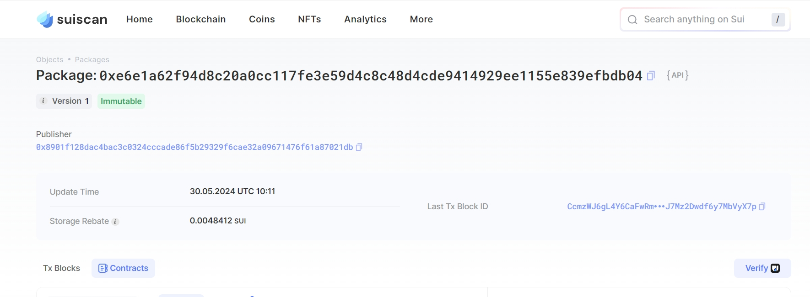

## 基本信息
- Sui钱包地址: `0x8901f128dac4bac3c0324cccade86f5b29329f6cae32a09671476f61a87021db`
> 首次参与需要完成第一个任务注册好钱包地址才被合并，并且后续学习奖励会打入这个地址
- github: `Chi1hiro`

## 个人简介
- 工作经验: x年
- 技术栈: `Java` `PHP`
> 重要提示 请认真写自己的简介
- 对Move特别感兴趣，想通过Move入门区块链
- 联系方式: tg: `Ch1hiro` 

## 任务

##   01 hello move  
- [] Sui cli version:	sui 1.26.0-d709c305ebf3-dirty
- [] Sui钱包截图: 
- [] package id:  0xe6e1a62f94d8c20a0cc117fe3e59d4c8c48d4cde9414929ee1155e839efbdb04
- [] package id 在 scan上的查看截图:

##   02 move coin
- [] My Coin package id : 0x88c45b95b24e19453fe0b5b7801655442f3c04609eb7734bb6d5ffcf58e72841
- [] Faucet package id : 0x7813f75f27bed82d27de18dc569efb9cbdeeb8c0b3c8f5e8371a6a307988f9bd
- [] 转账 `My Coin` hash:  6BjS4DTrRmx6SNWkbqTnedppShYAMpMXCLk7PUmp8nYz
- [] `Faucet Coin` address1 mint hash:  6cafhP6pzpDj7RnyEibHSqPRog5FcneQGazgzXM6KQzu
- [] `Faucet Coin` address2 mint hash:  26mQjPR64fiUU1we3vxA37qQotXKpv9QJsaay8q8KZFA

##   03 move NFT
- [] nft package id :  0x1d1d2e3a881a0b0957448e4ef4596da63753bc83ab9d52bf6bc3c9b4fc3aa873
- [] nft object id :   0xb4c1625faf5054f765ca6aaa977ae676d0819544f4172cda32641a5f9676518b
- [] 转账 nft  hash:  6A5KhkEUqnBvXvKMEd9BBnbEjHWkKwUJEHzbvXLTUNLq
- [] scan上的NFT截图:

##   04 Move Game
- [] game package id :
- [] deposit Coin hash:
- [] withdraw `Coin` hash:
- [] play game hash:

##   05 Move Swap
- [] swap package id :
- [] call swap CoinA-> CoinB  hash :
- [] call swap CoinB-> CoinA  hash :

##   06 Dapp-kit SDK PTB
- [] save hash :

## 07 Move CTF Check In

- [] CLI call 截图 : 
- [] flag hash :
