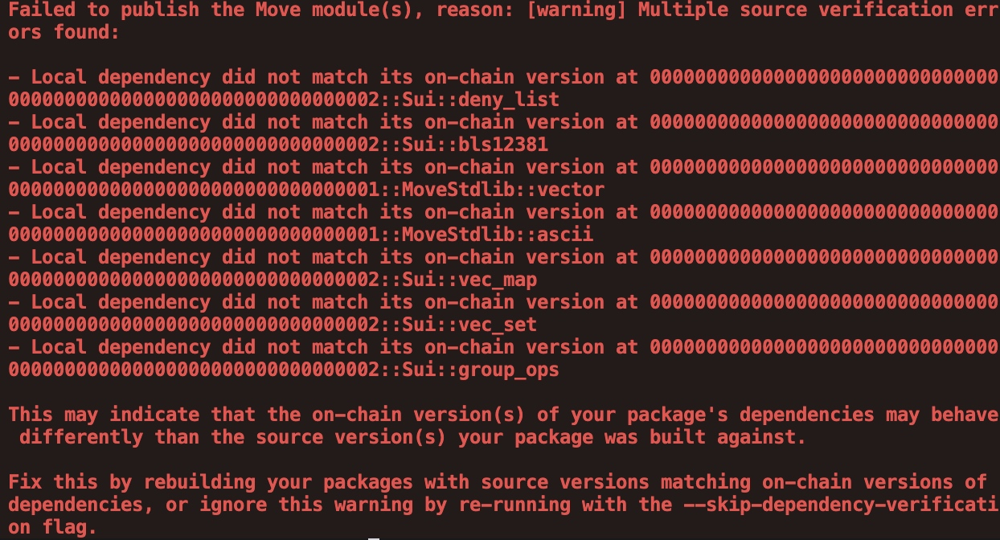
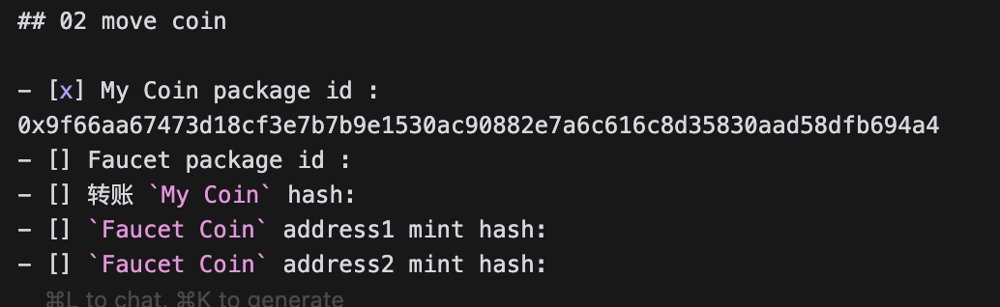
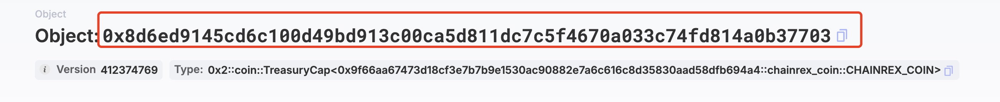
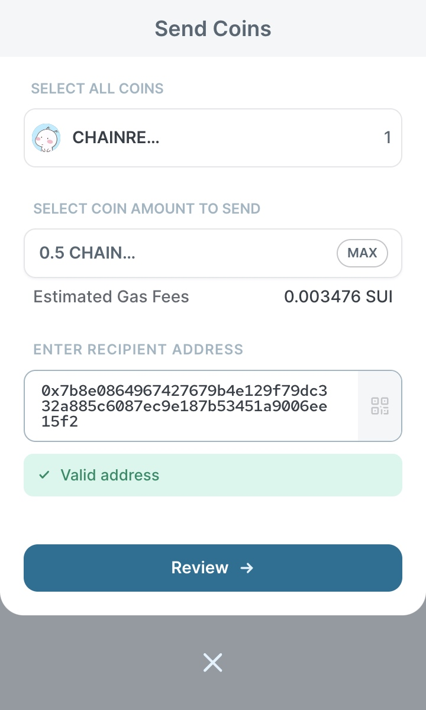

# 手摸手教你完成HOH Move共学Task2


> Move 共学由 HOH 社区、HackQuest、OpenBuild、KeyMap 联合发起。共学营集齐了多位 Move 语言领域内的专业导师，帮助新手小白快速了解 Move 语言及应用于 Web3 开发。

本教程面向新手，即使没有任何编程基础也能快速上手，有基础的同学可以跳着看。

## Task2需求
- 完成 Coin相关知识的学习
- 完成 My Coin 的学习并部署主网
- 完成 Faucet Coin 的学习并部署主网
- 提交 My Coin 和 Faucet Coin 合约发布 package id
- 发送 My Coin 给地址 0x7b8e0864967427679b4e129f79dc332a885c6087ec9e187b53451a9006ee15f2
- Faucet Coin 需要至少用两个地址mint
- 必须是自己 github id 开头的Coin名字,水龙头的Coin是 github id + Faucet

## 前置知识学习
在学习Coin协议之前，我们需要对Move的语法有基本的认识，在这里推荐几个教程，帮助大家快速掌握Move的语法。如果只是想完成Task，不想深入了解Move语言的可以跳过此部分以及之后关于代码的讲解。
- [Let's Move Sui](https://movesui.sui-book.com/)：对权限控制讲解的比较清晰，至少阅读：
    - 1.1 `基础概念`全部
    - 1.2 `中级Move`的1.2.1 - 1.2.10
    - 2.1 `Coin` 的 2.1.1 - 2.1.12
- [Move Book](https://move.sui-book.com/move-basics/index.html)：可以看一些基础的语法(第7章 Move基础)，例如基本类型、数组、条件控制等。作为 Let's Move Sui 的补充。

## My Coin
参考教程：[Let's Move Sui - 创建Coin](https://movesui.sui-book.com/02_sui_标准/01_Coin/02_创建Coin.html)
### 代码编写
在code文件夹下新建task2目录，并打开终端cd到task2目录，并运行`sui move new 包名`，包名称以你的github id开头，得到以下文件结构。


将sources文件夹下的.move文件内容替换为以下代码

```rust
module chainrex_coin::chainrex_coin {
    use sui::coin::{Self, Coin, TreasuryCap};
    use sui::url::{Self, Url};

    public struct CHAINREX_COIN has drop {}

    fun init(
        witness: CHAINREX_COIN,
        ctx: &mut TxContext
    ) {
        let (treasury_cap, metadata) = coin::create_currency<CHAINREX_COIN>(
            witness,
            9,
            b"CHAINREX",
            b"CHAINREX_COIN",
            b"ChainRex Coin",
            option::some<Url>(
                url::new_unsafe_from_bytes(
                    b"https://avatars.githubusercontent.com/u/76983474"
                )
            ),
            ctx
        );
        transfer::public_freeze_object(metadata);
        transfer::public_transfer(
            treasury_cap,
            tx_context::sender(ctx)
        )
    }

    public entry fun mint(
        treasury_cap: &mut TreasuryCap<CHAINREX_COIN>,
        amount: u64,
        recipient: address,
        ctx: &mut TxContext
    ) {
        coin::mint_and_transfer(treasury_cap, amount, recipient, ctx);
    }

    public fun burn(
        treasury_cap: &mut TreasuryCap<CHAINREX_COIN>,
        coin: Coin<CHAINREX_COIN>
    ) {
        coin::burn(treasury_cap, coin);

    }
}
```

为了满足task2的要求，你需要修改以下内容：


### 代码详解（仅阅读）
#### 前置知识总结
##### 一次性见证者
一次性见证对象只在模块第一次部署时创建，每个模块中拥有唯一的实例。
在定义时需要满足以下规则：
- 与模块同名但全大写的结构体（任何 _ 都保留）。
- 该结构体必须具有 drop 能力。
- 没有字段
- 不是范型类型

拓展链接：
- [设计模式：见证对象](https://move.sui-book.com/programmability/witness-pattern.html)
- [结构体能力](https://movesui.sui-book.com/01_sui_介绍/02_中级Move/03_结构体能力.html)

##### 事务上下文
每个事务都有执行上下文。上下文是在执行过程中程序可以访问的一组预定义变量。例如，每个事务都有一个发送者地址，事务上下文包含一个保存发送者地址的变量。

事务上下文可以通过TxContext结构体在程序中访问。该结构体定义在sui::tx_context模块中，包含以下字段：
```rust
struct TxContext has drop {
    /// The address of the user that signed the current transaction
    sender: address,
    /// Hash of the current transaction
    tx_hash: vector<u8>,
    /// The current epoch number
    epoch: u64,
    /// Timestamp that the epoch started at
    epoch_timestamp_ms: u64,
    /// Counter recording the number of fresh id's created while executing
    /// this transaction. Always 0 at the start of a transaction
    ids_created: u64
}
```

拓展链接：[事务上下文](https://move.sui-book.com/programmability/transaction-context.html)

##### 共享对象和归属对象

在Move中，有两种类型的对象：

共享对象（Shared Objects）可以被任何用户读取和修改。我们可以使用`transfer::share_object(shared_object)`来共享一个对象。

归属对象（Owned Objects）是私有对象，只有拥有它们的用户才能读取和修改。所有权在执行Sui上的交易时会自动验证。我们可以使用`transfer::transfer(owned_object, tx_context::sender(ctx))`来将对象的所有权转移给某个用户。其中`tx_context::sender (ctx)`可以获取交易发起者的地址。

```rust
public struct SharedObject has key {
   id: UID,
}


public struct OwnedObject has key {
   id: UID,
}


public fun create_shared_object(ctx: &mut TxContext) {
     let shared_object = SharedObject {
         id: object::new(ctx),
     };
     transfer::share_object(shared_object);
}


public fun create_owned_object(ctx: &mut TxContext) {
     let owned_object = OwnedObject {
         id: object::new(ctx),
     };
     transfer::transfer(owned_object, tx_context::sender(ctx));
}

```
使用归属对象的一个关键好处是，它们可以并行处理，因为涉及到它们的交易不会重叠（不读取或修改相同的数据）。然而，如果共享对象被修改，则无法并行处理，并且需要经过更严格的执行过程，这会更慢且不可扩展。另一个需要注意的重要事项是，共享对象只能在创建它们的同一交易中被设为共享。

一般来说，最好尽可能多地在智能合约中使用归属对象。 共享对象通常只用于跨多个用户共享状态的情况，如果该状态不需要改变，建议优先使用不可变对象而非共享对象。

一般的经验法则是：

- 如果数据从未改变，则使用不可变对象作为合约的所有共享状态。
- 对于可以更新的共享状态，使用共享对象。
- 对于其他所有情况，使用归属对象。

##### 不可变对象

不可变对象与共享对象几乎相同。任何用户都可以将它们作为其交易的一部分。 然而，共享对象可以作为可变引用包含，因此可以被任何人修改。而不可变对象在“冻结”后永远不能改变。

我们可以使用`transfer::freeze_object`冻结一个对象。

不可变对象与共享对象之间的另一个关键区别——归属对象不能变为共享对象（需要在创建对象后的同一交易中立即调用 transfer::share_object），但归属对象可以在任何时候根据所有者的意愿变为不可变对象。

##### public_transfer、public_share和public_freeze

具有 store 能力的对象可以通过 transfer::public_(transfer || share || freeze) 在其定义的同一模块之外进行转移、共享和冻结。

没有 store 能力的对象只能在其定义的同一模块内进行转移、共享和冻结。

#### Coin协议
类似于以太坊ERC-20标准，Move也有自己的代币标准Coin。在ERC-20标准中，所有开发人员都需要提供自己的实现方式，并且最终会一次又一次地编写几乎相同的代码。而在Move中，直接在0x2定义了Coin标准，使开发人员可以直接定义和管理代币，而不必每次都重新编写实现。

Move 语言的 Coin 设计更接近现实世界中的货币使用方式。在 Move 中，用户接收到的 Coin 实际存储在他们自己的账户对象中，这与传统的钱包存钱的方式相似，用户可以随时取出和使用。这与 ERC-20 代币在以太坊上的实现不同，后者通常将所有用户的余额集中存储在一个智能合约中，这种设计更像是银行系统而不是个人钱包。
#### 创建代币
##### 定义Coin
为了创建代币，需要首先在模块中定义一个[一次性见证对象](https://movesui.sui-book.com/01_sui_介绍/02_中级Move/10_系统对象.html)（OTW）。
```rust
module chainrex_coin::chainrex_coin {
    public struct CHAINREX_COIN has drop {}
}
```
定义init函数，该函数在部署模块时自动被调用，使用一次性见证对象和事务上下文作为参数。在init函数中，通过调用coin::create_currency 创建新的代币，其参数分别为witness（见证者对象），decimals（小数位数），symbol（代币符号），name（代币名称），description（代币描述），icon_url（代币icon），ctx（事务上下文）

```rust
module chainrex_coin::chainrex_coin {

    public struct CHAINREX_COIN has drop {}
    
    fun init(
        witness: CHAINREX_COIN,
        ctx: &mut TxContext
    ) {
        let (treasury_cap, metadata) = coin::create_currency<CHAINREX_COIN>(
            witness,
            9,
            b"CHAINREX",
            b"CHAINREX_COIN",
            b"ChainRex Coin",
            option::some<Url>(
                url::new_unsafe_from_bytes(
                    b"https://avatars.githubusercontent.com/u/76983474"
                )
            ),
            ctx
        );
        transfer::public_freeze_object(metadata);
        transfer::public_transfer(
            treasury_cap,
            tx_context::sender(ctx)
        )
    }
}
```
coin::create_currency返回TreasuryCap对象和元数据对象，它们都具有store能力。
元数据对象用于存储关于代币的信息：符号（Coin 将显示的缩写）、名称、描述和logo URL。这允许链外组件（如 Web UI）查找并显示这些信息。可以选择冻结元数据对象，这样名称/符号等就不能再更改。
```rust
transfer::public_freeze_object(metadata);
```
TreasuryCap用于管理代币，其权限所有者可以用它mint代币，我们需要将它的权限转移至模块的部署者
```rust
transfer::public_transfer(treasury_cap, tx_context::sender(ctx));
```

##### 铸造代币
通过TreasuryCap对象，用户可以铸造代币。仅当用户有该TreasuryCap的使用权限，mint函数才能被调用。在函数体内，通过coin::mint_and_transfer铸造指定数量的代币并转移给指定地址。

```rust
    public entry fun mint(
        treasury_cap: &mut TreasuryCap<CHAINREX_COIN>,
        amount: u64,
        recipient: address,
        ctx: &mut TxContext
    ) {
        coin::mint_and_transfer(treasury_cap, amount, recipient, ctx);
    }
```

##### 销毁代币
coin::burn 将销毁给定 Coin 对象中的所有代币，并且还会销毁 Coin 对象本身，这相当于销毁整个钱包。
```rust
    public fun burn(
        treasury_cap: &mut TreasuryCap<CHAINREX_COIN>,
        coin: Coin<CHAINREX_COIN>
    ) {
        coin::burn(treasury_cap, coin);

    }
```

### 部署到主网

打开终端cd到项目根文件夹下 
```
cd chainrex_coin
```
运行以下命令添加主网RPC端点
```
sui client new-env --alias mainnet --rpc https://fullnode.mainnet.sui.io:443
```
运行以下命令查看所有环境
```
sui client envs
```
返回以下结果
```
╭─────────────────┬─────────────────────────────────────┬────────╮
│ alias           │ url                                 │ active │
├─────────────────┼─────────────────────────────────────┼────────┤
│ testnet         │ https://fullnode.testnet.sui.io:443 │        │
│ mainnet         │ https://fullnode.mainnet.sui.io:443 │        │
│ suiscan-testnet │ https://rpc-testnet.suiscan.xyz:443 │ *      │
╰─────────────────┴─────────────────────────────────────┴────────╯
```
运行以下命令切换到主网
```
sui client switch --env mainnet
```
返回以下结果即可
```
Active environment switched to [mainnet]
```
运行以下命令查看当前激活的地址
```
sui client active-address
```
将返回当前使用的地址，例如：
```
0x6f73a5a6967015adaa7ef618619e0113170bb576bbd9c8f8ee2156fcb81a510d
```
一般第一次使用主网前，账户里面是没有gas的，你需要从别的钱包转入一点SUI作为gas。建议将开发用的钱包和存钱用的钱包区分开来，在交易所购买一些SUI提现到自己的钱包，然后再从钱包转一些SUI到开发用的地址，建议一次转1个SUI。

运行以下命令查看当前账户的余额
```
sui client gas
```
返回以下结果
```
╭────────────────────────────────────────────────────────────────────┬────────────────────┬──────────────────╮
│ gasCoinId                                                          │ mistBalance (MIST) │ suiBalance (SUI) │
├────────────────────────────────────────────────────────────────────┼────────────────────┼──────────────────┤
│ 0x53f6937a6b5f2c4e3cd6e85e7c5cdab1283b15d4617e1337bf68bccd0e2dc10d │ 1000000000         │ 1.00             │
╰────────────────────────────────────────────────────────────────────┴────────────────────┴──────────────────╯
```
运行以下命令进行部署
```
sui client publish
```
如果出现以下错误



则尝试使用以下命令
```
sui client publish --skip-dependency-verification
```
部署成功后可以到区块链浏览器（https://suiscan.xyz/） 上查看交易，并复制package id，填入readme.md中




### 链上交互

接着我们还需要转账一些代币到指定地址，在此之前需要铸造一些代币给自己，为了方便交互，我们可以导出开发账户的私钥并导入到浏览器钱包。
```
sui keytool export --key-identity 当前地址
```
返回以下结果，其中suiprivkey开头的就是私钥
```
╭────────────────────┬────────────────────────────────────────────────────────────────────────────────────────────╮
│ exportedPrivateKey │  suiprivkey...                    │
│ key                │ ╭─────────────────┬──────────────────────────────────────────────────────────────────────╮ │
│                    │ │ alias           │                                                                      │ │
│                    │ │ suiAddress      │  0x6f73a5a...                                │ │
│                    │ │ publicBase64Key │  AJ9Aws...                        │ │
│                    │ │ keyScheme       │  ed25519                                                             │ │
│                    │ │ flag            │  0                                                                   │ │
│                    │ │ peerId          │  9f40c2c4c7633...    │ │
│                    │ ╰─────────────────┴──────────────────────────────────────────────────────────────────────╯ │
╰────────────────────┴────────────────────────────────────────────────────────────────────────────────────────────╯
```

可以通过钱包的ADD按钮 - Import Private Key导入私钥


回到区块链浏览器，查看刚刚部署的Package

在右边可以看到Mint需要三个参数，分别是TreasuryCap id，铸造的代币数量和接收者。
其中TreasuryCap id可以在钱包的交易历史中找到

找到Type为TreasureCap的Object


点击进去后，可以找到它的id

填写好参数，注意Arg1是代币的数量，是包含小数的，Arg2接收地址填部署者地址即可。之后连接钱包，并签名交易。


接着发送一些代币给这个地址`0x7b8e0864967427679b4e129f79dc332a885c6087ec9e187b53451a9006ee15f2`，使用钱包完成交互即可。



最后在区块链浏览器中搜索自己的地址，复制刚刚的交易哈希，并填入readme.md中


## Faucet Coin
水龙头代币和之前编写的My Coin非常类似，只是将TreasuryCap的权限设置为共享，链上交互的方法也非常类似，因此本节将省略大部分内容，只写和My Coin不一样的部分
### 代码编写
运行`sui move new 包名`，包名称以你的github id + faucet开头，得到以下文件结构。


将sources文件夹下的.move文件内容替换为以下代码

```rust
module chainrex_faucet_coin::chainrex_faucet_coin {
    use sui::coin::{Self, Coin, TreasuryCap};
    use sui::url::{Self, Url};

    public struct CHAINREX_FAUCET_COIN has drop {}

    fun init(
        witness: CHAINREX_FAUCET_COIN,
        ctx: &mut TxContext
    ) {
        let (treasury_cap, metadata) = coin::create_currency<CHAINREX_FAUCET_COIN>(
            witness,
            9,
            b"CRF",
            b"CHAINREX_FAUCET_COIN",
            b"ChainRex Faucet Coin",
            option::some<Url>(
                url::new_unsafe_from_bytes(
                    b"https://avatars.githubusercontent.com/u/76983474"
                )
            ),
            ctx
        );
        transfer::public_freeze_object(metadata);
        transfer::public_share_object(treasury_cap)
    }

    public entry fun mint(
        treasury_cap: &mut TreasuryCap<CHAINREX_FAUCET_COIN>,
        amount: u64,
        recipient: address,
        ctx: &mut TxContext
    ) {
        coin::mint_and_transfer(treasury_cap, amount, recipient, ctx);
    }

    public fun burn(
        treasury_cap: &mut TreasuryCap<CHAINREX_FAUCET_COIN>,
        coin: Coin<CHAINREX_FAUCET_COIN>
    ) {
        coin::burn(treasury_cap, coin);

    }
}


```
需要替换的内容与My Coin并无太大差异


### 代码详解（仅阅读）
Faucet Coin是一个任何人都可以mint的代币，可以将TreasuryCap变成共享对象，此时任何用户都可以使用它mint代币。
```
transfer::public_share_object(treasury_cap);
```
其余部分与My Coin相同

### 部署到主网
```
sui client publish --skip-dependency-verification
```
部署成功后可以到区块链浏览器（https://suiscan.xyz/） 上查看交易，并复制package id，填入readme.md中


### 链上交互

我们需要使用两个不同的账户铸造代币，交互流程与My Coin一致。

我们可以在Package的Tx Blocks中找到这两个交易哈希，填入readme.md即可


至此Task2已经完成，可以去提交PR啦