# 手摸手教你完成HOH Move共学Task3-Move NFT


> Move 共学由 HOH 社区、HackQuest、OpenBuild、KeyMap 联合发起。共学营集齐了多位 Move 语言领域内的专业导师，帮助新手小白快速了解 Move 语言及应用于 Web3 开发。

本教程面向新手，即使没有任何编程基础也能快速上手，有基础的同学可以跳着看。

## 写在前面
经过前两个task的学习，相信你已经掌握Move的基本语法、项目的部署流程、链上交互流程，在之前文章中提到的内容之后不会重复讲解。

如果你还未完成task1和task2，可以翻看我之前的教程：

- [手摸手教你完成HOH Move共学Task1-HelloWorld](https://learnblockchain.cn/article/9810)
- [手摸手教你完成HOH Move共学Task2-Move Coin](https://learnblockchain.cn/article/9822)

## Task3需求
- 完成 NFT相关知识的学习
- 完成可以mint NFT的合约上链
- 给自己地址mint一个NFT
- NFT必须是自己 github 的头像作为图片
- mint 一个 nft 发送到地址: 0x7b8e0864967427679b4e129f79dc332a885c6087ec9e187b53451a9006ee15f2
- 提交mint到自己地址的浏览器查看(Scan)截图

## NFT标准（仅阅读）
NFT（非同质化代币）通过智能合约和唯一标识符在区块链上表示。其工作原理如下：

- 智能合约：NFT 是通过智能合约创建和管理的，这些合约是具有预定义规则和条件的自执行协议。 Sui等区块链平台上的智能合约负责 NFT 的创建、转移和所有权。这些合约包含了管理 NFT 行为的逻辑，例如如何创建、购买、出售和转移。

- 唯一标识符：每个 NFT 都有一个唯一标识符，将其与区块链上的其他所有代币区分开来。这个标识符通常是一长串字符，关联到特定的 NFT。 它通常被称为“代币 ID”或“代币索引”。这个标识符确保了 NFT 的唯一性，并允许它在区块链上轻松跟踪。

- 元数据：NFT 通常包括元数据，即与代币关联的数字资产的附加信息。 元数据可以包括创作者的详细信息、资产的描述、其属性以及实际数字文件的链接（例如图像、视频或音频文件）。 由于区块链的大小限制，元数据通常存储在链外（区块链外），并在 NFT 的智能合约中包含对这些元数据的引用。 这允许用户在不将全部内容存储在区块链上的情况下访问和显示关于 NFT 的信息。

- 所有权和转移：NFT 的所有权在区块链上跟踪。当创建 NFT 时，智能合约会记录初始所有者的钱包地址。 当 NFT 转移给另一方时，智能合约中的所有权信息会更新，以反映新所有者的钱包地址。这个转移过程是安全和透明的，因为它记录在区块链的公共账本上。

- 互操作性：NFT 通常在各种区块链平台上创建和交易，每个平台都有自己的一套标准。 为了确保不同平台之间的互操作性，出现了一些标准和协议，允许 NFT 在多个生态系统中被识别和使用。例如，以太坊上的 NFT 可以在遵循相同标准的各种 NFT 市场和平台上支持。

在 Sui 区块链上，使用对象创建和管理 NFT 非常容易。每个 NFT 都可以是一个对象，它本身就是唯一的，并且可以包含由创建者/开发者定义的任何元数据。

在 Move 中，我们可以将 NFT 收藏品和代币表示为对象。一个收藏品对象可以有以下字段：

1. creator：收藏品创作者的地址
2. name：收藏品的名称
3. description：收藏品的描述
4. limit：可以在收藏品中铸造的代币数量
5. url：收藏品的 URL

一个 NFT 代币通常有以下字段：

1. collection：收藏品对象的地址
2. name：代币的名称
3. url：代币图像的 URL
4. attributes：代币的属性列表，如出生日期、世代等

尽管使用以上简单标准可以用来创建自己的NFT，但是有两个问题：

1. 它不是其他开发者/创作者使用的标准。如果没有关于如何定义 NFT 属性的统一标准，钱包（用户用于签署和发送交易到 Sui 网络）和 UI 将难以正确显示数据。
2. 开发者每次创建自己的 NFT 集合时需要重新实现所有功能。

由于上述原因，社区拥有一个通用标准和功能集对于 NFT 来说是合理的，这样可以让创作者更容易创建集合，并让 UI 和钱包在不需要大量手动工作的情况下良好地显示它们。

目前，Sui 网络上的大多数 NFT 集合使用两个主要标准：

1. OriginByte: https://github.com/Origin-Byte/nft-protocol。这是 Sui 上市场份额最大的 NFT 标准。
2. Suiet: https://std.suiet.app/

接下来，我们将使用OriginByte标准创建我们的NFT。

## 代码编写

### 导入依赖

创建完项目后，我们可以在Move.toml中添加Origin-Byte库的依赖，它将从Github下载Origin-Byte的代码库，并将NftProtocol引入我们的项目中。

```toml
NftProtocol = { git = "https://github.com/Origin-Byte/nft-protocol.git", subdir = "contracts/nft_protocol", rev = "main" }
```
完整的Move.toml如下，记得将name改为自己的包名称

```toml
[package]
name = "nfts"
edition = "2024.beta" # edition = "legacy" to use legacy (pre-2024) Move
# license = ""           # e.g., "MIT", "GPL", "Apache 2.0"
# authors = ["..."]      # e.g., ["Joe Smith (joesmith@noemail.com)", "John Snow (johnsnow@noemail.com)"]

[dependencies]
Sui = { git = "https://github.com/MystenLabs/sui.git", subdir = "crates/sui-framework/packages/sui-framework", rev = "mainnet-v1.19.1" }
NftProtocol = { git = "https://github.com/Origin-Byte/nft-protocol.git", subdir = "contracts/nft_protocol", rev = "main" }
# For remote import, use the `{ git = "...", subdir = "...", rev = "..." }`.
# Revision can be a branch, a tag, and a commit hash.
# MyRemotePackage = { git = "https://some.remote/host.git", subdir = "remote/path", rev = "main" }

# For local dependencies use `local = path`. Path is relative to the package root
# Local = { local = "../path/to" }

# To resolve a version conflict and force a specific version for dependency
# override use `override = true`
# Override = { local = "../conflicting/version", override = true }

[addresses]
nfts = "0x0"

# Named addresses will be accessible in Move as `@name`. They're also exported:
# for example, `std = "0x1"` is exported by the Standard Library.
# alice = "0xA11CE"

[dev-dependencies]
# The dev-dependencies section allows overriding dependencies for `--test` and
# `--dev` modes. You can introduce test-only dependencies here.
# Local = { local = "../path/to/dev-build" }

[dev-addresses]
# The dev-addresses section allows overwriting named addresses for the `--test`
# and `--dev` modes.
# alice = "0xB0B"
```

我们可以先运行`sui move build`构建一下项目，首次运行将下载Origin-Byte的代码仓库。

下面先给出nfts.move的源代码

```rust
module nfts::nfts {
    use nft_protocol::attributes::{Self, Attributes};
    use nft_protocol::collection;
    use std::ascii::String;
    use std::string;
    use sui::url::{Self, Url};
    use nft_protocol::display_info;
    use nft_protocol::mint_cap::{Self, MintCap};
    use nft_protocol::mint_event;
    use ob_permissions::witness;

    public struct NFTS has drop {}

    /// 可用于创建后授权其他操作。至关重要的是，这个结构体不能随意提供给任何合约，因为它充当了授权令牌。
    public struct Witness has drop {}

    public struct NFT has key, store {
        id: UID,
        name: String,
        description: String,
        url: Url,
        attributes: Attributes,
    }

    fun init(otw: NFTS, ctx: &mut TxContext) {
        let (mut collection, mint_cap) = collection::create_with_mint_cap<NFTS, NFT>(
            &otw, option::none(), ctx
        );
        let delegated_witness = witness::from_witness(Witness {});

        collection::add_domain(
            delegated_witness,
            &mut collection,
            display_info::new(
                string::utf8(b"NFTs"),
                string::utf8(b"A NFT collection of NFTs on Sui"),
            ),
        );
        transfer::public_share_object(collection);
        transfer::public_share_object(mint_cap);
    }

    public entry fun mint_nft(
        mint_cap: &MintCap<NFT>,
        name: String,
        description: String,
        url: String,
        ctx: &mut TxContext,
    ) {
        let nft = NFT {
            id: object::new(ctx),
            name,
            description,
            url: url::new_unsafe(url),
            attributes: attributes::from_vec(vector[], vector[])
        };

        mint_event::emit_mint(
            witness::from_witness(Witness {}),
            mint_cap::collection_id(mint_cap),
            &nft,
        );
        transfer::public_transfer(nft, tx_context::sender(ctx));
    }

    public entry fun transfer_nft(nft: NFT, to: address) {
        transfer::public_transfer(nft, to);
    }
}
```
## 代码详解（仅阅读）
### NFT对象
首先我们可以先定义出NFT对象，该对象表示一个NFT集合里面的单个NFT代币

```rust
public struct NFT has key, store {
    id: UID,
    name: String,
    description: String,
    url: Url,
    attributes: Attributes,
}
```
### 创建集合

OriginByte 标准只规定了集合的结构，它们的集合对象非常简洁，所有属性都需要作为显示属性添加（通过 collection::add_domain）

```rust
public struct Collection<phantom T> has key, store {
    id: UID,
    version: u64,
}
```
在init函数中创建出NFT集合，经历了以下几个步骤：
1. 在同一个包中声明一个新的结构体 Witness {}
2. 使用 witness::from_witness 创建一个“委托见证”对象
3. 使用collection::add_domain为集合添加更多属性
4. 将collection和mint_cap设置为共享对象
```rust
public struct Witness has drop {}

fun init(otw: NFTS, ctx: &mut TxContext) {
    let (mut collection, mint_cap) = collection::create_with_mint_cap<NFTS, NFT>(
        &otw, option::none(), ctx
    );
    let delegated_witness = witness::from_witness(Witness {});

    collection::add_domain(
        delegated_witness,
        &mut collection,
        display_info::new(
            string::utf8(b"NFTs"),
            string::utf8(b"A NFT collection of NFTs on Sui"),
        ),
    );
    transfer::public_share_object(collection);
    transfer::public_share_object(mint_cap);
}
```
### 铸造NFT
接着定义铸造函数,通过创建一个NFT对象完成铸造。

```rust
public entry fun mint_nft(
    mint_cap: &MintCap<NFT>,
    name: String,
    description: String,
    url: String,
    ctx: &mut TxContext,
) {
    let nft = NFT {
        id: object::new(ctx),
        name,
        description,
        url: url::new_unsafe(url),
        attributes: attributes::from_vec(vector[], vector[])
    };

    mint_event::emit_mint(
        witness::from_witness(Witness {}),
        mint_cap::collection_id(mint_cap),
        &nft,
    );
    transfer::public_transfer(nft, tx_context::sender(ctx));
}
```
在此处，我们的属性(name和description)直接放在结构体当中，而attributes则设置为空。

如果像通过attributes添加属性，可以采取以下写法

```rust
let attributes = attributes::from_vec(
    vector[string::utf8(b"name"), string::utf8(b"description")],
    vector[name, description],
);
let nft = NFT {
    id: object::new(ctx),
    url: url::new_unsafe(url),
    attributes,
};
```
使用 attributes 的主要好处是，可以在以后（铸造后）添加新属性，而不必向 NFT 结构体添加新字段。模块部署后，现有的结构体不能被修改或添加新字段。

例如我们可以通过以下函数添加新属性
```rust
use sui::vec_map;

public fun add_new_attributes(nft: &mut NFT, new_attribute_name: String, new_attribute_value: String) {
    let new_attributes = vec_map::empty<String, String>();
    vec_map::insert(&mut new_attributes, new_attribute_name, new_attribute_value);
    attributes::add_new(&mut nft.id, new_attributes);
}
```

不过在本案例中，不需要添加新属性，所以采取直接添加到结构体中的方式。

铸造函数还接收一个 MintCap 对象以发出铸造事件。这是必需的，以便链外组件能够知道 NFT 属于 NFTs 集合。OriginByte 提供的 mint_event::emit_mint 还需要在 init 函数中添加显示属性时传递的委托见证对象。在大多数情况下，MintCap 可以是一个共享对象，以允许任何用户调用 mint_nft 函数。

```rust
mint_event::emit_mint(
        witness::from_witness(Witness {}),
        mint_cap::collection_id(mint_cap),
        &nft,
    );
```

最后，我们需要将NFT的权限转移给铸造者
```rust
transfer::public_transfer(nft, tx_context::sender(ctx));
```
### 转移NFT
最后的最后,我们还需要一个转移函数，以便用户将他们的NFT转移给其他用户
```rust
public entry fun transfer_nft(nft: NFT, to: address) {
    transfer::public_transfer(nft, to);
}
```
## 链上交互
接下来我们可以部署到主网，并上链交互。如果在部署时有任何问题，可以参考task2的部署教程：https://learnblockchain.cn/article/9822#部署到主网。
我们可以先把package id填入readme.md中
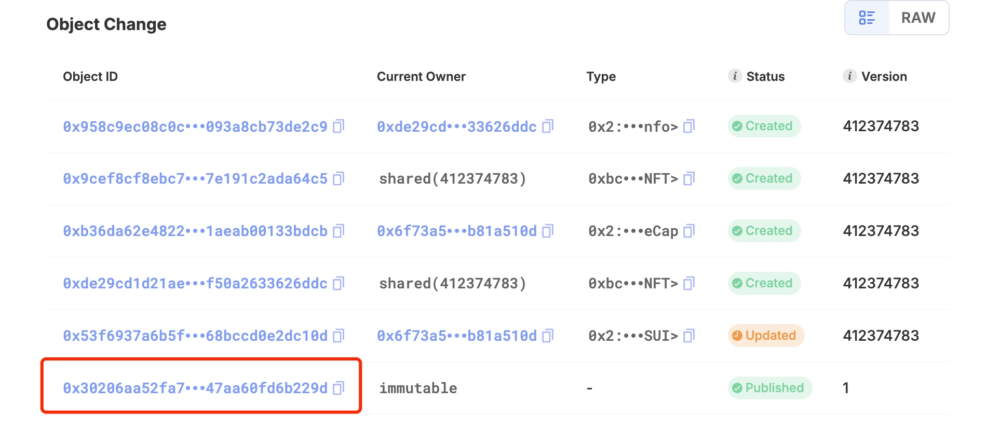

我们可以在钱包或者区块链浏览器中找到MintCap的id，并将其复制
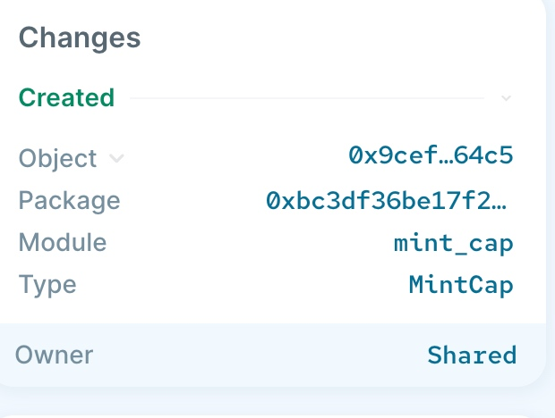
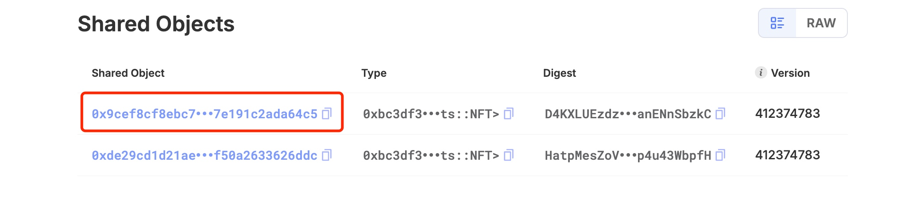
它将是mint函数的第一个参数，其余三个参数分别为：名称、描述和图片url，按照task的要求，url应该是你github的头像链接
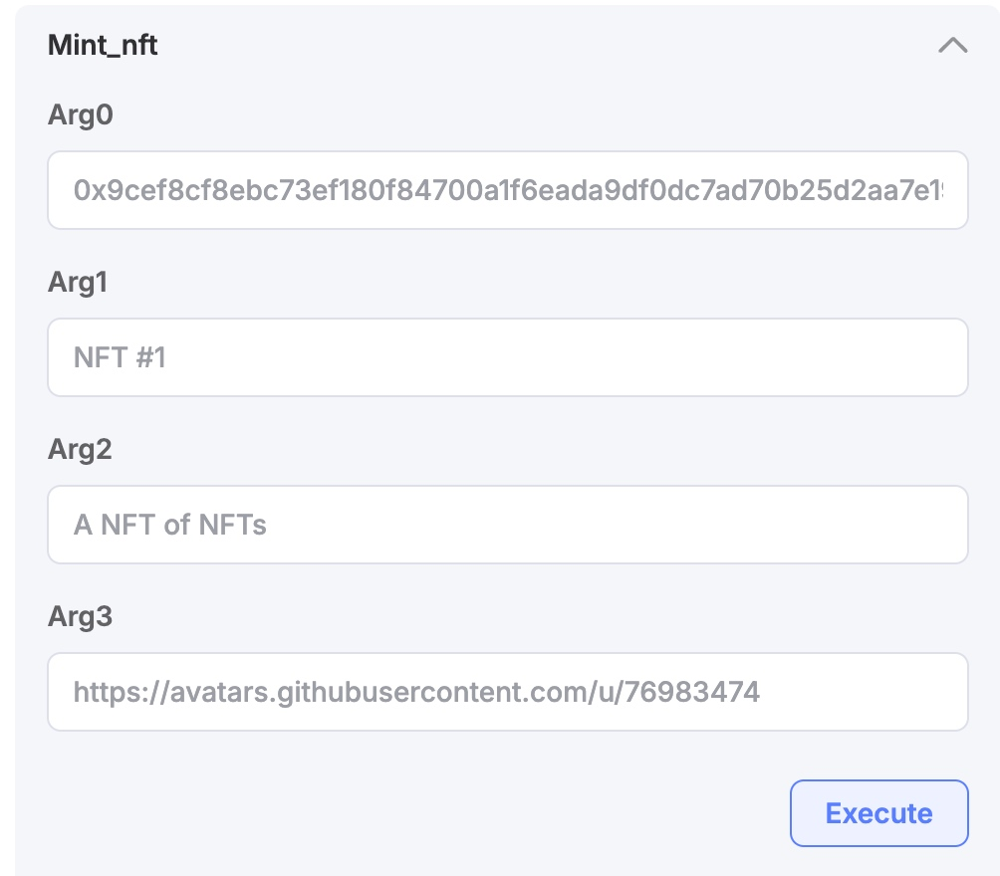

铸造成功后，Created部分便是你铸造的nft，我们可以复制此id填到readme中

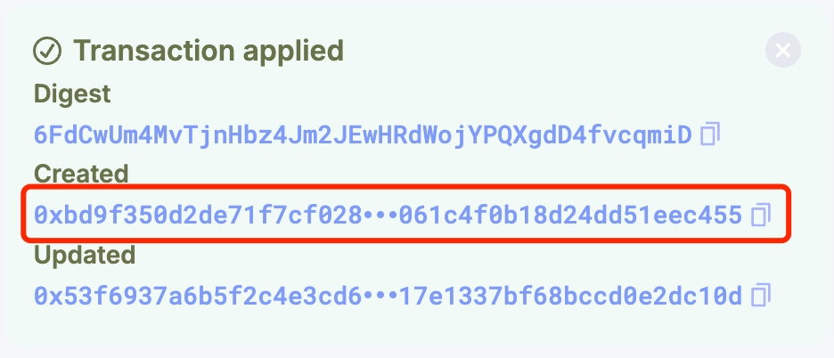
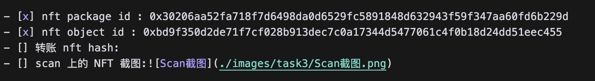

接着我们可以点进去，这是你铸造的NFT详情页，将其截图保存并放到项目中
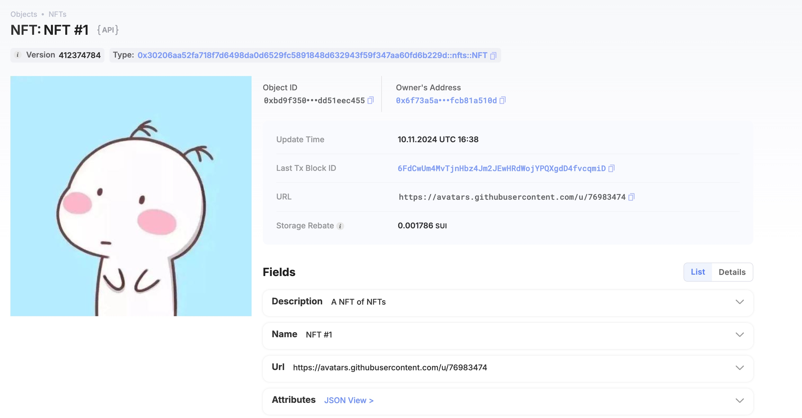
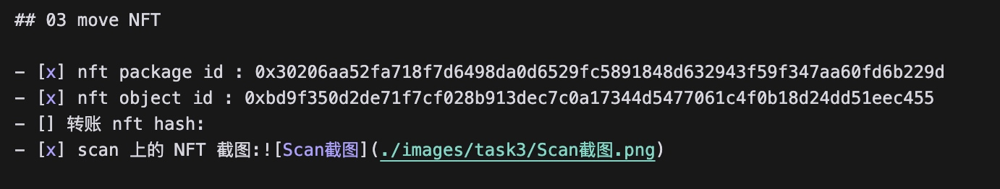

最后，我们再铸造一个NFT
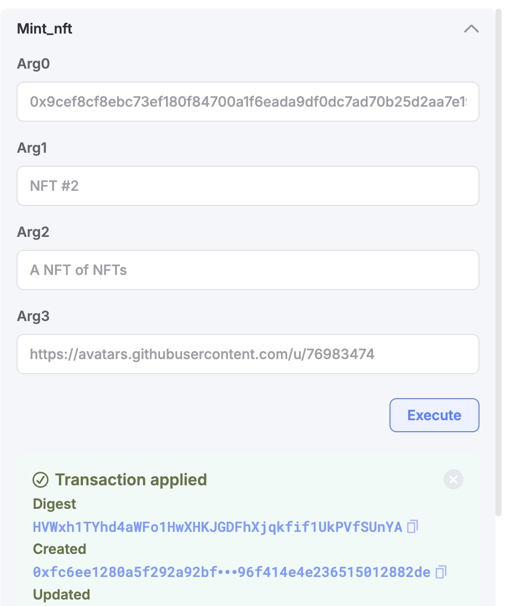


之后我们调用Transfer_nft函数，第一个参数是新铸造的NFT id，第二个参数是任务要求的地址`0x7b8e0864967427679b4e129f79dc332a885c6087ec9e187b53451a9006ee15f2`，执行后会将该NFT转移给该地址

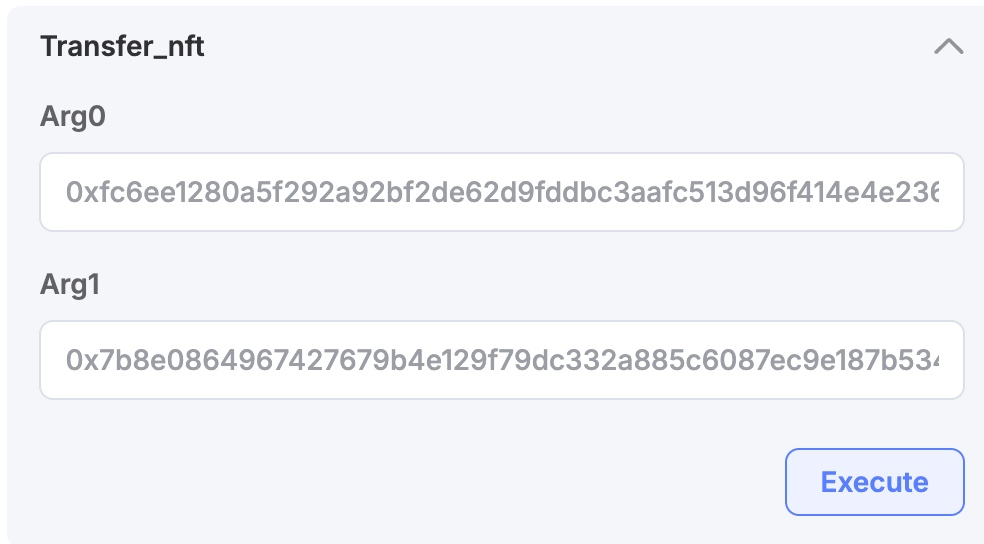

最后我们复制转账的哈希，填入readme中

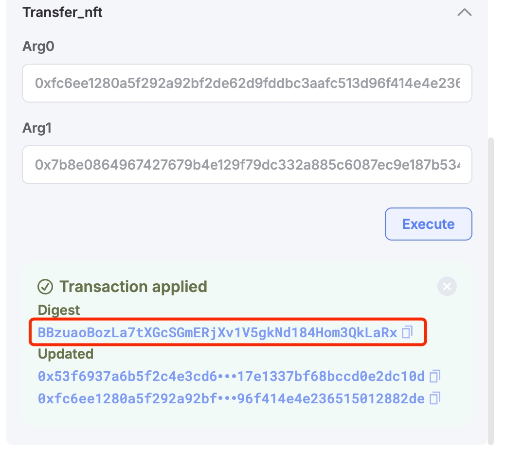
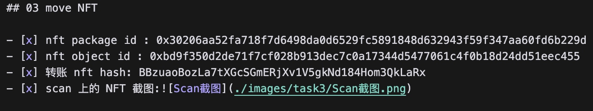

至此我们就完成了task3，可以去提PR啦！