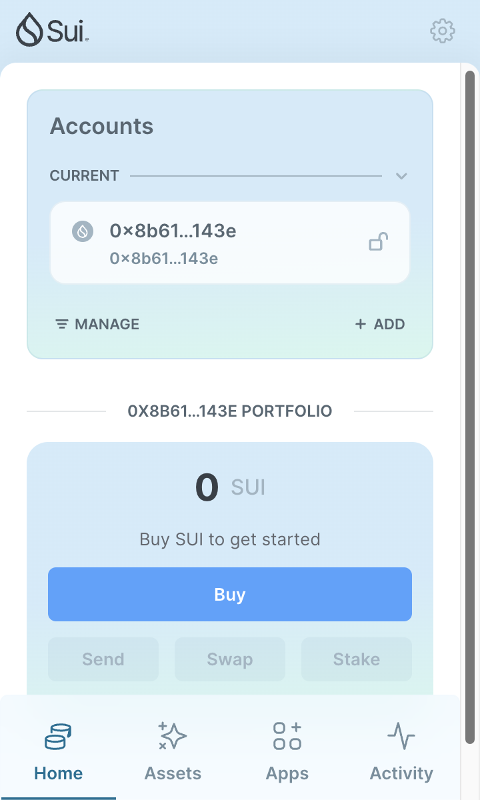
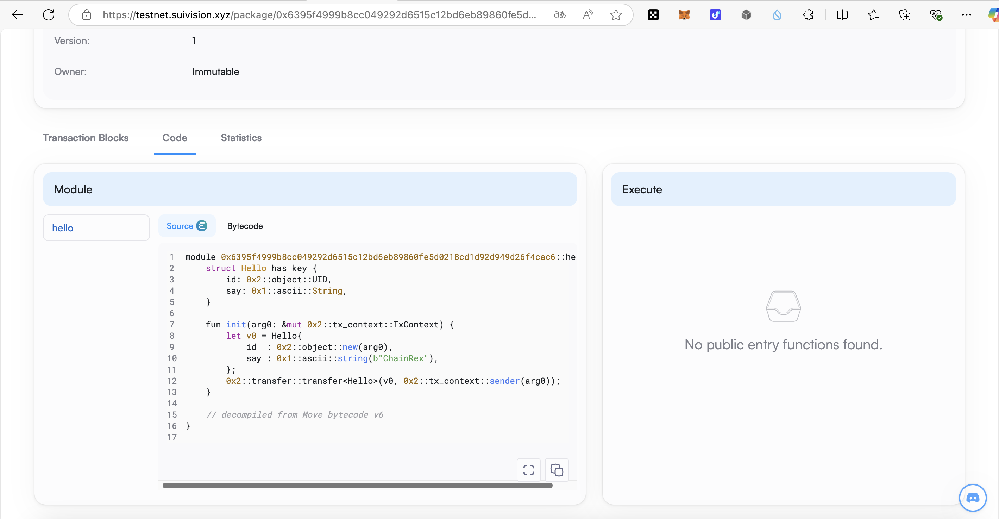
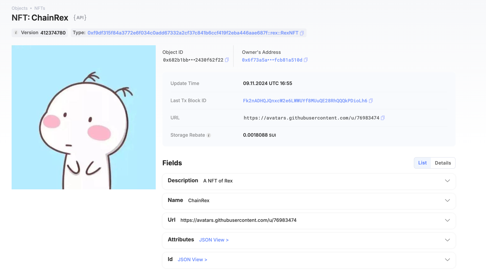
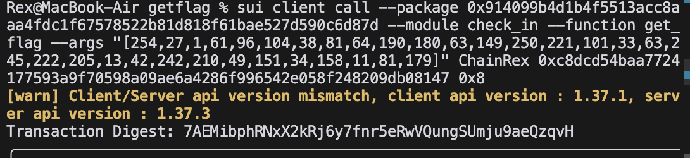

## 基本信息

- Sui 钱包地址: `0x8b61df0302677d4dd003f2168ba8277009d5a6a07cbeaf4ad1649c26c748143e`
  > 首次参与需要完成第一个任务注册好钱包地址才被合并，并且后续学习奖励会打入这个地址
- github: `ChainRex`

## 个人简介

- 浙江大学硕士研究生一年级在读
- 就读于浙江大学区块链实验室，研究方向为 AI+区块链
- 熟悉 Solidity 合约开发
- 熟悉基本的前后端开发框架：`Vue` `Spring Boot` `Gin`
- 熟悉前后端链上交互技术：`Ether.js` `go-ethereum`
- 熟悉大模型 RAG 应用的开发

- 联系方式: tg: `chain_rex`

## 任务

## 01 hello move

- [x] Sui cli version: sui 1.37.1-homebrew
- [x] Sui 钱包截图: 
- [x] package id: 0x6395f4999b8cc049292d6515c12bd6eb89860fe5d0218cd1d92d949d26f4cac6
- [x] package id 在 scan 上的查看截图:

## 02 move coin

- [x] My Coin package id : 0x5c1042a50f66773a2da032c15aa7620527b21091c01f30c4c89bb002104da8e7
- [x] Faucet package id : 0x4a207050f8085df4fb83b4360740ea8c39862e072da85eb6a601ca80521e8a32
- [x] 转账 `My Coin` hash: 7EMd9f4s5Mtv9wVFTUjd79rkkQZq5c92E12JqBVKgZD3
- [x] `Faucet Coin` address1 mint hash: 22S8YvXcqgRayGCHobL9ph4qgaVCp8TztAffS5JkFyxq
- [x] `Faucet Coin` address2 mint hash: 4GctkNi86pm62V2G5HQPLZb6X6c1BgtJoxXjCzxgxFSH

## 03 move NFT

- [x] nft package id : 0xf9df315f84a3772e6f034c0add67332a2cf37c841b6ccf419f2eba446aae687f
- [x] nft object id : 0x682b1bb9aa78392c56b6381cc24e1c2f9e4c463950efeb5a7bde4a2430f62f22
- [x] 转账 nft hash: 6PjBzWagrHhpzUwFugujqraTQbzjuCAmaxJ637aa8eDh
- [x] scan 上的 NFT 截图:

## 04 Move Game

- [x] game package id : 0x37c3152c9b1dcce88d27f6d2375fdbf9fbd357eb0a7baaea4b268a12af15b524
- [x] deposit Coin hash: FZ34ZYUCi3YNd9JobJjp6EMuyCYhyAGhUeWp8cYqFPw
- [x] withdraw `Coin` hash: 8bv1pckuG5Bb1AKxyETP2Wsh786J3MSGr39KU9WS2z8Q
- [x] play game hash: 5UL2HWzWpcLdrdYConQZDFEWwG9LFzoxb4uP5EgwhyBS

## 05 Move Swap

- [x] swap package id : 0xb510dd237d2e18682968ef3bd6c423b337c312be2466f76702148f9500adc7f3
- [x] call swap CoinA-> CoinB hash : CZZ6SnzdTRtKPVqUiktX2x5xBBeUijbvjYFK2nkKad4z
- [x] call swap CoinB-> CoinA hash : 3gqW9nEmLP3xtFQpy8mqDTFuwoYtcRKh4ncexuxqYRhR

## 06 Dapp-kit SDK PTB

- [x] save hash : AL1kk6K8EhJKyM3mFgnhuRPN6VLYPNenbokqg3m1ELXY

## 07 Move CTF Check In

- [x] CLI call 截图 : 
- [x] flag hash : 7AEMibphRNxX2kRj6y7fnr5eRwVQungSUmju9aeQzqvH

## 08 Move CTF Lets Move

- [x] proof : [247,211,70,0,0,0,0,0]
- [x] flag hash : 8BBCSXL71ARQrYrWFdi21gXurDH4CKDayeCMpwAhwrdm
