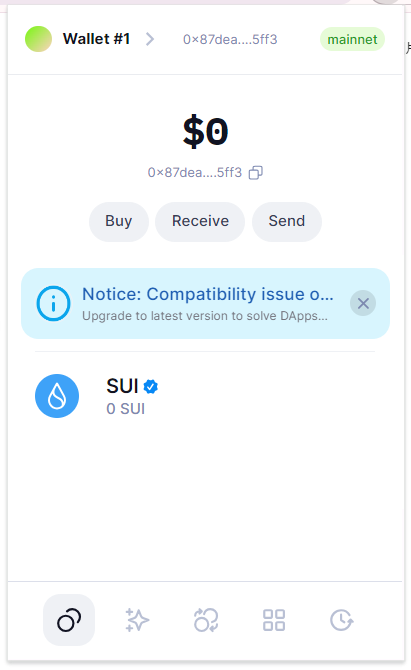
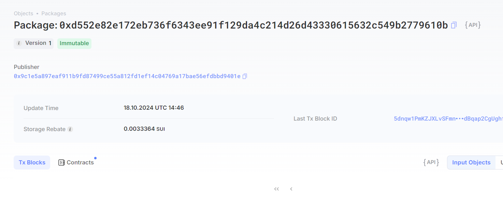

## 基本信息
- Sui钱包地址: 0x87dea1abb0e4fd025bcfe1dbf8d6a12294746209054801b966108c6481d25ff3
> 首次参与需要完成第一个任务注册好钱包地址才被合并，并且后续学习奖励会打入这个地址
- github: Cherrysli

## 个人简介
- 工作经验: 0年
- 技术栈: 学习中
## 任务

##   01 hello move  
- [] Sui cli version:
- [] Sui钱包截图: 
- [] package id: 0xd552e82e172eb736f6343ee91f129da4c214d26d43330615632c549b2779610b
- [] package id 在 scan上的查看截图:

##   02 move coin
- [] My Coin package id : 
- [] Faucet package id : 
- [] 转账 `My Coin` hash:
- [] `Faucet Coin` address1 mint hash:
- [] `Faucet Coin` address2 mint hash:

##   03 move NFT
- [] nft package id :
- [] nft object id : 
- [] 转账 nft  hash:
- [] scan上的NFT截图:

##   04 Move Game
- [] game package id :
- [] deposit Coin hash:
- [] withdraw `Coin` hash:
- [] play game hash:

##   05 Move Swap
- [] swap package id :
- [] call swap CoinA-> CoinB  hash :
- [] call swap CoinB-> CoinA  hash :

##   06 Dapp-kit SDK PTB
- [] save hash :

##   07 Move CTF Check In
- [] CLI call 截图 : 
- [] flag hash :

##   08 Move CTF Lets Move
- [] proof : 
- [] flag hash :
