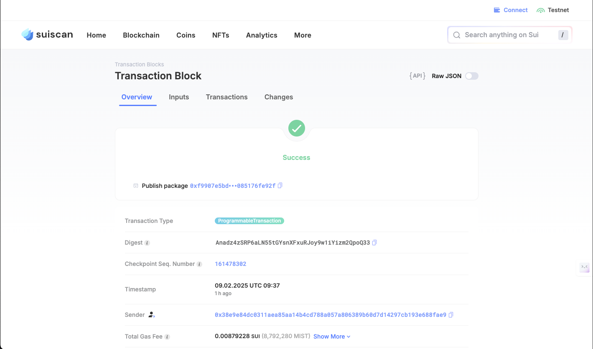

## 基本信息
- Sui钱包地址: `0x8dfc3ce69b7614e6039fd465ff4e0f6bda570127ba964261e5419215147fe4e8`
> 首次参与需要完成第一个任务注册好钱包地址才被合并，并且后续学习奖励会打入这个地址
- github: `CodeTips`

## 个人简介
- 工作经验: 10年
- 技术栈: `Objective-C` `Swift` `Python` `Golang` `C++` 等
> 重要提示 请认真写自己的简介
- 移动安全，对Move特别感兴趣，想通过Move入门区块链
- 联系方式: tg: `Melee520` 

## 任务

##   01 hello move  
- [x] Sui cli version: sui 1.42.1-homebrew
- [x] Sui钱包截图: 
- [x] package id: `0xf9907e5bd24da4fd3ba28b35687bad376c49c655cd80197da609c085176fe92f`
- [x] package id 在 scan上的查看截图:

##   02 move coin
- [] My Coin package id : 
- [] Faucet package id : 
- [] 转账 `My Coin` hash: 
- [] `Faucet Coin` address1 mint hash:
- [] `Faucet Coin` address2 mint hash:

##   03 move NFT
- [x] nft package id : 0x0b86fc2b5c83d8ae61655224e3164de895b044c130afb464e64b81a66bf63095
- [x] nft object id : 0xf80b0e892a4086bcfe7ef1dfac4d04835d3e582417f34bbef51c88b666d7181f
- [x] 转账 nft  hash: JBoGwmxzwRuP3k47Udt3QMorRERadjiy2UF97a3B9uJa
- [x] scan上的NFT截图:

##   04 Move Game
- [] game package id :
- [] deposit Coin hash:
- [] withdraw `Coin` hash:
- [] play game hash:

##   05 Move Swap
- [] swap package id :
- [] call swap CoinA-> CoinB  hash :
- [] call swap CoinB-> CoinA  hash :

##   06 Dapp-kit SDK PTB
- [] save hash :

##   07 Move CTF Check In
- [] CLI call 截图 : 
- [] flag hash :

##   08 Move CTF Lets Move
- [] proof : 
- [] flag hash :

