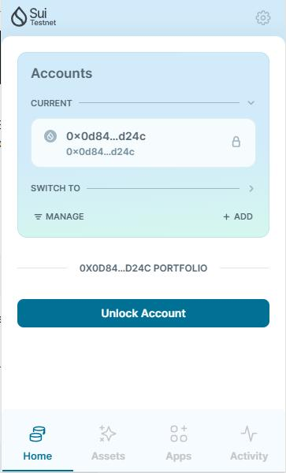
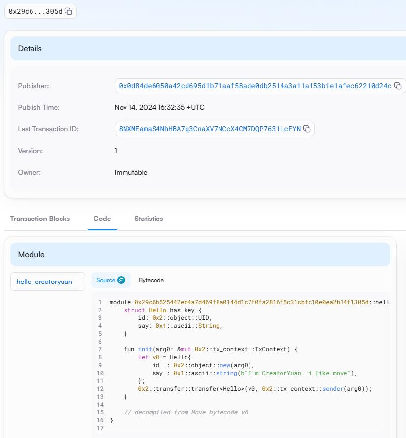
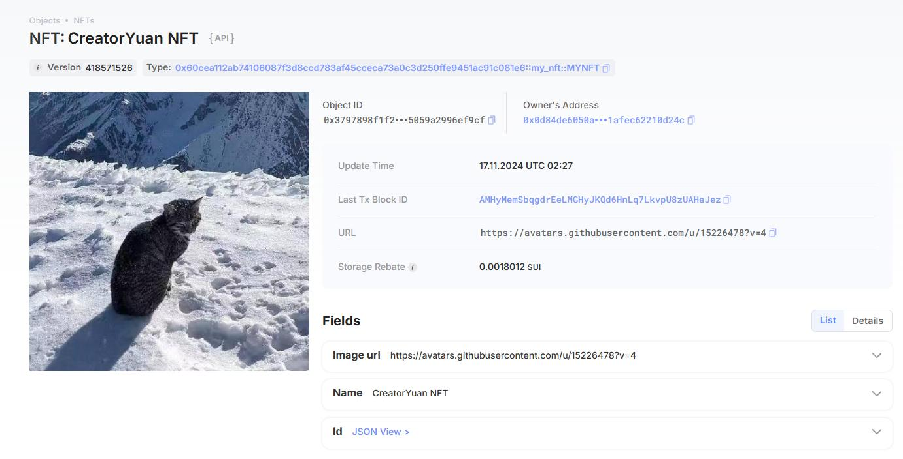

## 基本信息
- Sui钱包地址: `0xf6811db11e9e7840efab14e32de8594c4133cc5998eec2e8e98bcb4ad73c70da`
> 首次参与需要完成第一个任务注册好钱包地址才被合并，并且后续学习奖励会打入这个地址
- github: `CreatorYuan`

## 个人简介
- 工作经验: 6年运维
- 技术栈:  `python` `shell`
> 重要提示 请认真写自己的简介
- 多年Linux运维经验，对Move特别感兴趣，想通过Move入门区块链
- 联系方式: tg: `yuanchenl`

## 任务

##   01 hello move  
- [x] Sui cli version: 1.37.3-b8eb8920aeca
- [x] Sui钱包截图: 
- [x] package id: 0x29c6b525442ed4a7d469f8a0144d1c7f0fa2816f5c31cbfc10e0ea2b14f1305d
- [x] package id 在 scan上的查看截图:

##   02 move coin
- [x] My Coin package id : 0x4700c160a3f4ea9fc84bc56fde8f7f02da283bee1c8b1758fd573f488f6c006e
- [x] Faucet package id : 0x4700c160a3f4ea9fc84bc56fde8f7f02da283bee1c8b1758fd573f488f6c006e
- [x] 转账 `My Coin` hash: 7sau5AWKGJBQDKxWryrrNKPCXtMVUDyr5joufvAQ1tVZ
- [x] `Faucet Coin` address1 mint hash: HYBCdN21XNYe2TBokjTNRNPi3VUiD81HbVPgQ6C2niYk
- [x] `Faucet Coin` address2 mint hash: 4Ut8uMb6yYBLGKiEJ2n4gyaSUhvmGWrCUCFKVobRudwR

##   03 move NFT
- [x] nft package id : 0x60cea112ab74106087f3d8ccd783af45cceca73a0c3d250ffe9451ac91c081e6
- [x] nft object id : 0x3797898f1f208af982f2a04300b4d23f224c2438f90dbad8155059a2996ef9cf
- [x] nft mint object id : 0x15f64b67efc7df69091550f2f6821d88b12acf5bbe821b4be83ec443bbc79a18
- [x] 转账 nft  hash: ATrd4yFycgeYhED2yWRMyCCDfPRDbmXx9RErWEpJW4QS
- [x] scan上的NFT截图:

##   04 Move Game
- [] game package id :
- [] deposit Coin hash:
- [] withdraw `Coin` hash:
- [] play game hash:

##   05 Move Swap
- [] swap package id :
- [] call swap CoinA-> CoinB  hash :
- [] call swap CoinB-> CoinA  hash :

##   06 Dapp-kit SDK PTB
- [] save hash :

##   07 Move CTF Check In
- [] CLI call 截图 : 
- [] flag hash :

##   08 Move CTF Lets Move
- [] proof : 
- [] flag hash :
