# Task 1
1. 创建钱包地址：`sui client new-address ed25519` 。保管好助记词，拥有了助记词就相当于拥有了银行账户密码。
   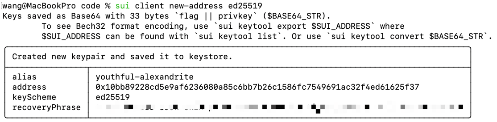
2. 获取测试网的 sui tokens：`curl --location --request POST 'https://faucet.testnet.sui.io/gas' \
   --header 'Content-Type: application/json' \
   --data-raw '{"FixedAmountRequest":{"recipient":"<WALLET ADDRESS>"}}'` 
   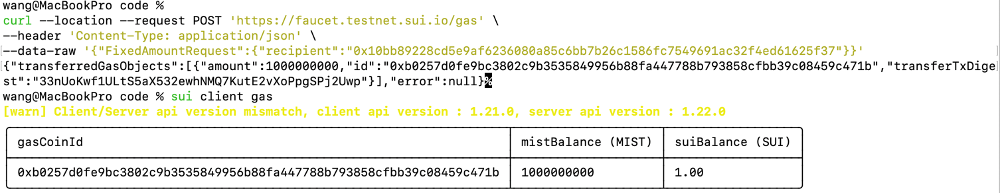
3.  发布合约：`sui client publish --gas-budget=20000000`
   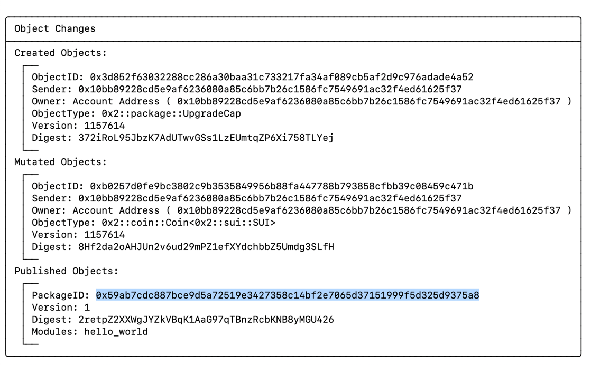

# Task 2
1. 发布合约 `sui client publish --gas-budget=40000000`
   * 拿到 faucet_coin 的 object id 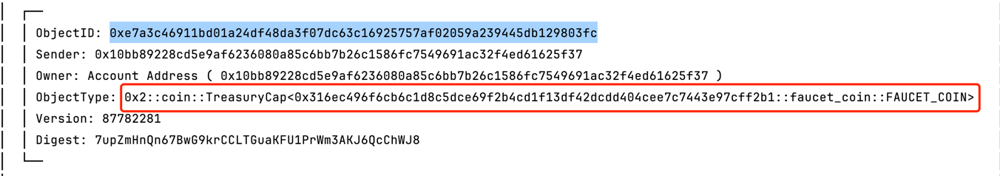
   * 拿到 my_coin 的 object id 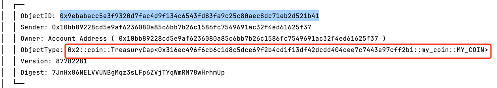
   * 拿到 my_coin 与 faucet_coin 的 package id 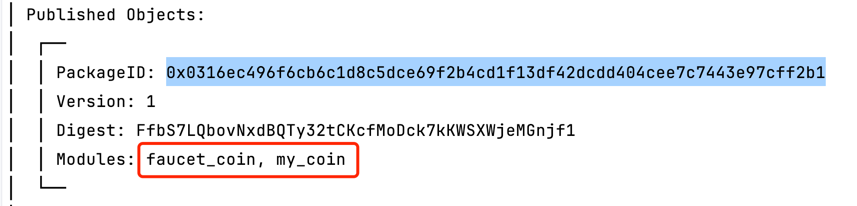
2. 转账 `sui client call --function mint --module my_coin --package $PACKAGE_ID --args $MY_COIN 100000000000 $ADDRESS --gas-budget 20000000`
   * 拿到 hash 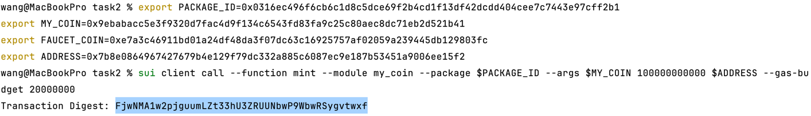

# Task 3
1. 发布合约 `sui client publish --gas-budget=20000000`
   * 拿到 package id
    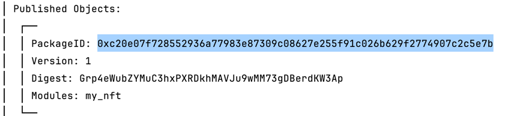
2. 创建 nft `sui client call --function mint_to_sender --module my_nft --package $PACKAGE_ID --args "DiHuangXia" "github DiHuangXia profile" "https://github.com/DiHuangXia" --gas-budget 20000000`
   * 拿到 nft 的 object id
     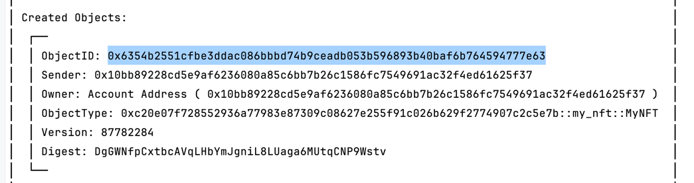
   * 查看 nft 所有者，与当前钱包的地址是一致的 `sui client object $NFT_ID`
     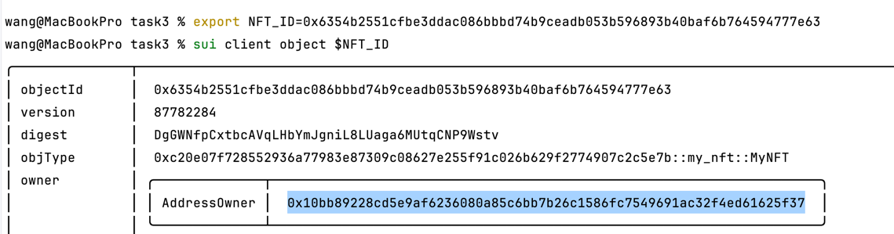
3. 将 nft 发送出去 `sui client call --function transfer --module my_nft --package $PACKAGE_ID --args $NFT_ID $RECIPIENT_ADDRESS --gas-budget 20000000`
   * 拿到 hash
     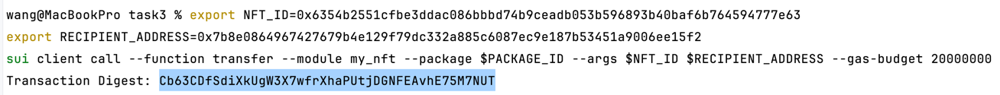
   * 查看 nft 拥有者 `sui client object $NFT_ID`，与上述接收者一致
     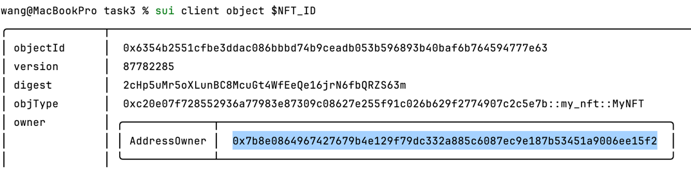

# Task 4
1. 发布合约 `sui client publish --gas-budget=20000000`
   * 拿到 package id
   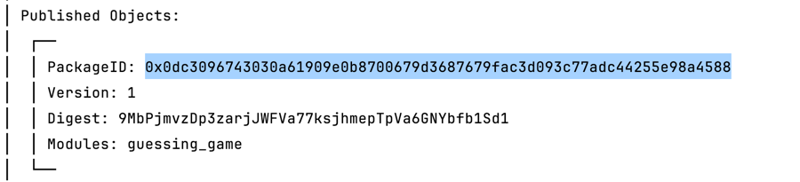
2. 玩一局游戏 `sui client call --function play --module guessing_game --package $PACKAGE_ID --args 0 0x6 --gas-budget 20000000`
   * 拿到 hash
   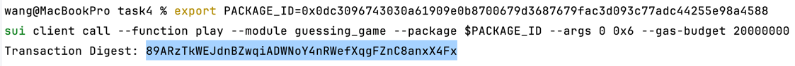

# Task 5
1. 发布合约 `sui client publish --gas-budget=20000000`
   * 拿到 package id
   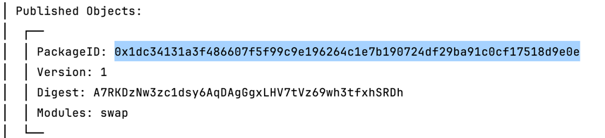
3. 根据 Task 3 的合约，生成两个 nft
    * 拿到 object id 和 type
   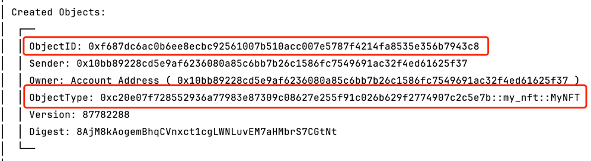
   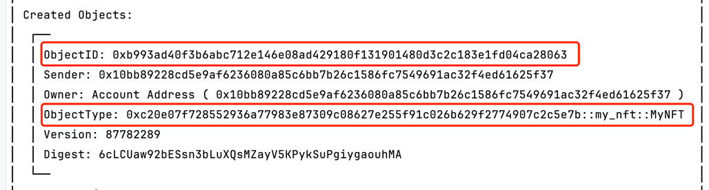
3. 创建 nft 1 换取 nft 2 的一个交换 `sui client call --function create --module swap --package $SWAP_PACKAGE_ID --type-args $NFT_1_TYPE $NFT_2_TYPE --args $RECIPIENT_ADDRESS $NFT_1_ID $NFT_2_ID --gas-budget 20000000`
   * 拿到创建交换的 hash 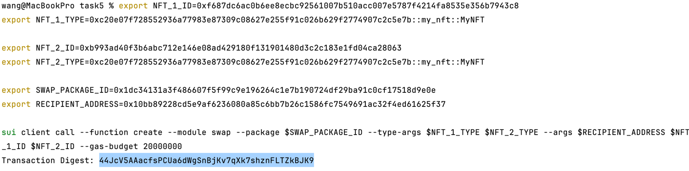
   * 拿到抵押物的 id
   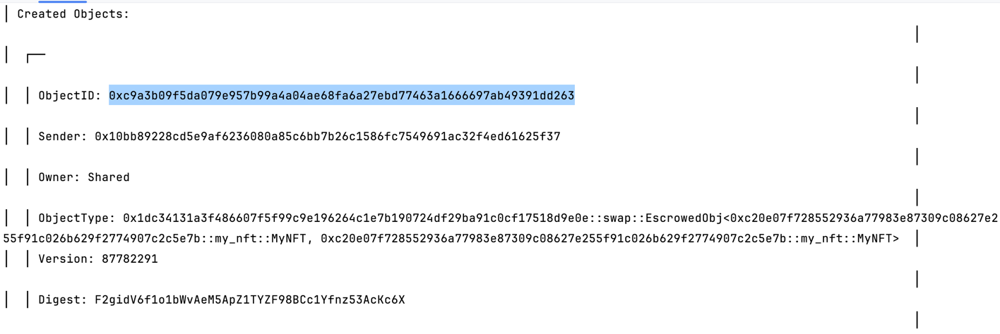
   * 查看 nft 2，`sui client object $NFT_2_ID` nft 2 已被抵押
   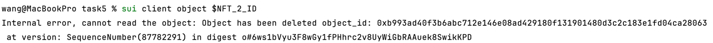
4. 开始交换，用 nft 1 换取 nft 2 `sui client call --function exchange --package $SWAP_PACKAGE_ID --module swap --type-args $NFT_1_TYPE $NFT_2_TYPE --args $NFT_1_ID $ESCROWED_OBJ --gas-budget 20000000`
   * 拿到完成交换的 hash 
   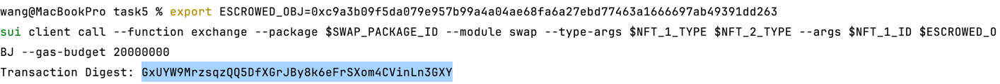
   * 再次查看 nft 2，`sui client object $NFT_2_ID`，nft 2 已交换
   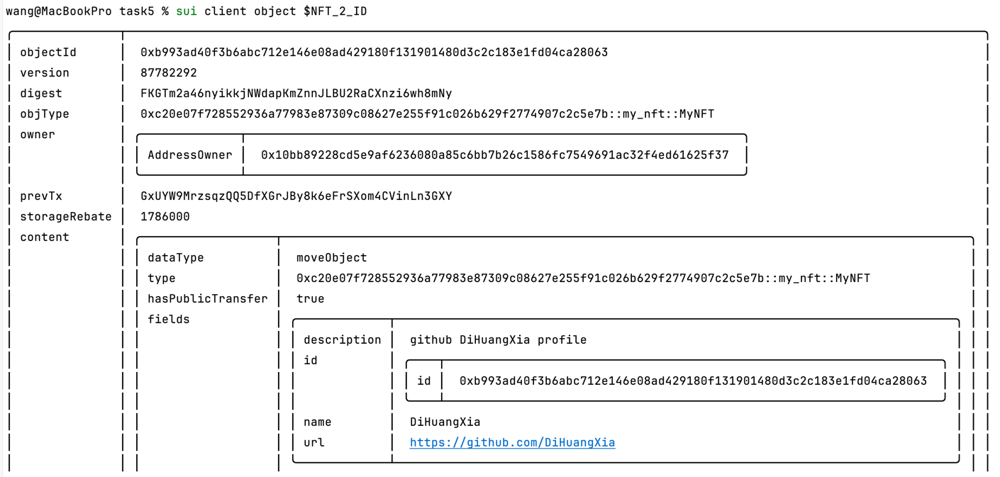