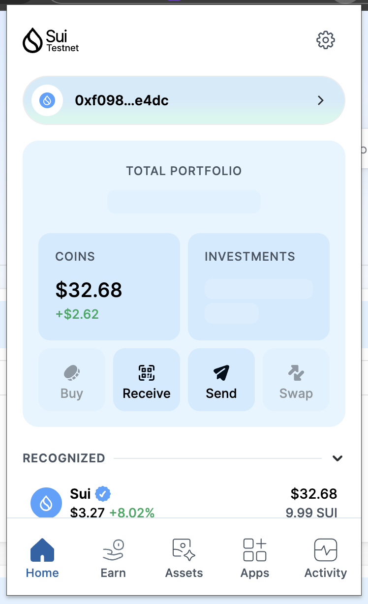
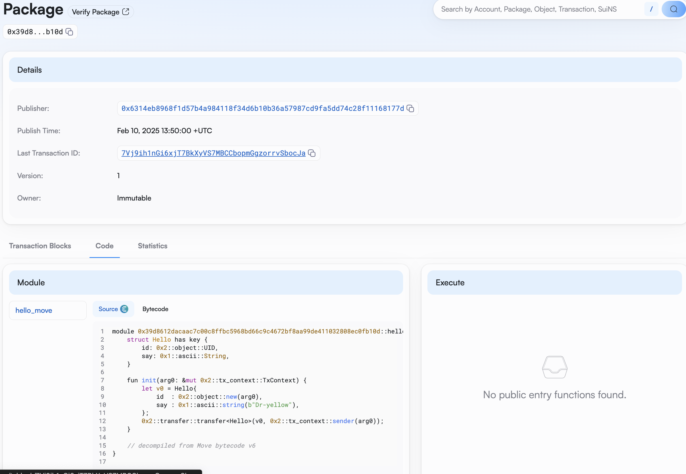
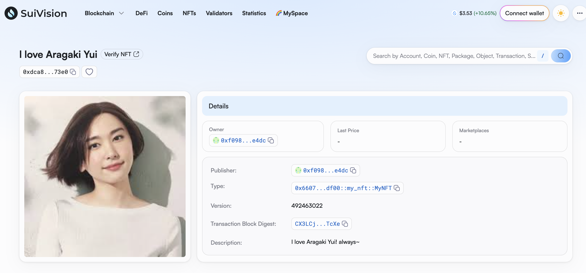

## 基本信息

- Sui 钱包地址: `0xf098fa2fdbcde298faa9271a996a52942a0d6b5f208e1f36eb49838f6337e4dc`
  > 首次参与需要完成第一个任务注册好钱包地址才被合并，并且后续学习奖励会打入这个地址
- github: `https://github.com/dr-yellow`

## 个人简介

- 工作经验:5 年
- 技术栈: `Rust` `TypeScript`
  > 重要提示 请认真写自己的简介
- 多年 web2 前端开发经验，有半年的 Dapp 开发经验，对 Move 特别感兴趣，想通过 Move 入门区块链
- 联系方式: tg: `https://t.me/Dr_yeece`

## 任务

## 01 hello move

- [] Sui cli version:sui 1.42.1-homebrew
- [] Sui 钱包截图: 
- [] package id:7Vj9ih1nGi6xjT7BkXyVS7MBCCbopmGgzorrvSbocJa
- [] package id 在 scan 上的查看截图:

## 02 move coin

- [] My Coin package id :0x5dd23a351b8e1651ecbea669ca1c5760b37bd699ba48f8b6f9355b27a15cf824
- [] Faucet package id :0x5dd23a351b8e1651ecbea669ca1c5760b37bd699ba48f8b6f9355b27a15cf824
- [] 转账 `My Coin` hash:66nX2Pou6MoFkutBorfgpRmyoPxi4mxcD1PnyEqmqxmC
- [] `Faucet Coin` address1 mint hash:HzoxVrs2rtZ4nDVQ2njUHNhLUUcMWw9sn1CuWjgHTfzd
- [] `Faucet Coin` address2 mint hash:14ceMpow9wFZ6K9dXrqzBBzP9wDZy8t1z14s9KWPke7h

## 03 move NFT

- [] nft package id :0x660789d5afac5921c15a73f337e89065690c931ce1b614e04bd7d0cdd0a2df00
- [] nft object id :0xdca81b22c5eb9634bf1054be307f4c9fdca538ac1d4b8c4057aaf91b4a1c73e0
- [] 转账 nft hash:8bPe3up7kuak8hdUV3bLj6UJxTzssUNvv5UrnSQDavdq
- [] scan 上的 NFT 截图:

## 04 Move Game

- [] game package id :
- [] deposit Coin hash:
- [] withdraw `Coin` hash:
- [] play game hash:

## 05 Move Swap

- [] swap package id :
- [] call swap CoinA-> CoinB hash :
- [] call swap CoinB-> CoinA hash :

## 06 Dapp-kit SDK PTB

- [] save hash :

## 07 Move CTF Check In

- [] CLI call 截图 : 
- [] flag hash :

## 08 Move CTF Lets Move

- [] proof :
- [] flag hash :
