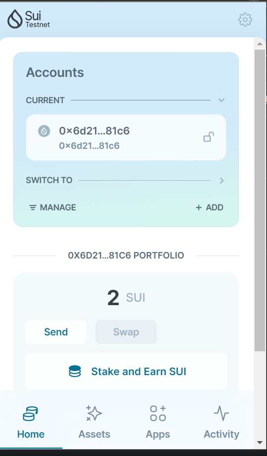
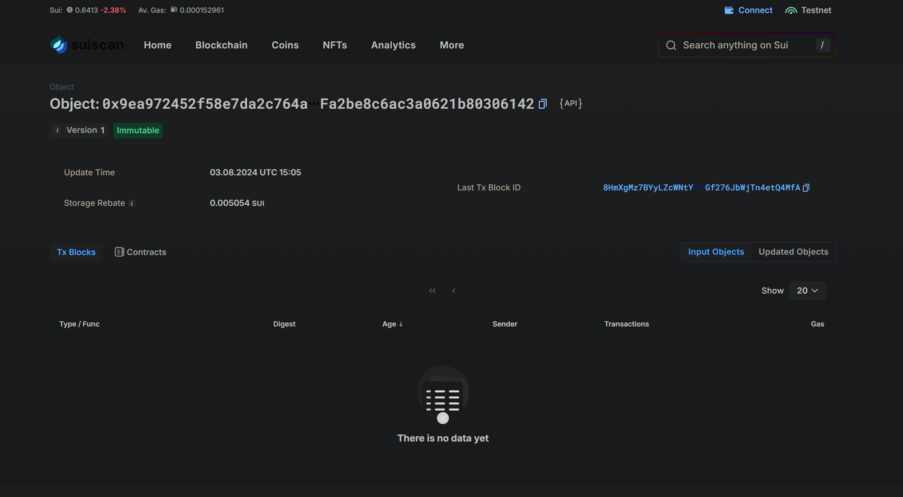
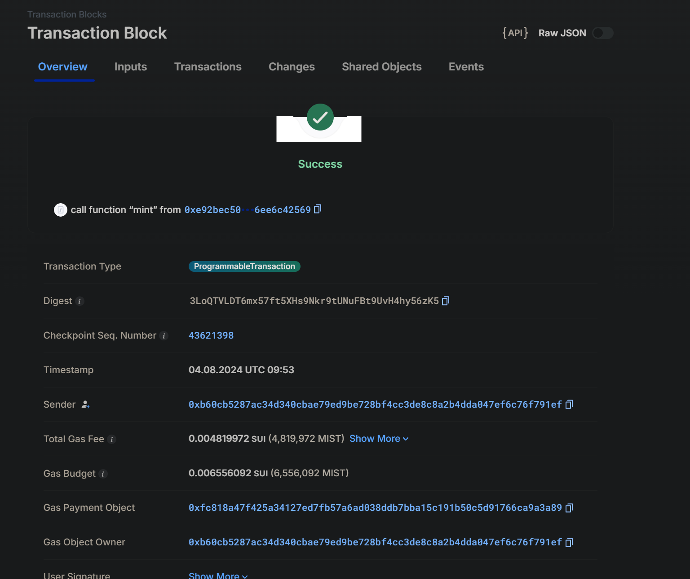
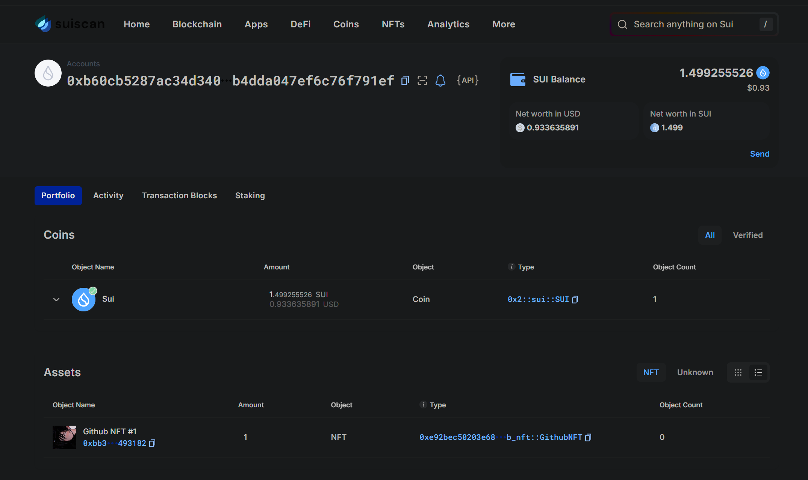

## 基本信息
- Sui钱包地址: `0xb60cb5287ac34d340cbae79ed9be728bf4cc3de8c8a2b4dda047ef6c76f791ef`
> 首次参与需要完成第一个任务注册好钱包地址才被合并，并且后续学习奖励会打入这个地址
- github: `Draculabo`

## 个人简介
- 工作经验: 3年
- 技术栈: `Frontend` `NodeJs` `Go` `Rust`
> 重要提示 请认真写自己的简介
- 多年web2开发经验，半年web3开发经验
- 联系方式: weixin: `dldtdd`

## 任务

##   01 hello move
- [] Sui cli version: 1.30.1-a4185da5659d
- [] Sui钱包截图: 
- [] package id: 0x9ea972452f58e7da2c764ae99ae7d121d199203fa2be8c6ac3a0621b80306142
- [] package id 在 scan上的查看截图:

##   02 move coin
- [] My Coin package id : 0xdaf19b1819cc1628625ef66a489e2f8f07eadd937040927b737da8173367dcb4
- [] Faucet package id : 0xdaf19b1819cc1628625ef66a489e2f8f07eadd937040927b737da8173367dcb4
- [] 转账 `My Coin` hash: 5AWYRGsBama5MedWt8rFXRak5EefFGjqZVehrPm1TBo1
- [] `Faucet Coin` address1 mint hash: 6qif5PmjdL52bkzyCKFJKQHQfApRFogB3kyZxbGzqWqx
- [] `Faucet Coin` address2 mint hash: C4UtPQUp79LvJdUtwp1AtKNLvLan3XnDTnsLBohgWKyH

##   03 move NFT
- [] nft package id : 0xe92bec50203e6843cd8619173426ee16eb54b0ef4902cad45a06556ee6c42569
- [] nft object id : 0xbb331b365be4196792807bb9dce6ef644ea81236bf714b3aa7bef8d512493182
- [] 转账 nft  hash: CKTygHcpsehjmnTwGJnhbPLvS6NA8xCJpQ3rG6NRqSpz
- [] scan上的NFT截图:
- [] scan上的NFT截图:

##   04 Move Game
- [] game package id :
- [] deposit Coin hash:
- [] withdraw `Coin` hash:
- [] play game hash:

##   05 Move Swap
- [] swap package id :
- [] call swap CoinA-> CoinB  hash :
- [] call swap CoinB-> CoinA  hash :

##   06 Dapp-kit SDK PTB
- [] save hash :

##   07 Move CTF Check In
- [] CLI call 截图 : 
- [] flag hash :

##   08 Move CTF Lets Move
- [] proof :
- [] flag hash :
