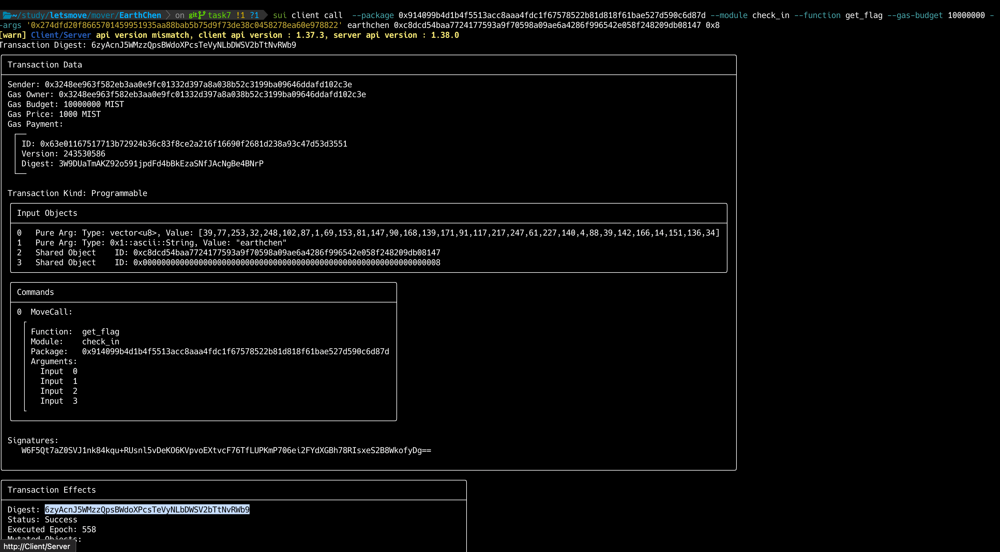

## 基本信息
- Sui钱包地址: `0x068e4c6c6b3f118a5aaa4b43e4ae7cded79fc42f3f725a79784dec0b6bd2d152`
> 首次参与需要完成第一个任务注册好钱包地址才被合并，并且后续学习奖励会打入这个地址
- github: `EarthChen`

## 个人简介
- 工作经验: 5年
- 技术栈: `Java`
> 重要提示 请认真写自己的简介
- 多年 Java 后端开发经验，对Move特别感兴趣，想通过Move入门区块链
- 联系方式: tg: `EarthChen` 

## 任务

##   01 hello move  
- [x] Sui cli version: sui 1.36.2-homebrew
- [x] Sui钱包截图: 
- [x] package id: 0x3662154617e9542cd2d82d48d8d07d81a1553b7360736ef8aa223dbfb068c924
- [x] package id 在 scan上的查看截图:

##   02 move coin
- [x] My Coin package id : 0x4bc96f381df661fb3d79e15d4139df4fb4d59b8c3f52c3c24b90a0d2f53d5fa9
- [x] Faucet package id : 0x75f3683f1fcd141ae9831aee3f74262e9ba5458cbfb71297859215dd37e9ed9f
- [x] 转账 `My Coin` hash: ADZZCZRGgQbSYmtJPMBXxNc1EE5WDd6RugLo65PcUKrw
- [x] `Faucet Coin` address1 mint hash: HgogvYavvJwpau9sivBvKipjyq4b6bVgETybLDmXwif8
- [x] `Faucet Coin` address2 mint hash: 5yFf2A8NP6bXaazgCRq9YL3rpKgvKh6zqcQN4jsYHBfv

##   03 move NFT
- [x] nft package id : 0xfab65405e3627be75f978b2f08b56ee5eed2628b58f013a6c1ecd83e346b3955
- [x] nft object id : 0x4c99c193f448ca5d85b9ee1420ba837c5bcc5326b0ace9e592a468546167cc02
- [x] 转账 nft  hash: 84F7VqM4u7AxQrWXigAXvC686pRimPrrJJCagjuTFqAN
- [x] scan上的NFT截图:

##   04 Move Game
- [x] game package id :0x472b8f0ff90d472069fb57f33a9899243debb7c3201f1dc3bb2b49d15ec537ee
- [x] deposit Coin hash: 8VXsjH2eVz1TWAc5DkAWrtPYVNoArEgVJZq8tCxnNscc
- [x] withdraw `Coin` hash: HizGTtY5FGAGuEQ3g9idAyFuP5BMh8dnH1hSKsTV9ZD8
- [x] play game hash: AjYKT5oKewnDWv9fnDvYRvoeRDBzfGuYGmPSMXGpv2cY

##   05 Move Swap
- [x] swap package id :0x6d4dd7fffe36cce18887a19a935df4cd45633546c947756ce7d45d1fbca9766e
- [x] call swap CoinA-> CoinB  hash :DXUJPhgKCNc8oMdq9gNQxRvzKPhWrZHbEwpa9bEc72S8
- [x] call swap CoinB-> CoinA  hash :8u7wjB5V3FnE4kBXF6Y1CcCpc7XPZ5o6zN9r3oQvwfs2

##   06 Dapp-kit SDK PTB
- [x] save hash :JPUo2RssPWGqhXdeGaUtr1uuhTjhgdMT9R3oFSVG5hb

##   07 Move CTF Check In
- [x] CLI call 截图 : 
- [x] flag hash : 6zyAcnJ5WMzzQpsBWdoXPcsTeVyNLbDWSV2bTtNvRWb9

##   08 Move CTF Lets Move
- [] proof : 
- [] flag hash :
