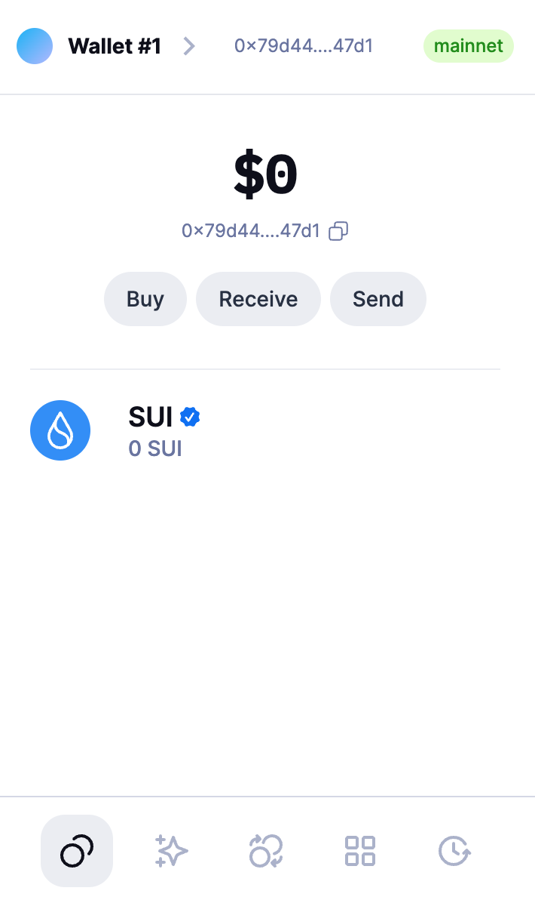
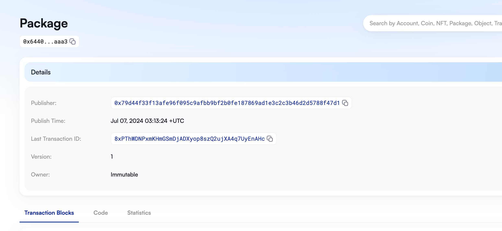
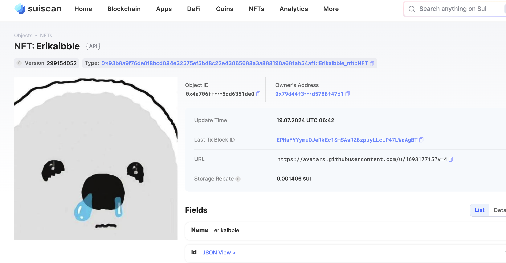
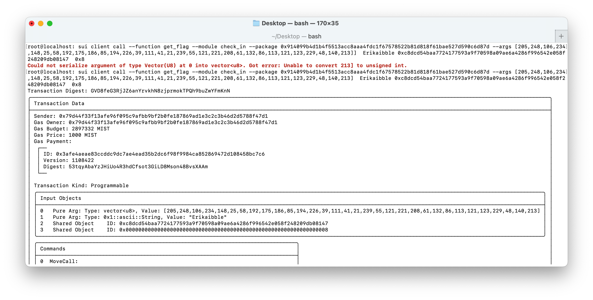

## 基本信息
- Sui钱包地址: `0x79d44f33f13afe96f095c9afbb9bf2b0fe187869ad1e3c2c3b46d2d5788f47d1 `
> 首次参与需要完成第一个任务注册好钱包地址才被合并，并且后续学习奖励会打入这个地址
- github: `Erikaibble`

## 个人简介
- 工作经验: 1年
- 技术栈: `C++`
> 重要提示 请认真写自己的简介
- 多年C++ Qt开发经验，对Move特别感兴趣，想通过Move入门区块链
- 联系方式: tg: `暂无` 

## 任务

##   01 hello move  
- [x] Sui cli version: sui-client 1.29.0
- [x] Sui钱包截图: 
- [x] package id:   0x64405c3cbc524f010a3bbdc624f84be4ec7a6cb3af29de5d6bfe553ad12eaaa3
- [x] package id 在 scan上的查看截图:

##   02 move coin
- [x] My Coin package id : 0x00cba092a7037174b482be3ee3b44cd9be4544ebe0f5397902264de5ab27cf94
- [x] Faucet package id : 0x00cba092a7037174b482be3ee3b44cd9be4544ebe0f5397902264de5ab27cf94
- [x] 转账 `My Coin` hash: Gn4sxyHyM3WzQxdmpekfU8QZR6orGDGuzB6rJDpNvcTH
- [x] `Faucet Coin` address1 mint hash: 3JibGxyMVFRVy5Kd5G6ziCjvkbQewqmixp1RiphszXkF
- [x] `Faucet Coin` address2 mint hash: 7zFEegXoFRvea3u7aPxrFXQAYC2r2VX8jzaFs9tG65B

##   03 move NFT
- [x] nft package id : 0x93b8a9f76de0f8bcd084e32575ef5b48c22e43065688a3a888190a681ab54af1
- [x] nft object id :  0x4a706ff4e9585f8df6314930164f03e30b68655f8accf3d97e84a55dd6351de0
- [x] 转账 nft  hash: FaoQ4L7Fj8q9qADGgoQxejrg2BC6EPzmqLYTLXkuJtA2
- [x] scan上的NFT截图:

##   04 Move Game
- [x] game package id : 0xedf9aad195e01bbb8e421df49f69b15a5328141b7514e4c11d40d83437fa74c2
- [x] deposit Coin hash: GBo5xh21HNiZVet4wcCWDD1wbk5T9M2T8yMtVpPFwGL2
- [x] withdraw `Coin` hash: 4GbCUiaJj7z15iMgiizXNQjLRooSKFNNrixYWzJ2xpC6
- [x] play game hash: 5R4WmD4CY2YCg8Scpbzqebb5EqJTaEi9pgWAcKPtEyiV

##   05 Move Swap
- [x] swap package id : 0x125e446c3486cb5ee0e61078e12cff4f6ac5923a7daff3b1a2a0102e09693600
- [x] call swap CoinA-> CoinB  hash : H4VnSqsPuapZTj31fNXGbU9RmFjj5wNUNSuErFqUXgbd
- [x] call swap CoinB-> CoinA  hash : 6nwFqfepFENe3omnL7dmig11qABxVEwsAxHLftiaKUjw

##   06 Dapp-kit SDK PTB
- [x] save hash : 6MVpKVjB1EK22UkiMHLcnTSiFrpFRmvXU2txz6bad9bd

##   07 Move CTF Check In
- [x] CLI call 截图 : 
- [x] flag hash : GVD8feG3RjJZ6anYrvkhN8zjprmokTPQh9buZwYFmKnN

##   08 Move CTF Lets Move
- [x] proof : ae49485f6941f67f180a
- [x] flag hash : Ae2i7T34sXmnERhQW9dDdUgN5Vjf8RDHncNRUDQFvRc9 
