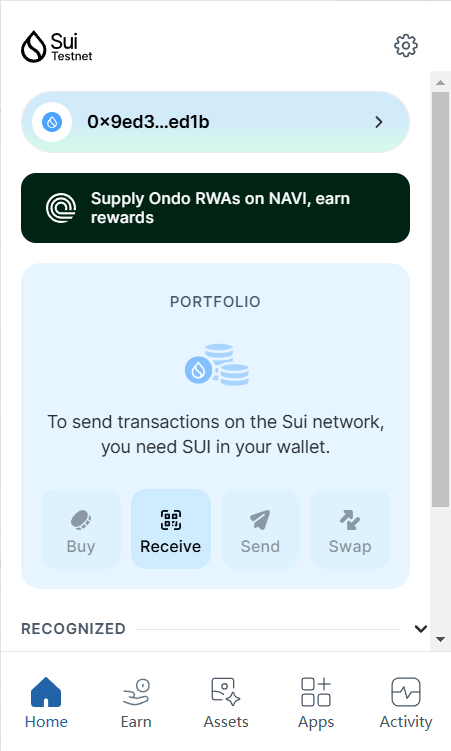
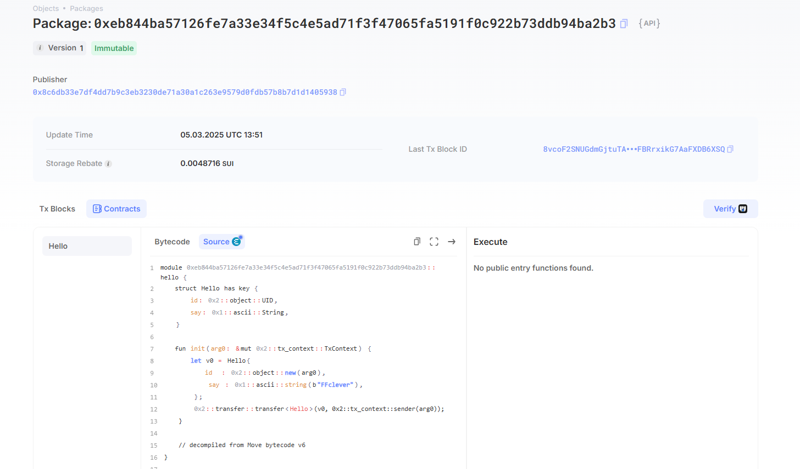

## 基本信息
- Sui钱包地址: `0x9ed396255698948d2add99757b0a5f5674427758fd9793c2f678c3c2d3c9ed1b`
> 首次参与需要完成第一个任务注册好钱包地址才被合并，并且后续学习奖励会打入这个地址
- github: `FFclever`

## 个人简介
- 工作经验: 0年
- 技术栈: `Python`
> 重要提示 请认真写自己的简介
- 刚开始学习开发，对Move特别感兴趣，想通过Move入门区块链，进入这门行业。
- 联系方式: tg: `2844494489@qq.com` 

## 任务 

##   01 hello move  
- [x] Sui cli version: sui 1.39.4-2b9ad60878db
- [x] Sui钱包截图: 
- [x] package id:  0xeb844ba57126fe7a33e34f5c4e5ad71f3f47065fa5191f0c922b73ddb94ba2b3
- [x] package id 在 scan上的查看截图:
 
##   02 move coin
- [] My Coin package id : 
- [] Faucet package id : 
- [] 转账 `My Coin` hash:
- [] `Faucet Coin` address1 mint hash:
- [] `Faucet Coin` address2 mint hash:

##   03 move NFT
- [] nft package id :
- [] nft object id : 
- [] 转账 nft  hash:
- [] scan上的NFT截图:

##   04 Move Game
- [] game package id :
- [] deposit Coin hash:
- [] withdraw `Coin` hash:
- [] play game hash:

##   05 Move Swap
- [] swap package id :
- [] call swap CoinA-> CoinB  hash :
- [] call swap CoinB-> CoinA  hash :

##   06 Dapp-kit SDK PTB
- [] save hash :

##   07 Move CTF Check In
- [] CLI call 截图 : 
- [] flag hash :

##   08 Move CTF Lets Move
- [] proof : 
- [] flag hash :

