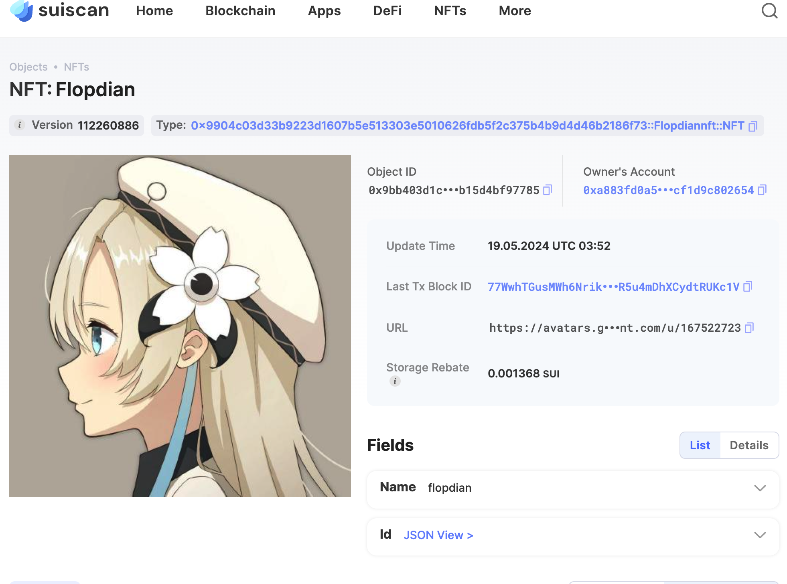

## 基本信息
- Sui钱包地址: `0xa883fd0a523a6fa17c165829501b53d37ebe0fdaccc2a8858b4ecf1d9c802654`
- 更换了钱包地址
> 首次参与需要完成第一个任务注册好钱包地址才被合并，并且后续学习奖励会打入这个地址
- github: `Flopdian`

## 个人简介
- 工作经验: 0年
- 技术栈: `Rust` `C++`
- 联系方式: tg: `secret` 

## 任务

##   01 hello move  
- [x] package id: `0x432784d02451a8836556253c85b511b4668586da125f3c804a063bc030843e4e`

##   02 move coin
- [x] My Coin package id : 0x64a774aafeabd3489f5adcd2d3c387059bacc17c4014a9302933ee658cc98aaf     
- [x] Faucet package id :  0x64a774aafeabd3489f5adcd2d3c387059bacc17c4014a9302933ee658cc98aaf     
- [x] 转账 `My Coin` hash: 316mRuEb4y1jroefCfGkJTW5euDvgNMLPmrHUDSzP7JF
- [x] `Faucet Coin` address1 mint hash: 9LBTorJYf8krJ2XXy79v4NtSLT3KYK6sAo5ioddHuMJx
- [x] `Faucet Coin` address2 mint hash: BGckc2QRddno2ioDtRzwjQdurXRgVQAS6xr1jSCypm8v

##   03 move NFT
- [x] nft package id : 0x9904c03d33b9223d1607b5e513303e5010626fdb5f2c375b4b9d4d46b2186f73  
- [x] nft object id : 0x9bb403d1caf5805c58d89f725237acc535cdad901c631933992db15d4bf97785   
- [x] 转账 nft  hash:  CpjTD5cakMKHgoZz9BppAym8hSZ3ASLGQgJu8ECUmVTW
- [x] scan上的NFT截图:

##   04 Move Game
- [x] game package id : 0x4e6b0c06a4d7c96204829c3c20e4ebcb3c1c9fd23b62ee3353324987d75b2ed5 
- [x] deposit Coin hash: FzF1eTtZ1kzCdCNcvA7PadR6FA6S7ea2rsuWKdD7BMgH
- [x] withdraw `Coin` hash:  C55VttDXghbubrpSWDRAirMKmpwLjMKhMjCMti6XBX8y
- [x] play game hash: 2xLVcj131HPdiTCPvBqdDhyfgBK7jnNX2qB1fumrdktk

##   05 Move Swap
- [x] swap package id :  0x403d306b5e6ac327434985aa227de2162621486cd0c74438239e8cc16aa76a5c
- [x] call swap CoinA-> CoinB  hash : 9ok57enSUWmCiTMB6rvx4qv4QTb2LVpf4j4VDYVp8xuX
- [x] call swap CoinB-> CoinA  hash : CzAkEQXHk18EciQGixft1u2WR5tvywJTSy621owY4apd

##   06 Dapp-kit SDK PTB
- [x] save hash : 7FuGnQ8hZX4pE7yMwpKB5DGocEub8SxWzHbzKDYNh5E2
