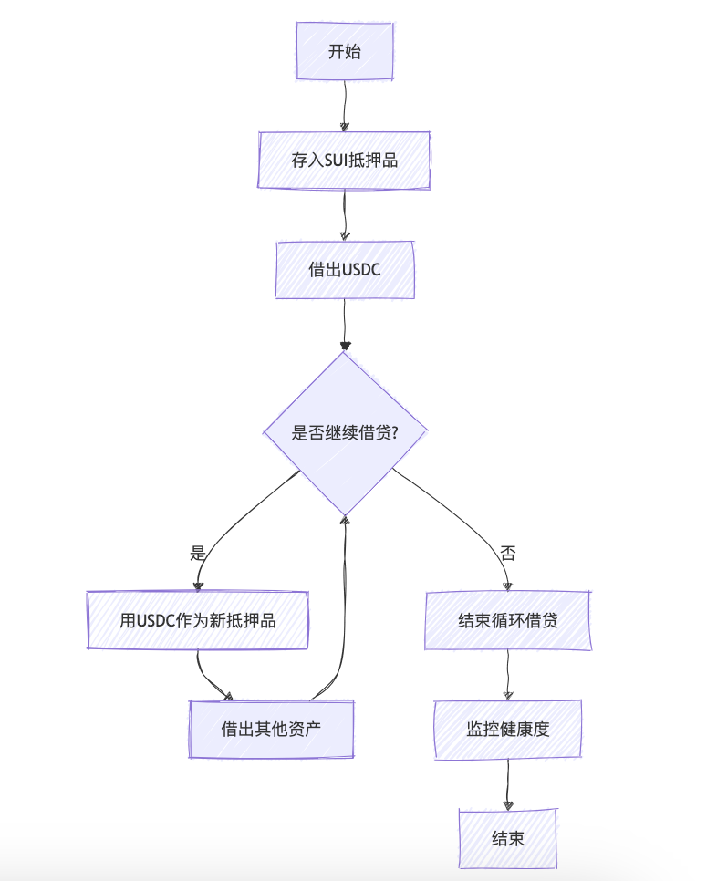
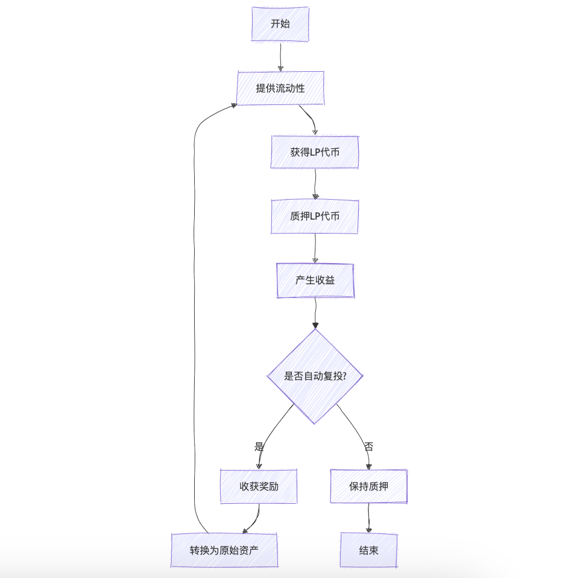
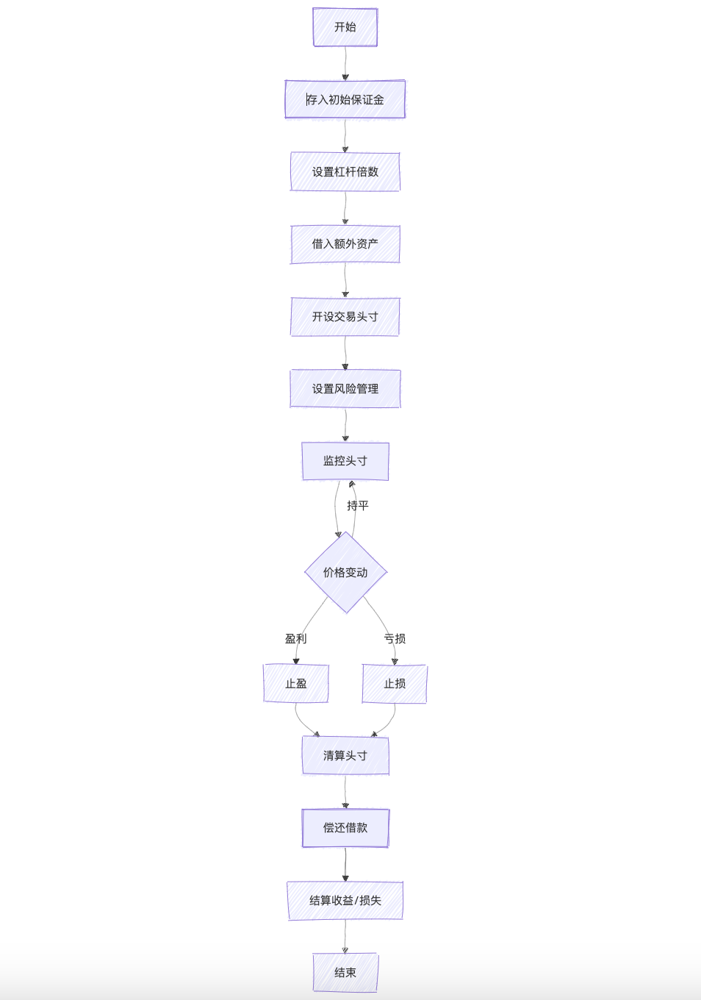

# Sui Move 学习: Navi Protocol 与 PTB 的使用
## 1.PTB (Programmable Transaction Block)概念
    PTB 是 Sui 中的交易容器，允许多个操作打包在一个原子交易（atomic transaction：原子交易是指一组操作，要么全部成功，要么全部失败。）中。在一个交易中，PTB 可以包含多个模块和函数调用，所有操作要么全部成功，要么全部失败。
## 2.PTB主要用途
    2.1 原子性操作:Navi Protocol 中的借贷操作
        1.存入抵押品（e.g. SUI）
        2.借出资产（e.g. USDC）
        3.更新用户状态
        4.更新借贷池状态
    2.2 Gas 费用优化
    （Gas 费用是指在区块链网络上执行交易或智能合约时所需支付的费用，以换取网络的计算资源和存储空间。）
        PTB 的使用可以优化Gas 费用。
        原因：多个操作打包在一个交易中，只需支付一次Gas 费用。
    2.3 复杂的交易流程
        1.Dex交易 （Dex 是 Decentralized Exchange 的缩写，中文是去中心化交易所。允许我们直接在区块链上进行点对点的资产交易，不需要中心化的中介。）
        2.跨池操作 
            例如：用户想用 SUI 换取 USDC，需要先在 Sui 池存入 SUI 作为抵押， 再在 Navi Protocol 中将 USDC 换成 SUI，再更新两个池的状态。
        3.多步骤金融操作 
            复合借贷操作
            
            Yield Farming （收益耕作）
            
             杠杆交易
            
            仅举例本人知道的交易类型，PTB 支持的交易类型还有很多。    
## 3.Navi Protocol
Navi Protocol 是一种用于 Sui 的去中心化交易协议，它允许用户在 Sui 网络上进行交易，而无需信任任何中心化机构。Navi Protocol 使用 PTB 来执行交易，并且支持多种交易类型，包括代币交易、NFT 交易等。
import {pool, Sui, wUSDC} from "navi-sdk/dist/address";
Pool & PoolConfig

wUSDC vs nUSDC 
wUSDC (Wrapped USDC) 是原始 USDC 的包装版本
主要用于在不同链或协议间实现 USDC 的互操作性。
本质上是一个 ERC20 代币，代表了在原链上锁定的 USDC。
nUSDC (Navi USDC)
是 Navi Protocol 特有的利息承载代币
代表了用户在 Navi Protocol 中存入的 USDC，价值会逐渐增加，因为它包含了存款产生的利息
总结：wUSDC 是为了跨链/跨协议使用而包装的 USDC，价值恒定 1:1，nUSDC 是 Navi Protocol 的收益代币，反映了存款本金加上累积的利息。 
| 特性 | wUSDC | nUSDC |
|------|-------|-------|
| 用途 | 交易媒介 | 存款凭证 |
| 价值锚定 | 1:1 锚定 USDC | 随时间增值 |
| 可转让性 | 可自由转让 | 协议内使用 |
| 利息 | 无 | 可赚取利息 |
| 主要场景 | 交易、支付 | 借贷、质押 |

余下内容，联系本人，若需转载原文，请注明出处。

💧  HOH水分子公众号

🌊  HOH水分子X账号

📹  课程B站账号

💻  Github仓库 https://github.com/move-cn/letsmove