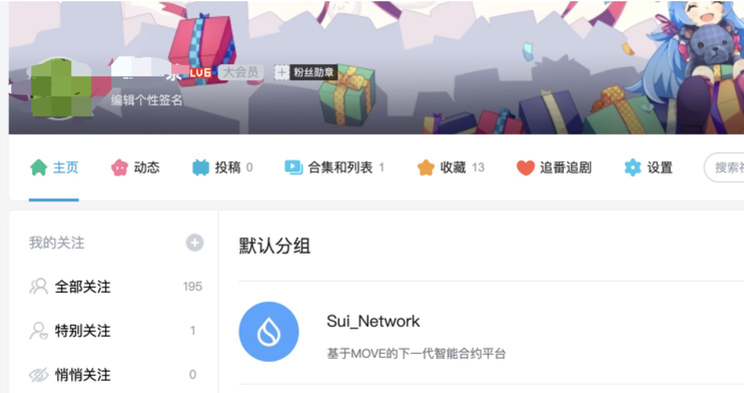
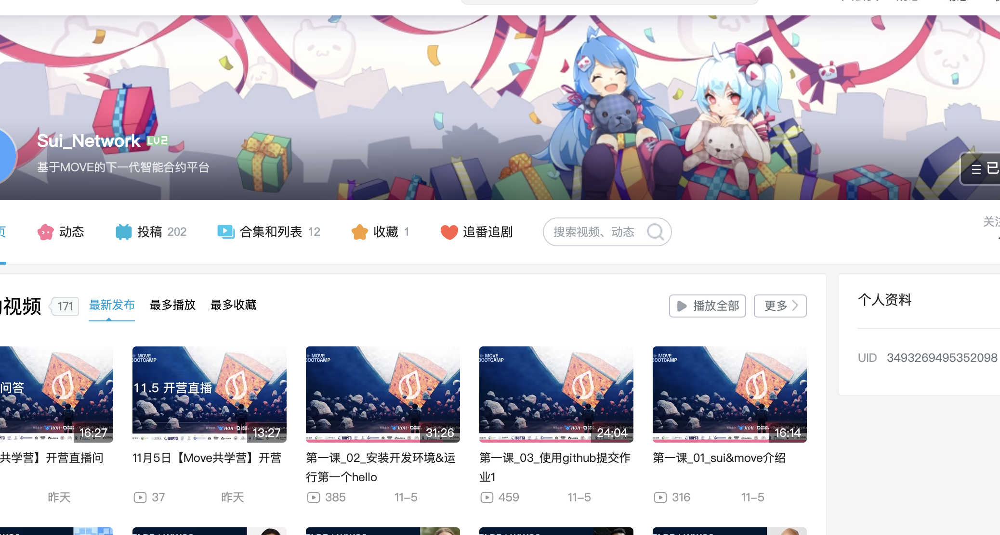
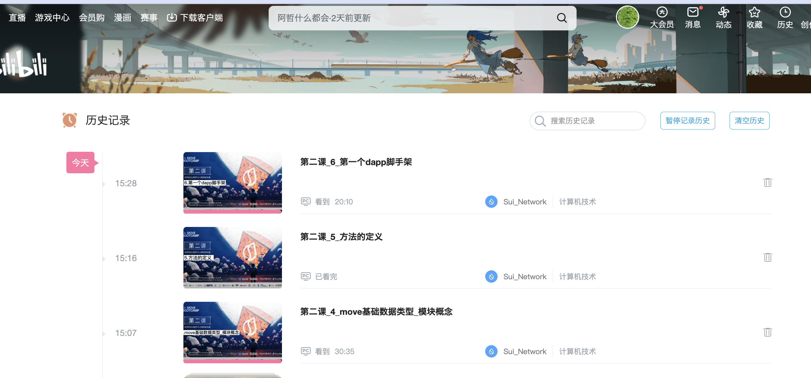
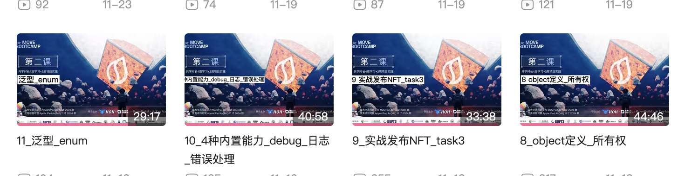
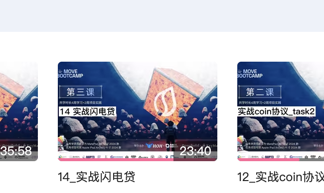
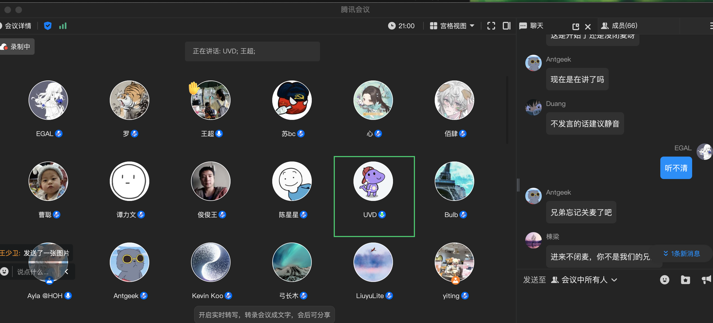
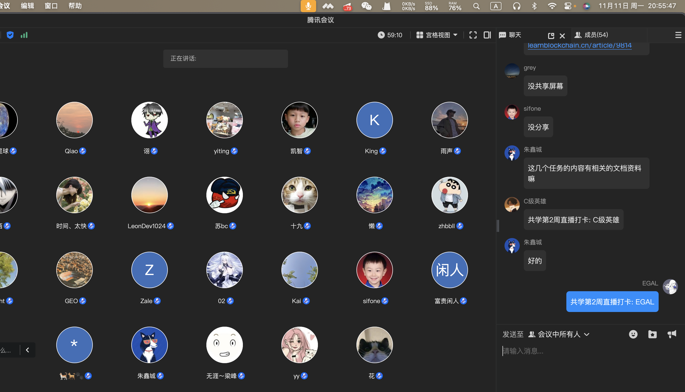
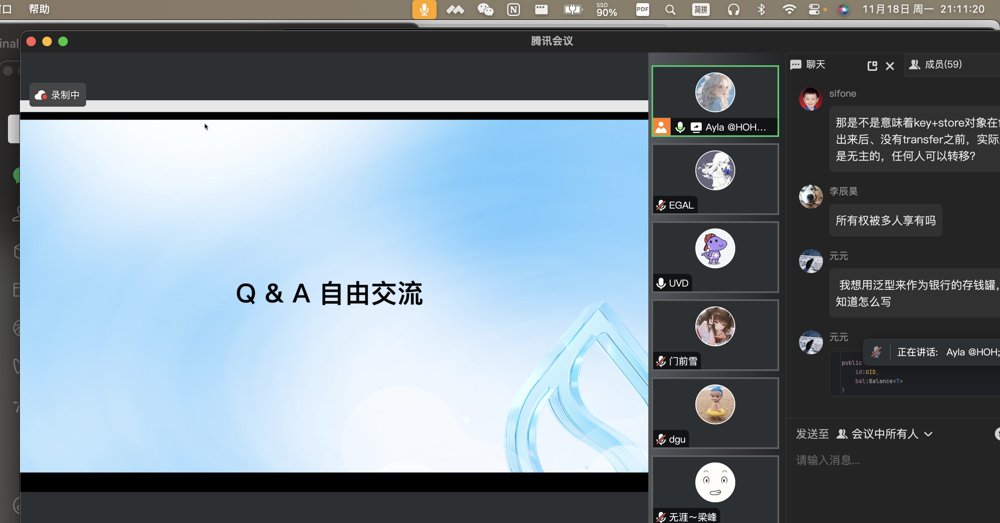
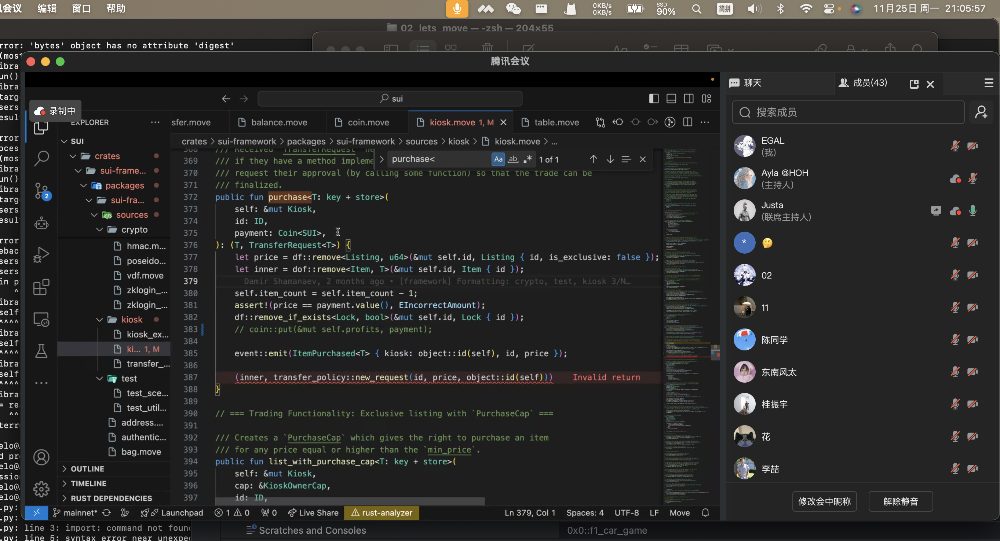

# 这个模板是2024年11月份的共学营才需要的

## b站，推特关注

- [✅] b站，推特关注截图: 

## 为共学营宣传（在朋友圈或者群聊中转发海报/文章）

- [] 宣传截图:

## 每周课程学习

- [✅] 第一周:
- [✅] 第二周:
- [✅] 第三周:
- [✅] 第四周:

## 参加直播答疑

- [✅] 第一周:
- [✅] 第二周:
- [✅] 第三周:
- [✅] 第四周:

## 群里分享学习笔记

- [✅] 第一篇笔记 :[Sui Move 学习 ：task4 链游部署](https://learnblockchain.cn/article/9824)
- [✅] 第二篇笔记：[Sui Move 学习：Task 5 Swap](https://learnblockchain.cn/article/9877) 截图在images
- [✅] 第三篇笔记：[学习记录截图](./images/task6笔记截图.png)
- [✅] 第四篇笔记：[笔记群内分享](./images/笔记群内分享.png)
- [✅] 第五篇笔记：[笔记群内分享](./images/第五篇笔记分享.png)

## 对外输出学习笔记

- [✅] 第一篇笔记【学习笔记链接】:[Sui Move 学习 ：task4 链游部署](https://learnblockchain.cn/article/9824)
- [✅] 第二篇笔记【学习笔记链接】[Sui Move 学习：Task 5 Swap](https://learnblockchain.cn/article/9877)
- [✅] 第三篇笔记【学习笔记链接】[Sui Move 学习: Navi Protocol 与 PTB （Task6：PTB、Navi 交互）](https://learnblockchain.cn/article/9947)
- [✅] 第四篇笔记【学习笔记链接】[Sui Move 学习:sui 命令总结](https://learnblockchain.cn/article/9951)
- [✅] 第五篇笔记【学习笔记链接】[Sui 区块链_可扩展且安全的Web3 Layer 1 解决方案](https://learnblockchain.cn/article/10052)

## 在HOH社区公众号发布自己的技术文章

- [] 第一篇笔记【公众号文章链接】
- [] 第二篇笔记【公众号文章链接】
- [] 第三篇笔记【公众号文章链接】
- [] 第四篇笔记【公众号文章链接】

## 直播分享学习技巧/工具推荐

- [] 会议截图:

## 提交项目

- [] 项目提交

