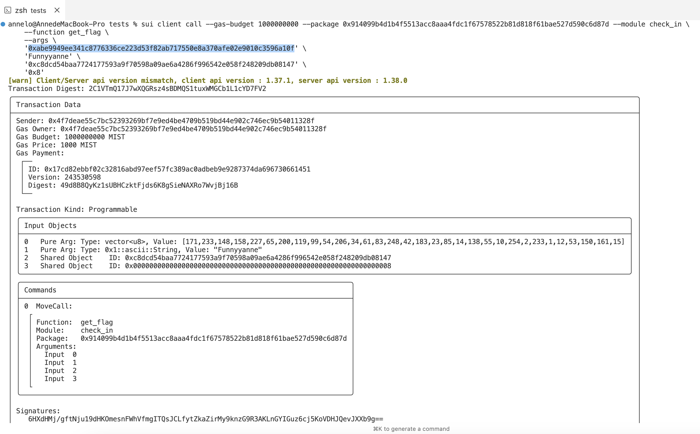

## 基本信息
- Sui钱包地址: `0x46ae399ed123f65668cdb30d2d08034d633874abf1ff989992bb7de65de97e72`
> 首次参与需要完成第一个任务注册好钱包地址才被合并，并且后续学习奖励会打入这个地址
- github: `Funnyyanne`

## 个人简介
- 工作经验: 5年
- 技术栈: `Kotlin` `Java` `Node.js` `Typescript` `Python` `JavaScript` `Dart` 
> 重要提示 请认真写自己的简介
- 多年web2开发经验，Flutter,Android，KMM，node.js全栈，正在学习web3开发入门区块链技术
- 联系方式: : `` 

## 任务

##   01 hello move  
- [✅] Sui cli version:sui 1.30.1-a4185da5659d
- [✅] Sui钱包截图: 
- [✅] package id: 0x83455e0dbb5e3948276aa65bb2a7e410c07ea5fd36b12455891d0726ac38f048
- [✅] package id 在 scan上的查看截图: 

##   02 move coin
- [✅] My Coin package id : 0x1f8d02082b92c84d74b4b524d5c425f5db43f2dd5268d22522920c94addbccbc
- [✅] Faucet package id : 0xc23a7d57739bd26fafb3daa58d4aeddcd9d17a6e205e5aaf6897f371bcf97eb2
- [✅] 转账 `My Coin` hash:8vqXCQEXEwz7TNW8zV8aKer2DGmeZRpk9hYHQzKTR1u6
- [✅] `Faucet Coin` address1 mint hash:5xVqhXTqLpEDJB89kUZCWF1rinyLPzhSEvsXXL6bVJkT
- [✅] `Faucet Coin` address2 mint hash:HuwYq57GoCT7QmM4ReGc4sTys26Nxz82cE7SPhiUfjvX

##   03 move NFT
- [✅] nft package id :0xb71b31896d476485c05b904df55402372e528289fea63f530b08a318dfc05cb7
- [✅] nft object id :0x99c37255c5d4fd7f8790cfff1196f385475fd590a436bc6515ed9e2cf9523e10
- [✅] 转账 nft  hash:Go7B3kYqbPkpxBt3tv4U6g6Kxywqba5kMCiq4tUfTJNS
- [✅] scan上的NFT截图:)

##   04 Move Game
- [✅] game package id :0x004a38371871a42d566603e5ea8608405e661924c3e8647934d37f2f9dc50d47
- [✅] deposit Coin hash:s5MPG3bmZGrMYRvEDREXekT5MU566ewfcHh5HrtzxuJ
- [✅] withdraw `Coin` hash:AXnwMZZ9MdGirmzecjUh5Gz9WCr7G56bg9DvKnr4u64f
- [✅] play game hash:GAUY5eMrJ86xjFN3H7TXTydKVRUQPeMSjKJEfELCGF5q

##   05 Move Swap
- [✅] swap package id :0x1365656b7973b47bd475a585464f2addd5e2c158593ed2be0cebaf9331ca1e9c
- [✅] call swap CoinA-> CoinB  hash :BvrUmqbQfxBSqCEH5RddU2eaT4Cyi5rRupTtxxSPcFTw
- [✅] call swap CoinB-> CoinA  hash :EFMWXjTE8PBXfv2WncAGB43Taqibm8SWMiyD6JR8tQoW

##   06 Dapp-kit SDK PTB
- [✅] save hash :JAbfWwAHS1VkCNtsRHtmckFpfJMSnp36CCYxa3oj7VGw

##   07 Move CTF Check In
- [✅] CLI call 截图 : 
- [✅] flag hash :2C1VTmQ17J7wXQGRsz4sBDMQS1tuxWMGCb1L1cYD7FV2

##   08 Move CTF Lets Move
- [✅] proof : [195, 57, 129, 1, 0, 0, 0, 0]
- [✅] flag hash :Ek1WgRUCpE5vfXdKZLDrZy9anyHQp9Hh2ACaSnzSqqre
