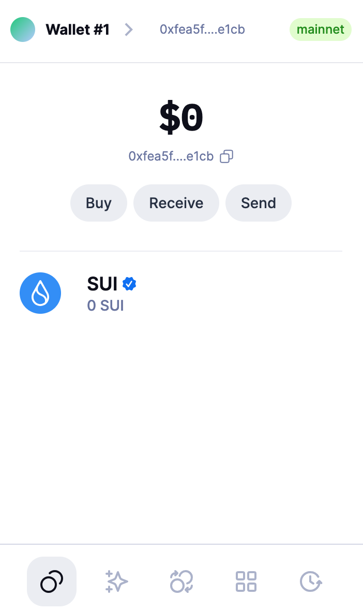
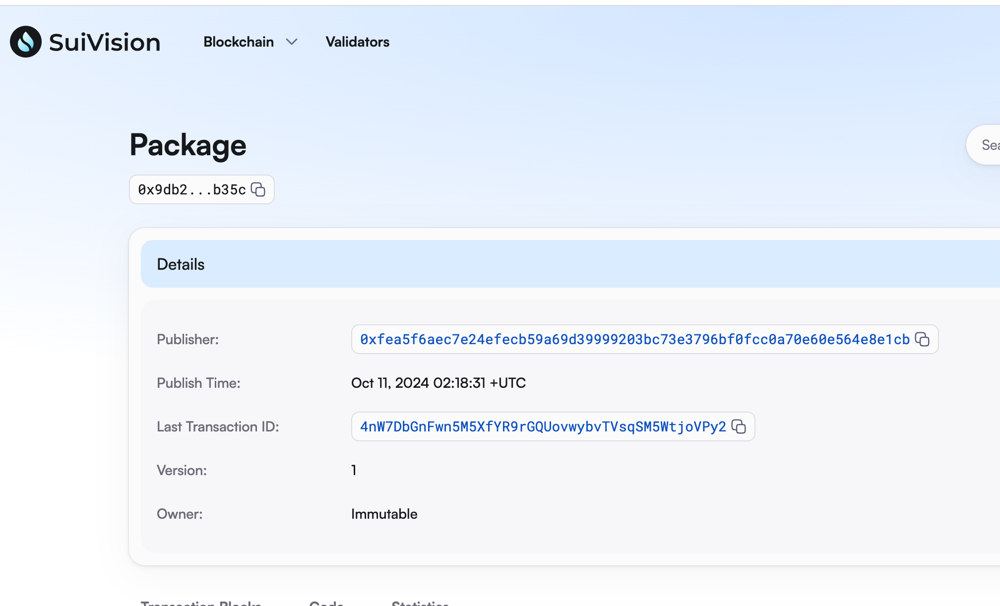
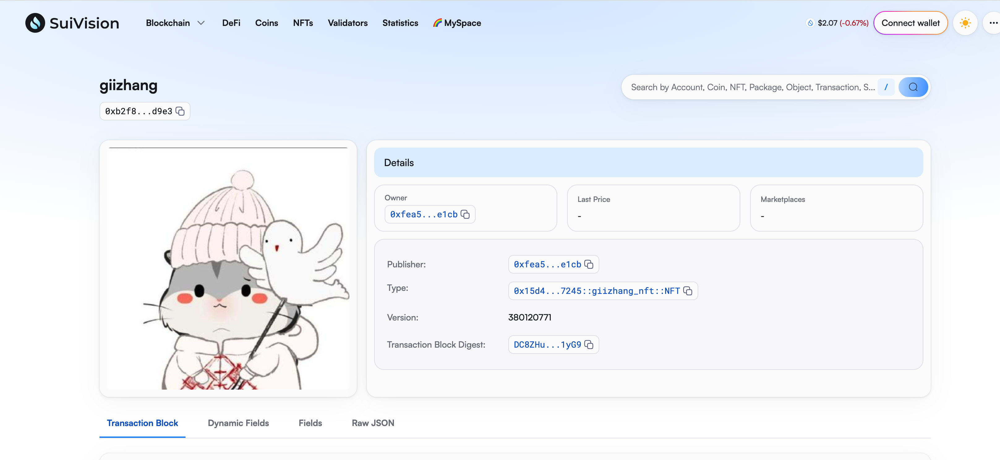

## 基本信息
- Sui钱包地址: `0xfea5f6aec7e24efecb59a69d39999203bc73e3796bf0fcc0a70e60e564e8e1cb`
> 首次参与需要完成第一个任务注册好钱包地址才被合并，并且后续学习奖励会打入这个地址
- github: `GIIZHANG`

## 个人简介
- 工作经验: 2年
- 技术栈: `JAVA`
> 重要提示 请认真写自己的简介
- 多年web2开发经验，对Move特别感兴趣，想通过Move入门区块链
- 联系方式: tg: `GRZHA` 

## 任务

##   01 hello move  
- [x] Sui cli version: sui-client 1.34.2-c9ae0f9282a0
- [x] Sui钱包截图: 
- [x] package id: 0x9db2d1993b75938a74df01f480151bfd535bb61c536215cb77012a9c2febb35c
- [x] package id 在 scan上的查看截图:

##   02 move coin
- [x] My Coin package id : 0xf8b2b94d4c27e5330870af87f8c617fd58798e8ae99683bf69e95bf294b7593d
- [x] Faucet package id :  0xf8b2b94d4c27e5330870af87f8c617fd58798e8ae99683bf69e95bf294b7593d
- [x] 转账 `My Coin` hash: VF8xdZN5ZTdwHDMbZQw4jXA86yy9hp4sHfyCogxW8rL
- [x] `Faucet Coin` address1 mint hash: DaJ7FYkKZEfndTmpLVp2YRtesxsrbsfTZ7Ts9GDKQwGb
- [x] `Faucet Coin` address2 mint hash: Ard2FKnYrJ33APbV6Tx1mdaXtpfbTdbeboXnscX9gcYG

##   03 move NFT
- [x] nft package id : 0x15d4446b92c495b5f84a54d6ac92bdc61ecbac6810b6f6e9e3c011e68aa47245
- [x] nft object id :  0xb2f8a616f85bb2b13ca210cd674138a3948faebc90525ea46a5db9849dfbd9e3
- [x] 转账 nft  hash: 3s3uQbRMeGytvkc4xvd5oq3QWkLBFxGrdicx49KuvDvu
- [x] scan上的NFT截图:

##   04 Move Game
- [] game package id :
- [] deposit Coin hash:
- [] withdraw `Coin` hash:
- [] play game hash:

##   05 Move Swap
- [] swap package id :
- [] call swap CoinA-> CoinB  hash :
- [] call swap CoinB-> CoinA  hash :

##   06 Dapp-kit SDK PTB
- [] save hash :

##   07 Move CTF Check In
- [] CLI call 截图 : 
- [] flag hash :

##   08 Move CTF Lets Move
- [] proof : 
- [] flag hash :
