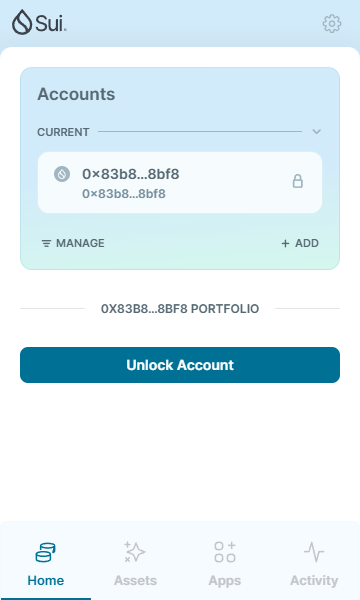

## 基本信息
- Sui钱包地址: `0x83b87f525846dd6dba5b8e9d6c59e85128403d8af18b18c014c46b4f3d188bf8`
> 首次参与需要完成第一个任务注册好钱包地址才被合并，并且后续学习奖励会打入这个地址
- github: `GZ-Zhao`

## 个人简介
- 工作经验: 0年
- 技术栈: `Java` `C++`
> 重要提示 请认真写自己的简介
- 刚开始学习web3的开发，正在学java，希望能参加黑客松比赛
- 联系方式: tg: `ErikZhao1` 

## 任务

##   01 hello move  √
- [] Sui cli version: sui 1.37.3-b8eb8920aeca
- [] Sui钱包截图: 
- [] package id: 0xc6760db1faf959e2d24c48397b0eabfabf9fb1d2f1f856cbe4b336a63215eb14
- [] package id 在 scan上的查看截图:

##   02 move coin
- [] My Coin package id : 
- [] Faucet package id : 
- [] 转账 `My Coin` hash:
- [] `Faucet Coin` address1 mint hash:
- [] `Faucet Coin` address2 mint hash:

##   03 move NFT
- [] nft package id :
- [] nft object id : 
- [] 转账 nft  hash:
- [] scan上的NFT截图:

##   04 Move Game
- [] game package id :
- [] deposit Coin hash:
- [] withdraw `Coin` hash:
- [] play game hash:

##   05 Move Swap
- [] swap package id :
- [] call swap CoinA-> CoinB  hash :
- [] call swap CoinB-> CoinA  hash :

##   06 Dapp-kit SDK PTB
- [] save hash :

##   07 Move CTF Check In
- [] CLI call 截图 : 
- [] flag hash :

##   08 Move CTF Lets Move
- [] proof : 
- [] flag hash :
