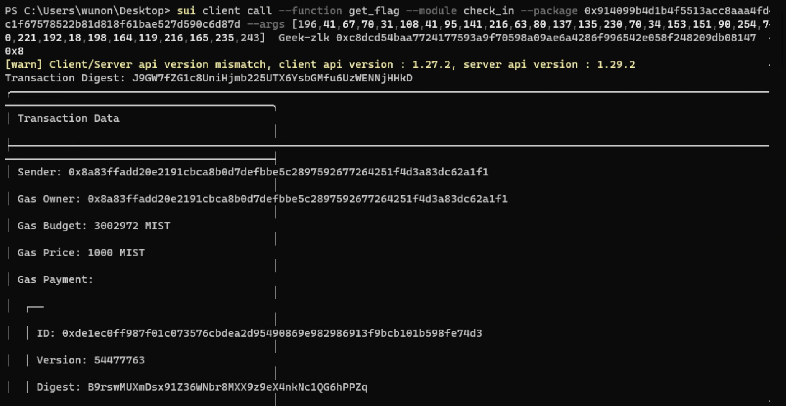

## 基本信息
- Sui钱包地址: `0x8a83ffadd20e2191cbca8b0d7defbbe5c2897592677264251f4d3a83dc62a1f1`
> 首次参与需要完成第一个任务注册好钱包地址才被合并，并且后续学习奖励会打入这个地址
- github: `Geek-zlk`

## 个人简介
- 工作经验: 2年
- 技术栈: `JS`
> 重要提示 请认真写自己的简介
- 2年前段开发经验，对Move特别感兴趣，想通过Move入门区块链
- 联系方式: tg: `zlkggglk` 

## 任务

##   01 hello move  
- [x] Sui cli version: sui-client 1.27.2-9e2be6ad4185 
- [x] Sui钱包截图: 
- [x] package id: 0x054e9c2ec20289b0097eea4babdfc248c2f994740f02a5009d987a691e155df4   
- [x] package id 在 scan上的查看截图:

##   02 move coin
- [x] My Coin package id : 0x371938ce3f96b99720eaf1083e1d36a62d052fa5d315e5b3f066e526e1961551 
- [x] Faucet package id : 0x371938ce3f96b99720eaf1083e1d36a62d052fa5d315e5b3f066e526e1961551 
- [x] 转账 `My Coin` hash: CumMLeZcq6RacmR9fLJu3VEmWTQVrC8ZNGZSh3WfmDgC
- [x] `Faucet Coin` address1 mint hash: AZUyC2NnvJx2ZetQoq5zgTuiQJHPCPRsBKc9bKrPSePk
- [x] `Faucet Coin` address2 mint hash: KPjfR9cvaPXKWE3ynVaNaGUk9KEAKmiDjEgDpdwyHQ9

##   03 move NFT
- [x] nft package id :  0xc382bed9abaf63354be157bef3ce2c0ef9e1a5901b701e2fc555b2d977ec67ed       
- [x] nft object id : 0xa24bc3d3328330fedc23e577e67e2edc2ae694ce9388ef0675edededc89ad3c0      
- [x] 转账 nft  hash:  6s9DcCoRVyJoXs4rRmoUpgHXteFLBeSL12KFxejajHd8
- [x] scan上的NFT截图:

##   04 Move Game
- [x] game package id : 0x2068eb036e9979416f64b7c1c585c63cb5609b4af832d0b894b6272391f8ecea 
- [x] deposit Coin hash: FbCaftXwQLuJV99aGQ1CdTk1t52sRTNdDPfSK6VjdzAG
- [x] withdraw `Coin` hash: 3NsUJGMNWPhUN5oHPmdCSCw4uCbtEcDeeiSpGfhJ7BMH
- [x] play game hash: EefpeZDi6wcdqkyfu4ytbiYh9d6ZJuN6UHBbpQkvhX4x

##   05 Move Swap
- [x] swap package id : 0x9f4bfb2224e7d8b94cde9c7d0c58b3410162f8acf89d38889eef182da1924b46   
- [x] call swap CoinA-> CoinB  hash : GGj8h33JEBy7DcKh22iErMRe1z32XDmg8Dhss91XKXez
- [x] call swap CoinB-> CoinA  hash : 7mCeLNCEtrrp1kihrmnaoBqcRhHDa9HbbZhnf9BqATcf

##   06 Dapp-kit SDK PTB
- [x] save hash : 84JWFrKa1woNASYskNgysb6woRXs8WCYkRcgbJ3JWVRj

##   07 Move CTF Check In
- [x] CLI call 截图 : 
- [x] flag hash : J9GW7fZG1c8UniHjmb225UTX6YsbGMfu6UzWENNjHHkD

##   08 Move CTF Lets Move
- [x] proof : e9dbd0c9cd2ce66a6c57
- [x] flag hash : FaN82jfLs4ZWVMKE5DMWY2SWnyJowomVPqWQGVki4UfM