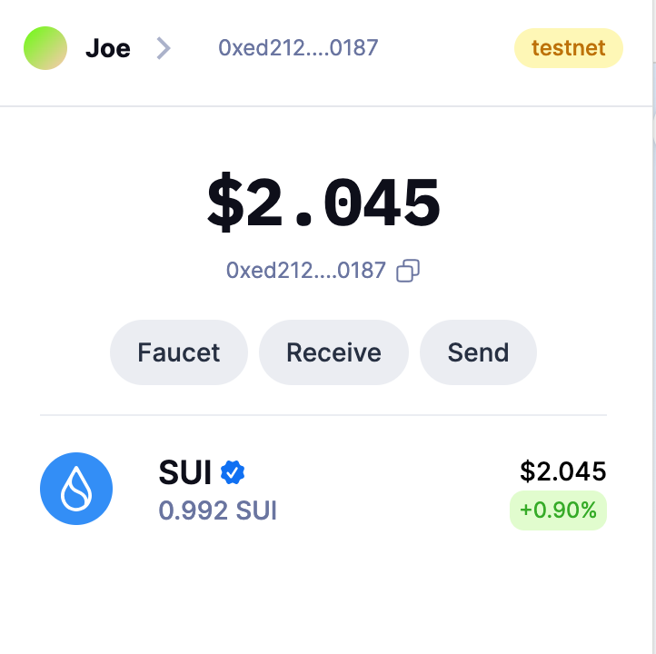
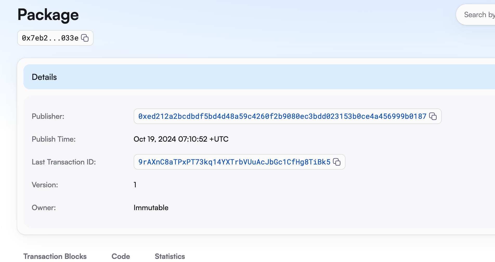
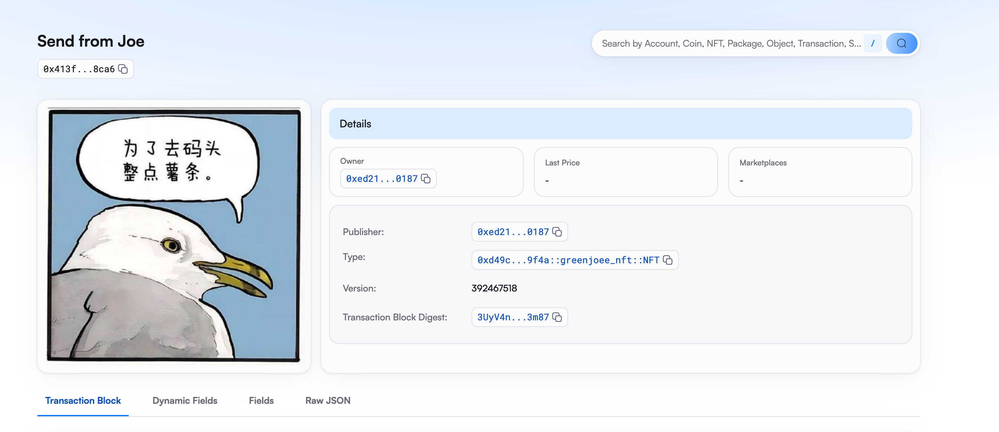

## 基本信息
- Sui钱包地址: `0xed212a2bcdbdf5bd4d48a59c4260f2b9080ec3bdd023153b0ce4a456999b0187`
> 首次参与需要完成第一个任务注册好钱包地址才被合并，并且后续学习奖励会打入这个地址
- github: `GreenJoee`

## 个人简介
- 工作经验: 4年
- 技术栈: `Java`
> 重要提示 请认真写自己的简介
- 多年web2开发经验，对Move特别感兴趣，想通过Move入门区块链
- 联系方式: tg: `JoeGrre` 

## 任务

##   01 hello move  
- [x] Sui cli version: 1.35.1
- [x] Sui钱包截图: 
- [x] package id:  0x7eb2a398b8588385930d47149c76b0c8faa86eef113c55ed55d5b0596850033e
- [x] package id 在 scan上的查看截图:

##   02 move coin
- [x] My Coin package id :  0x6cd45e877b2427ec332bed1e67f8037aa597f7999dd88968565f125af6a7a7b8
- [x] Faucet package id :  0x6cd45e877b2427ec332bed1e67f8037aa597f7999dd88968565f125af6a7a7b8
- [x] 转账 `My Coin` hash: AcLX5sK1gbYou7iaT3M17CxMHNN96aZWcJTNYfB5FQJj
- [x] `Faucet Coin` address1 mint hash: 9G1Dug2mPeVzrx8aJoPXbzgHmK9YXtAyYv61Bx8xDzq5
- [x] `Faucet Coin` address2 mint hash: DNmuunkbsE4pxgnwPrTDdXWF4EMfSWopp6JfSW4dQXTm

##   03 move NFT
- [x] nft package id : 0xd49c4d775165ba377dd54390079d66da6cbba15059f9db02d4d8f5fe7d509f4a
- [x] nft object id :  0x413f201716d3f5d0a81ce745846b428effe9aa46fe512dec076547563c8c8ca6
- [x] 转账 nft  hash:  6uua2nvNDig3We9XRQ9qxE3ET3mDnPBMSjxXSeUKVixq
- [x] scan上的NFT截图:

##   04 Move Game
- [] game package id :
- [] deposit Coin hash:
- [] withdraw `Coin` hash:
- [] play game hash:

##   05 Move Swap
- [] swap package id :
- [] call swap CoinA-> CoinB  hash :
- [] call swap CoinB-> CoinA  hash :

##   06 Dapp-kit SDK PTB
- [] save hash :

##   07 Move CTF Check In
- [] CLI call 截图 : 
- [] flag hash :

##   08 Move CTF Lets Move
- [] proof : 
- [] flag hash :
