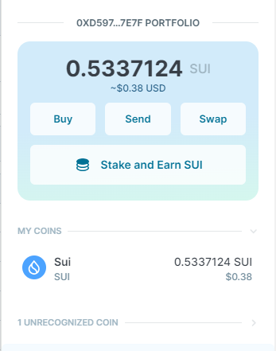
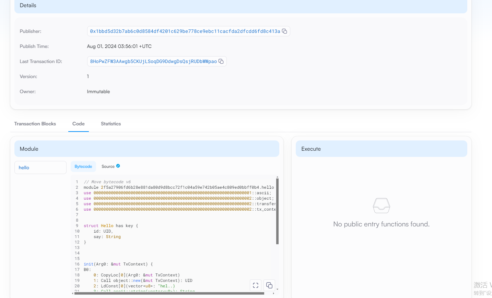

## 基本信息

- Sui钱包地址: 0xd597b66546c45e694ea0dab519def73ac1a1a59180a16111659896cf02747e7f
  
  > 首次参与需要完成第一个任务注册好钱包地址才被合并，并且后续学习奖励会打入这个地址

- github: GroundedPig

## 个人简介

- 工作经验: 6年
- 技术栈: java
- 联系方式: 微信群

## 任务

## 01 hello move

- [x] Sui cli version: 1.29.2-09db80adf1af
- [x] package id: 0x2f5a27906fd6b28e881da80d9d8bcc72f1c04a59e742b05ae4c809ed0bbff0b4
- [x] Sui钱包截图: 
- [x] package id 在 scan上的查看截图:

##   02 move coin
- [] My Coin package id :
- [] Faucet package id :
- [] 转账 `My Coin` hash:
- [] `Faucet Coin` address1 mint hash:
- [] `Faucet Coin` address2 mint hash:

##   03 move NFT
- [] nft package id :
- [] nft object id :
- [] 转账 nft  hash:
- [] scan上的NFT截图:

##   04 Move Game
- [] game package id :
- [] deposit Coin hash:
- [] withdraw `Coin` hash:
- [] play game hash:

##   05 Move Swap
- [] swap package id :
- [] call swap CoinA-> CoinB  hash :
- [] call swap CoinB-> CoinA  hash :

##   06 Dapp-kit SDK PTB
- [] save hash :

##   07 Move CTF Check In
- [] CLI call 截图 : 
- [] flag hash :

##   08 Move CTF Lets Move
- [] proof :
- [] flag hash :
