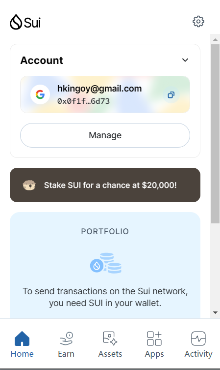
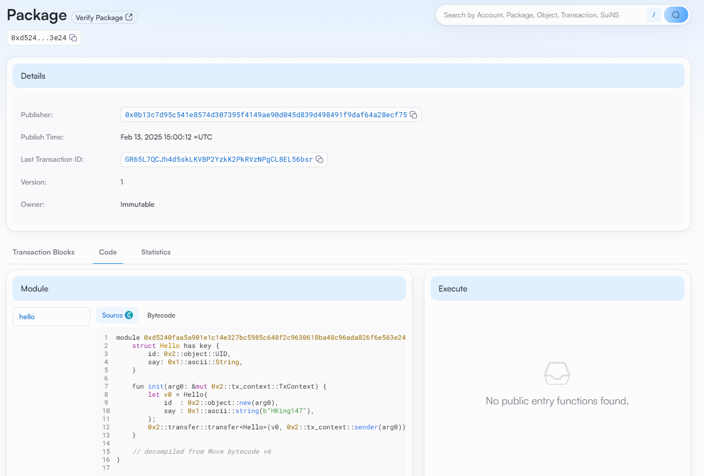
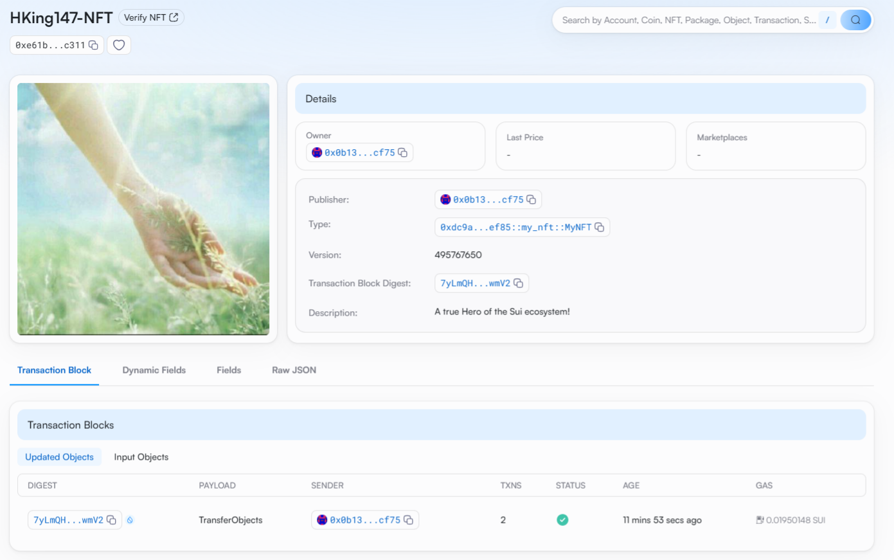

## 基本信息
- Sui钱包地址: `0x0b13c7d95c541e8574d307395f4149ae90d045d839d498491f9daf64a28ecf75`
> 首次参与需要完成第一个任务注册好钱包地址才被合并，并且后续学习奖励会打入这个地址
- github: `HKing147`

## 个人简介
- 工作经验: 6年
- 技术栈: `C++` `Python` `Go`
> 重要提示 请认真写自己的简介
- 多年web2开发经验，对Move特别感兴趣，想通过Move入门区块链
- 联系方式: tg: `HKing OY` 

## 任务

##   01 hello move  
- [x] Sui cli version: sui 1.42.2-homebrew
- [x] Sui钱包截图: 
- [x] package id: 0xd5240faa5a901e1c14e327bc5985c648f2c9630618ba48c96ada826f6e563e24
- [x] package id 在 scan上的查看截图:

##   02 move coin
- [x] My Coin package id : 0x48da4710c1f55a2ac3051424bda5abaf7009fdd8105a6d780bfd38cd4a10a922
- [x] Faucet package id : 0x48da4710c1f55a2ac3051424bda5abaf7009fdd8105a6d780bfd38cd4a10a922
- [x] 转账 `My Coin` hash: E4bB5zVKNTCfWHnCgkNd3YkZbt2XJ24eLX5kYy73Ajzf
- [x] `Faucet Coin` address1 mint hash: 9vnnFt5ZtVt7Ggj1nbFyXoDfF1Em7bVR2ZqJMmUKoZ3C
- [x] `Faucet Coin` address2 mint hash: ExhkVCDSEa7Zw93SBhiqUofVXtVawTjvLKsQr4Ve9bvH

##   03 move NFT
- [x] nft package id : 0xdc9ab71a1ebeaf7548e3e8919bbb01ef2a42124b6902fbcc9c520b7d7321ef85
- [x] nft object id : 0xe61bb6ef52c522aae20594cf67eba47f6fe24798a21c4b2d0896ed7e58d3c311
- [x] 转账 nft  hash: 7yLmQHXX8vc1cK1KzAQABXprD3aasNu4HBS72o8wwmV2
- [x] scan上的NFT截图:

##   04 Move Game
- [] game package id :
- [] deposit Coin hash:
- [] withdraw `Coin` hash:
- [] play game hash:

##   05 Move Swap
- [] swap package id :
- [] call swap CoinA-> CoinB  hash :
- [] call swap CoinB-> CoinA  hash :

##   06 Dapp-kit SDK PTB
- [] save hash :

##   07 Move CTF Check In
- [] CLI call 截图 : 
- [] flag hash :

##   08 Move CTF Lets Move
- [] proof : 
- [] flag hash :

