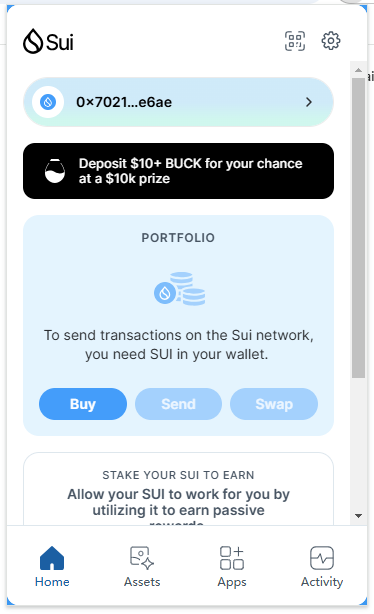
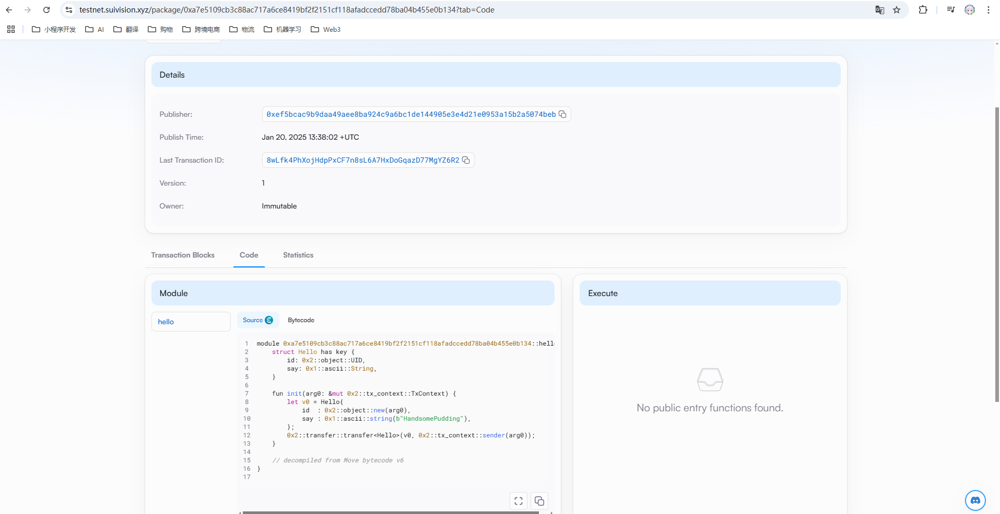

## 基本信息
- Sui钱包地址: `0x70217ebfeb440b37a7acb7567801007981014e292e274f874ccb90fec170e6ae`
> 首次参与需要完成第一个任务注册好钱包地址才被合并，并且后续学习奖励会打入这个地址
- github: `HandsomePudding`

## 个人简介
- 工作经验: 1.5年
- 技术栈: `Java`
> 重要提示 请认真写自己的简介
- 负责支付相关的业务，对于区块链的了解仅仅停留在调用过Polygon转账的API，想深入了解一下区块链
- 联系方式: QQ: `2039527370` 

## 任务

##   01 hello move  
- [√] Sui cli version: sui 1.40.3-fea2f2707d4a
- [√] Sui钱包截图: 
- [√] package id: 0xa7e5109cb3c88ac717a6ce8419bf2f2151cf118afadccedd78ba04b455e0b134
- [√] package id 在 scan上的查看截图:

##   02 move coin
- [] My Coin package id : 0x9ca86ce825f7edb7ecb299bc020402df76133eb516ef63963fc3094f21b73331
- [] Faucet package id : 0xa11ac0b1fe1c294f5677d60111e9baa883aff4988683ec13555adc1d7be2b76e
- [] 转账 `My Coin` hash: 9xGH5JUMAwZ2ttiK5qmZRbdwRt9RsgT7utc3J3uEEn8r
- [] `Faucet Coin` address1 mint hash: Fy9ZfnidhM6KCu8zkABNkKnXFpKWXJmsNjznz1Q5dAcf
- [] `Faucet Coin` address2 mint hash: Cfx2L3YS7AMKbXMi4ZkH9goDumiguqBaZ116qMy11wgf

##   03 move NFT
- [] nft package id :
- [] nft object id : 
- [] 转账 nft  hash:
- [] scan上的NFT截图:

##   04 Move Game
- [] game package id :
- [] deposit Coin hash:
- [] withdraw `Coin` hash:
- [] play game hash:

##   05 Move Swap
- [] swap package id :
- [] call swap CoinA-> CoinB  hash :
- [] call swap CoinB-> CoinA  hash :

##   06 Dapp-kit SDK PTB
- [] save hash :

##   07 Move CTF Check In
- [] CLI call 截图 : 
- [] flag hash :

##   08 Move CTF Lets Move
- [] proof : 
- [] flag hash :

