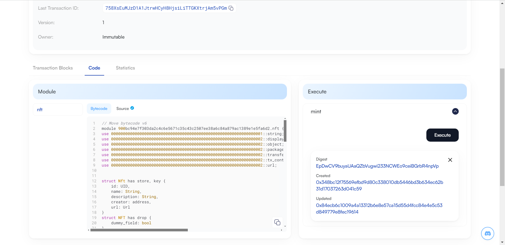

## 基本信息
- Sui钱包地址: `0xd3612acfa508e80805f815542812b47da5b774f4929744b69fc4b610fcafaf68`
> 首次参与需要完成第一个任务注册好钱包地址才被合并，并且后续学习奖励会打入这个地址
- github: `Heemale`

## 个人简介
- 工作经验: 2.5年
- 技术栈: `React` `Nodejs` `Solidity`
- 多年web2开发经验，对Move特别感兴趣，想通过Move入门区块链。
- 联系方式: tg: [`heemale`](https://t.me/heemale)

## 任务

##   01 hello move
- [x] package id: 0x7f3c649fd0f706ff051779203d4e7bcd809aa6873009bb302e398001a8ab1f9c

##   02 move coin
- [x] My Coin package id : 0x708db97a44f5dc7d11c73fe7a1d823d8a4744f5a2f883f2fbffa362c70678db2
- [x] Faucet package id : 0x708db97a44f5dc7d11c73fe7a1d823d8a4744f5a2f883f2fbffa362c70678db2
- [x] 转账 `My Coin` hash: 9pNyKfJAsF5raCRw4GeAZrgFu27FtS3jgFv12CMseUgx

##   03 move NFT
- [x] nft package id : 0x900bc94e7f303da2c4c6e5671c35c43c2507ee38a6c84a879ac1389e1e5fa6d2
- [x] nft object id : 0x348bc12f75569efbd9d80c338010db5446bd3b634ec62b31d17037263d041c59
- [x] 转账 nft  hash: 7SoZHuQV5oX9Z5QsjU2d5K8GsxeNxKgFr6MHpEZ2PfxB
- [x] mint到自己地址的浏览器查看(Scan)截图

##   04 Move Game
- [] game package id :
- [] call game hash:

##   05 Move Swap
- [] swap package id :
- [] call swap hash:

##   06 SDK PTB
- [] save hash:
