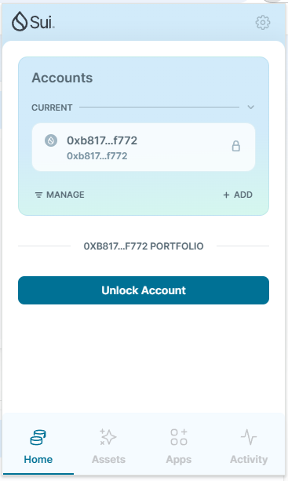
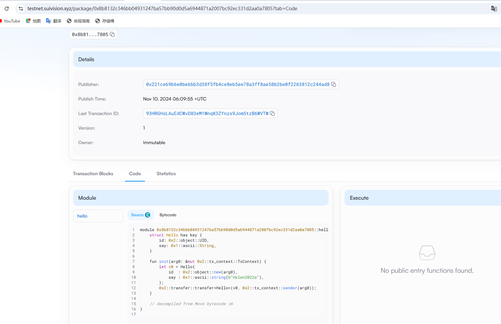
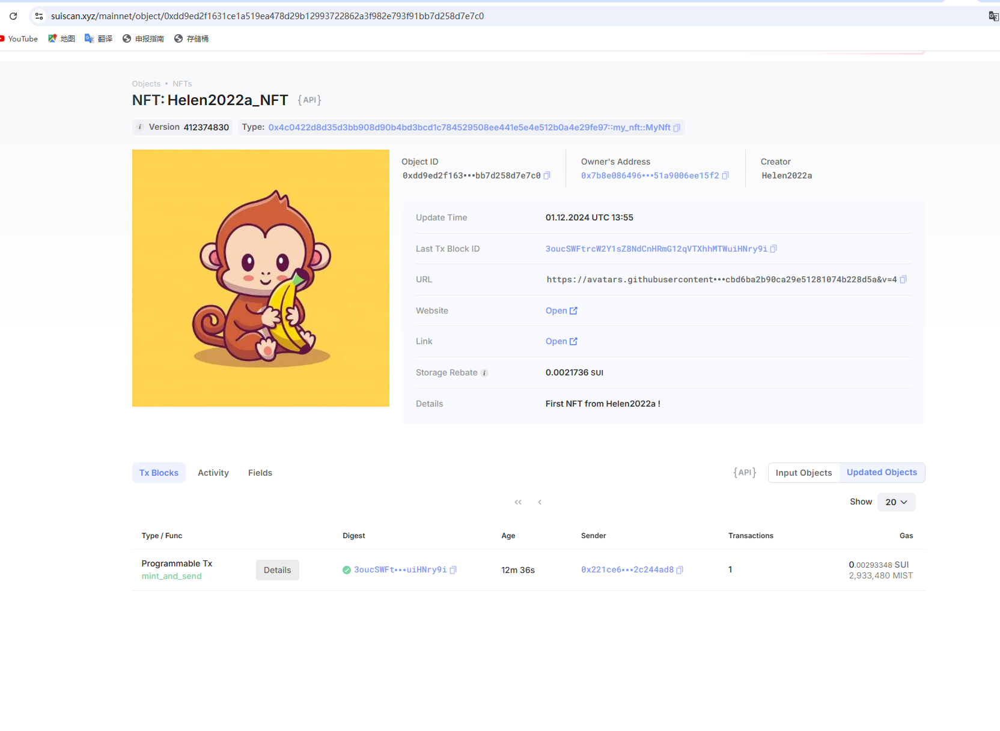

## 基本信息
- Sui钱包地址: `0xb81710e52a8fdc6fb6c7d103032d0dfc076752b35a6deac950e015011fabf772`
> 首次参与需要完成第一个任务注册好钱包地址才被合并，并且后续学习奖励会打入这个地址
- github: `Helen2022a`

## 个人简介
- 工作经验: 20年
- 技术栈: `java` `python` `nodejs` `motoko`
> 重要提示 请认真写自己的简介
- 多年web2后端开发经验，最近进入web3领域，写过ICP上的motoko语言，想再学一门web3开发语言
- 联系方式: wechat: `15921884211` 

## 任务

##   01 hello move  
- [✓] Sui cli version: sui 1.37.1-7839b9501066
- [✓] Sui钱包截图: 
- [✓] package id: 0x221ce69b6e0be6bb3d38f5fb4ce8eb5ee78a3ff8ae58b2be0f2263812c244ad8
- [✓] package id 在 scan上的查看截图:

##   02 move coin
- [✓] My Coin package id : 0x5c3a6b4a55686eb982ce65be5cb4b0d7935765c8be1dc1902de031efd945866e
- [✓] Faucet package id : 0x5d2aad9075f6d13961d0d08545eaf9e3194b466f9775bc45492e87395ba3059b
- [✓] 转账 `My Coin` hash: 7wJH7ELc7Wzw25jUzrdnMdeQkvw169kHrWSt5M5j2yNk
    相关命令：
    sui client call --package 0x5c3a6b4a55686eb982ce65be5cb4b0d7935765c8be1dc1902de031efd945866e --module my_coin --function mint_and_send --args 0x2e8acd5b90955411516907a58fe2f16317230449829bc71ac99d3c35215aa578 100000000 0x7b8e0864967427679b4e129f79dc332a885c6087ec9e187b53451a9006ee15f2
- [✓] `Faucet Coin` address1 mint hash: 8ByUxcx9r6SqiARUSSTUPThC2FEjFG6t5SVzxk5zE5yv
    相关命令：
    sui client call --package 0x5d2aad9075f6d13961d0d08545eaf9e3194b466f9775bc45492e87395ba3059b --module faucet_coin --function mint_and_send --args 0xe6c8a1222e5143b21a4e762d5441d575a27471efde1c320628c139991748c6d4 100000000 0xb81710e52a8fdc6fb6c7d103032d0dfc076752b35a6deac950e015011fabf772
- [✓] `Faucet Coin` address2 mint hash: 3nrvJwHZ8fV7XYZk1VxjjzLqprbAKCC5FD1U3RH8rfut
    相关命令：
    sui client call --package 0x5d2aad9075f6d13961d0d08545eaf9e3194b466f9775bc45492e87395ba3059b --module faucet_coin --function mint_and_send --args 0xe6c8a1222e5143b21a4e762d5441d575a27471efde1c320628c139991748c6d4 100000000 0x7b8e0864967427679b4e129f79dc332a885c6087ec9e187b53451a9006ee15f2

##   03 move NFT
- [✓] nft package id : 0x4c0422d8d35d3bb908d90b4bd3bcd1c784529508ee441e5e4e512b0a4e29fe97
- [✓] nft object id : 0xdd9ed2f1631ce1a519ea478d29b12993722862a3f982e793f91bb7d258d7e7c0
- [✓] 转账 nft  hash: 3oucSWFtrcW2Y1sZ8NdCnHRmG12qVTXhhMTWuiHNry9i
    相关命令：
    sui client call --package 0x4c0422d8d35d3bb908d90b4bd3bcd1c784529508ee441e5e4e512b0a4e29fe97 --module my_nft --function mint_and_send --args Helen2022a_NFT "https://avatars.githubusercontent.com/u/106859147?s=400&u=47d0ee6bd6cbd6ba2b90ca29e51281074b228d5a&v=4" 0x7b8e0864967427679b4e129f79dc332a885c6087ec9e187b53451a9006ee15f2
- [✓] scan上的NFT截图:

##   04 Move Game
- [✓] game package id : 0xae7be301ca3d9d1f8dd9ec99a4f3a34071a93aa8c9333ecab796e7edbba8ce60
game deploy hash: 7aRXUitQYz2atHPMFwZLm69gw966apyseq53xDDeSkrK
game object id: 0xc2d342cd75e354f6e87addc0380b4b2ba623139be01827fe778e7286edf1db6f
充值：
sui client call --package 0x5d2aad9075f6d13961d0d08545eaf9e3194b466f9775bc45492e87395ba3059b --module faucet_coin --function mint_and_send --args 0xe6c8a1222e5143b21a4e762d5441d575a27471efde1c320628c139991748c6d4 20000000000 0x221ce69b6e0be6bb3d38f5fb4ce8eb5ee78a3ff8ae58b2be0f2263812c244ad8

- [✓] deposit Coin hash: 9vGq6Vk8TZcSezUunfH54h5cWaS72wCqnF4fX4TWNh9t
相关命令：
sui client call --package 0xae7be301ca3d9d1f8dd9ec99a4f3a34071a93aa8c9333ecab796e7edbba8ce60 --module instant_win_game --function deposit --args 0xc2d342cd75e354f6e87addc0380b4b2ba623139be01827fe778e7286edf1db6f  0x1666440f5f9a16b08a4bddb213e56471c0e0b423567069656359f95e0f2408f1 --gas-budget 100000000

- [✓] withdraw `Coin` hash: 44AjqDN2oXxzrkrWY65HxYM6eJymACpwaJcEiNPeasW7
相关命令：
sui client call --package 0xae7be301ca3d9d1f8dd9ec99a4f3a34071a93aa8c9333ecab796e7edbba8ce60 --module instant_win_game --function withdraw --args 0xc2d342cd75e354f6e87addc0380b4b2ba623139be01827fe778e7286edf1db6f 0x14d4fb75c96a7e9bccb98968c2b6fa00d93c5f065bbbc4e4916138ba69ac2ffb 200000000  --gas-budget 100000000

- [✓] play game hash: 3vkmegZUbhL96R2wciVnpBbUg1LpGPX9sR2XZFZk77Tm
相关命令：
    sui client call --package 0xae7be301ca3d9d1f8dd9ec99a4f3a34071a93aa8c9333ecab796e7edbba8ce60 --module instant_win_game --function play --args 0xc2d342cd75e354f6e87addc0380b4b2ba623139be01827fe778e7286edf1db6f 0x4c4059076475251621dcf1ae74984dd9a63bc608fe12c73104c34fb270339edb 0x8  --gas-budget 10000000

充值 1 faucet coin
sui client call --package 0x5d2aad9075f6d13961d0d08545eaf9e3194b466f9775bc45492e87395ba3059b --module faucet_coin --function mint_and_send --args 0xe6c8a1222e5143b21a4e762d5441d575a27471efde1c320628c139991748c6d4 100000000 0x221ce69b6e0be6bb3d38f5fb4ce8eb5ee78a3ff8ae58b2be0f2263812c244ad8

##   05 Move Swap
- [✓] swap package id : 0xf4fb98c8c3fc3a792aa2a66104a3f64efafc099007fd99004c3dfe5aa0dd7035
- [✓] call swap CoinA-> CoinB  hash : Hqvwr3MH6pw6tUaWizYvRtsDYfCGVCh9gra74uQrg9hd
- [✓] call swap CoinB-> CoinA  hash : 63E8Tr1ffEqDAq1PGdhTz7JGK2iCBJdoQaAHaFN5zxvc

##   06 Dapp-kit SDK PTB
- [] save hash :

##   07 Move CTF Check In
- [] CLI call 截图 : 
- [] flag hash :

##   08 Move CTF Lets Move
- [] proof : 
- [] flag hash :
