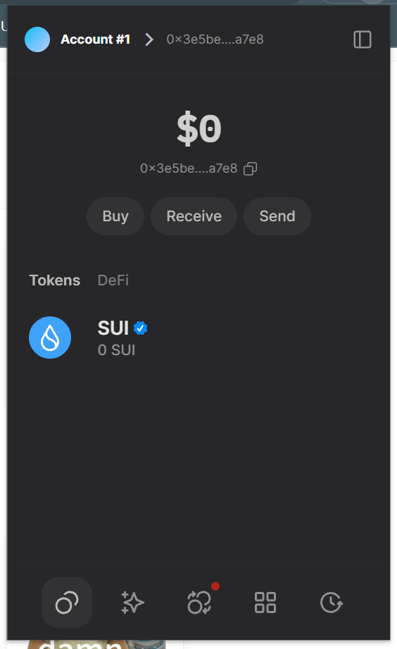
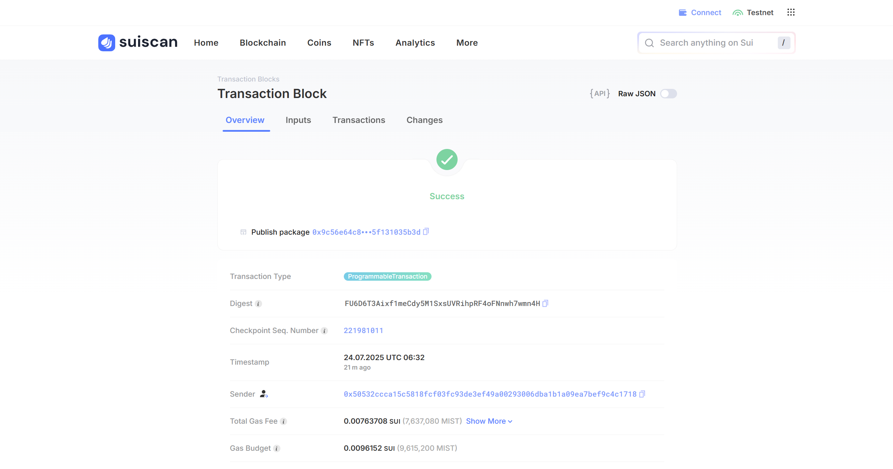

## 基本信息

- Sui钱包地址: `0x3e5be17b44fdd58f044020ae381cc988d0466e92bef21d7c30dfdc56ce55a7e8`

> 首次参与需要完成第一个任务注册好钱包地址才被合并，并且后续学习奖励会打入这个地址

- Github: `HikaruQwQ`

## 个人简介

- 工作经验: 3年
- 技术栈: `Python` `React`

> 重要提示 请认真写自己的简介

- 一个做运维/前后端的，想试试Web3前沿技术（听说有钱发就来了）
- 联系方式: bonjour.bio/hikaru

## 任务

## 01 hello move  

- [x] Sui cli version: 1.52.2-7f45ba185ff0
- [x] Sui钱包截图: 
- [x] package id: `0x9c56e64c807b822af0ee4bc30485aa10886cc81f5f80b3eb41c975f131035b3d`
- [x] package id 在 scan上的查看截图: