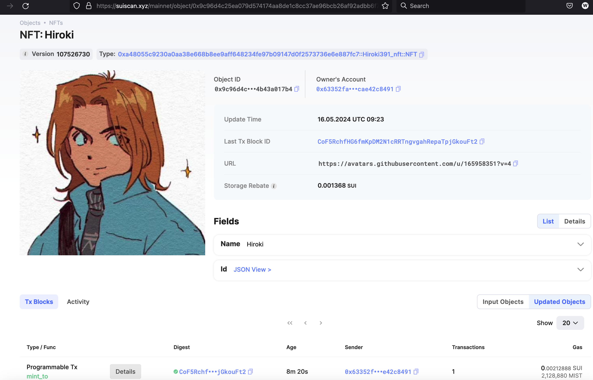

## 基本信息
- Sui钱包地址: `0x63352fa9593fa2d16a71823f7ab8865af627d51706a637fdfdf508cae42c8491`
> 首次参与需要完成第一个任务注册好钱包地址才被合并，并且后续学习奖励会打入这个地址
- github: `Hiroki391`

## 个人简介
- 工作经验: 0年
- 技术栈: `Python`
> 重要提示 请认真写自己的简介
- 对Move语言感兴趣，想通过Move入门区块链
- 联系方式: tg: `hirokiZhang` 

## 任务

##   01 hello move  
- [x] Sui cli version: sui-client 1.24.1
- [x] Sui钱包截图: 
- [x] package id:  0x5343900dd7a4670cdd63564428770f7f3c00299dcfb1bc290607ecaf551a8c36 
- [x] package id 在 scan上的查看截图:

##   02 move coin
- [x] My Coin package id : 0xadd3f6d153775687016c1271a3cab27c68732aa494fd1d20afe37891a466b707
- [x] Faucet package id : 0x0251e62aaa7b0cc3cbf2ab554ec4819204cbfebe30fa86d893aabf6c4708461d 
- [x] 转账 `My Coin` hash: HfdxSZA4M8jcL2ZJJKWrh3UMLZQ2f3LVNCpttyVH9wHm
- [x] `Faucet Coin` address1 mint hash: 919Ruby1MjKxA8yDkgK6rWA4914n4wEhfjSRErW69nqZ
- [x] `Faucet Coin` address2 mint hash: 369sjTixwYF4X78y4tty3gdGBV8aRNowcDFSj95gC7E6

##   03 move NFT
- [x] nft package id :  0xa48055c9230a0aa38e668b8ee9aff648234fe97b09147d0f2573736e6e887fc7 
- [x] nft object id : 0x9c96d4c25ea079d574174aa8de1c8cc37ae96bcb26af92adbb6f7a4b43a017b4   
- [x] 转账 nft  hash: FFCcX6uWdnx6haRJx7241r1bE8v2MHP9rZKR2mbCbGYi
- [x] scan上的NFT截图:

##   04 Move Game
- [x] game package id : 0xe5c3c8d5e85b4a9a6d1f7af006e00da9b93272a053a8e40f58414b0e9ed48929
- [x] deposit Coin hash: 6VWfUo7hpRw6h5Gve1bvYTmKuMUEwGaX5NBhJhBNvbFN
- [x] withdraw `Coin` hash: 3cu3m4qfk2Lvr7CjzRggqVSQMPV9SVGbrSr43GJiVxou
- [x] play game hash: 7me3Uimd6nMnumgH4RAhtSjVpRwVQ9C7vLRVCmBKS8Pd

##   05 Move Swap
- [x] swap package id : 0xaebd6134ac55a687b3d3a4b1705eaede10dde88bac0ad60bf2d6e6951e8f5d90
- [x] call swap CoinA-> CoinB  hash :  D5ZW4agz46KPHveYfghBz6aqzfNsuzprCXc3FSvPn5f9
- [x] call swap CoinB-> CoinA  hash :  381CB8SJY6CmNeAy4c4QjzQ9J7QBgLT5HVAKCj1pWcCY

##   06 SDK PTB
- [x] save hash : 2crzyf28X96jqgnomsbZh2WVFqmLKMAZvF5JCBsMjJki

##   07 Move CTF Check In
- [x] CLI call 截图 : 
- [x] flag hash : Cm7dkd49FPjoPwe86TvS9s1BiwJukhHr2rKN3qkk6kbp

##   08 Move CTF Lets Move
- [x] proof :  82c9a22559470d9db4ab
- [x] flag hash :  A5HcogsR7FFaxfuhGtxCrBq1nTs47HvVa5KGNrrUmFTv