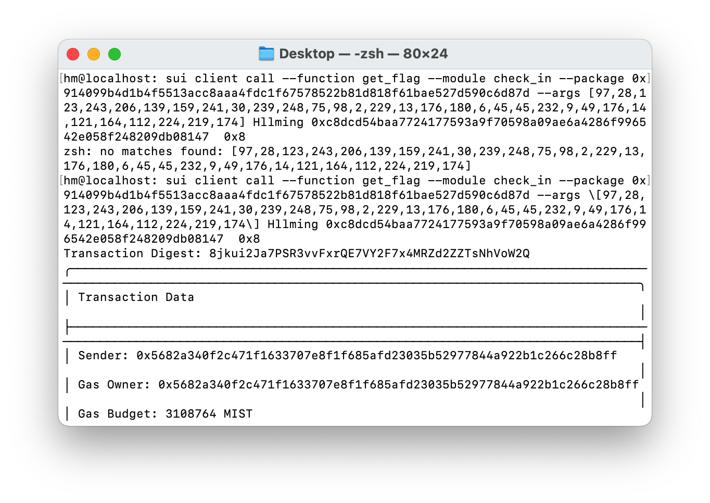

## 基本信息
- Sui钱包地址: `0x5682a340f2c471f1633707e8f1f685afd23035b52977844a922b1c266c28b8ff`
> 首次参与需要完成第一个任务注册好钱包地址才被合并，并且后续学习奖励会打入这个地址
- github: `HlLming`

## 个人简介
- 工作经验: 1年
- 技术栈: `Vue` `React`
> 重要提示 请认真写自己的简介
- 有前端开发经验，对Move特别感兴趣，想通过Move入门区块链
- 联系方式: tg: `Hllming` 
## 任务

##   01 hello move  
- [x] Sui cli version: 1.28.3
- [x] Sui钱包截图: 
- [x] package id: 0x9a6f5ed5d360ae13bf86463722e93a3e0259882f67eed0900022f5cdcde74779 
- [x] package id 在 scan上的查看截图:

##   02 move coin
- [x] My Coin package id : 0x920491420bc64ee56160c3b36d1938575b07527e0e35310f1f5e42695b4ee83b
- [x] Faucet package id : 0x920491420bc64ee56160c3b36d1938575b07527e0e35310f1f5e42695b4ee83b
- [x] 转账 `My Coin` hash: NARDUX1DeBeyi4RzcnuDGrrDWKHfH1sEK81vQRcB1YP
- [x] `Faucet Coin` address1 mint hash: BBWHCM9HiALsnuUt1FopeoNznFxzz81JruLJzbzRk2Kn
- [x] `Faucet Coin` address2 mint hash: 4iYeXqf3hLT6DUQM6R4a9iLLEv7ciCrrsVTudnXWGfRu

##   03 move NFT
- [x] nft package id : 0xdb866ab73c2aa59855d267a13a07b48799ca4adfacaa85acaec03721d9af0f6c
- [x] nft object id : 0x03564380160f5d9382ba81c79b41415c827c8d532b83c892136286582275d925
- [x] 转账 nft  hash: 67yG86BBCWRfuFWNQvr7jYDqZ32R4PwjsMvB2vKf1ZoP
- [x] scan上的NFT截图:

##   04 Move Game
- [x] game package id: 0x4c72ef8941dc4e55d9514b4a3b357f02778dd9e2e7b4cf7ee100b35ccdec7640
- [x] deposit Coin hash: DAuPRANTYTycaYXVgPRGAwXSzQEKCUj13rbCkeRnLAX
- [x] withdraw `Coin` hash: KSwtHRmUEpbroeAq2pHh3N9duWUJMJuzCFCvYUz49Di
- [x] play game hash: DRmiqKQwHDxQNMUR1AeMkGi5ZWGP8nnSn46fxgy9hMrc

##   05 Move Swap
- [x] swap package id : 0x5e6a9eb51859738d349580f661812279cecf1f5b56856058bec29cb96cef6247
- [x] call swap CoinA-> CoinB  hash : tmKJ2QACQrRXKEViVHNfiAyiLXbNaSrjmB3tuk1DoT8
- [x] call swap CoinB-> CoinA  hash : H3kiw8XEkaSx7oVyeSwo81SkWnur3guQsFbbxnGUwYoC

##   06 Dapp-kit SDK PTB
- [x] save hash : Anndq9oE3sJBSSyepSNexSbHVWrheWBb3JZKUvwMDYxB

##   07 Move CTF Check In
- [x] CLI call 截图 : 
- [x] flag hash :  8jkui2Ja7PSR3vvFxrQE7VY2F7x4MRZd2ZZTsNhVoW2Q

##   08 Move CTF Lets Move
- [x] proof : 9071665258e933a4b98a
- [x] flag hash : qXoetJHvCEvVTmMV4XDbju1oXyMaeph7RhPWFR2cGwm
