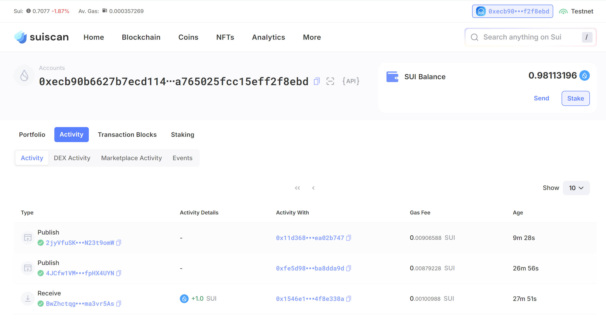
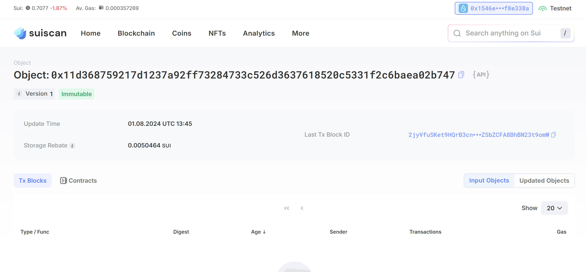

## 基本信息
- Sui钱包地址: `0x1546e1d5d29e19d9474742942ec422b46e54f09693bce7d17b0183814f8e338a`
> 首次参与需要完成第一个任务注册好钱包地址才被合并，并且后续学习奖励会打入这个地址
- github: `HoneyLin`

## 个人简介
- 工作经验: 10年
- 技术栈: `Java` `Golang` `Python` `Javascript` `Nodejs` `Solidity`
> 重要提示 请认真写自己的简介
- 多年web2开发经验，会得东西很杂，全栈偏后端。对区块链及Move特别感兴趣，想参与Move相关工作。
- 联系方式: tg: `haia25675` 

## 任务

##   01 hello move  
- [x] Sui cli version: sui 1.30.1-a4185da5659d
- [x] Sui钱包截图: 
- [x] package id: 0xfe5d985fdcfc92d0871708b4fe7bbd6e48bf2962d5df30e4670256ecba8dda9d
- [x] package id 在 scan上的查看截图:

##   02 move coin
- [] My Coin package id : 
- [] Faucet package id : 
- [] 转账 `My Coin` hash:
- [] `Faucet Coin` address1 mint hash:
- [] `Faucet Coin` address2 mint hash:

##   03 move NFT
- [] nft package id :
- [] nft object id : 
- [] 转账 nft  hash:
- [] scan上的NFT截图:

##   04 Move Game
- [] game package id :
- [] deposit Coin hash:
- [] withdraw `Coin` hash:
- [] play game hash:

##   05 Move Swap
- [] swap package id :
- [] call swap CoinA-> CoinB  hash :
- [] call swap CoinB-> CoinA  hash :

##   06 Dapp-kit SDK PTB
- [] save hash :

##   07 Move CTF Check In
- [] CLI call 截图 : 
- [] flag hash :

##   08 Move CTF Lets Move
- [] proof : 
- [] flag hash :
