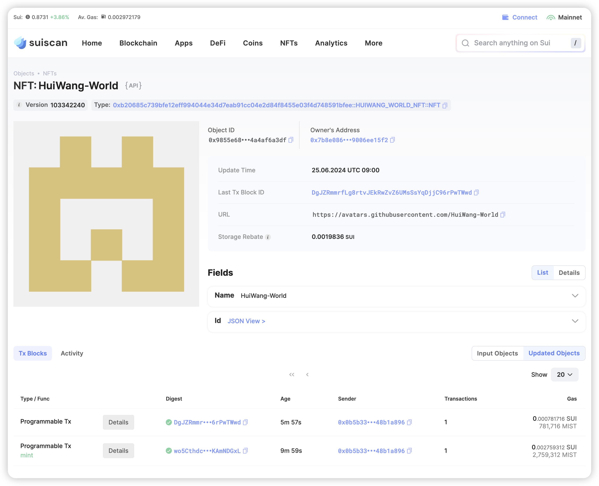

## 基本信息
- Sui钱包地址: `0x991d9292483f0d344665b6e4288756860d61684d3c81035285670a57801a10a5`
> 首次参与需要完成第一个任务注册好钱包地址才被合并，并且后续学习奖励会打入这个地址
- github: `HuiWang-World`

## 个人简介
- 工作经验: 6年
- 技术栈: `java` `python`
> 重要提示 请认真写自己的简介
- 多年web2开发经验，对Move特别感兴趣，想通过Move入门区块链
- 联系方式: tg: `xxx` 

## 任务

##   01 hello move
- [x] Sui cli version: sui 1.24.1-2aadf14aa
- [x] package id: 0xd4fb3cc172f20e39641345c9762c59c6b45cb5700138a8568584e6383616ac0d

##   02 move coin
- [x] My Coin package id : 0xae16113528530ccfefb1dfcf99da129421621be8307edee8bb05ea1ecb7dd2fa
- [x] Faucet package id : 0xae16113528530ccfefb1dfcf99da129421621be8307edee8bb05ea1ecb7dd2fa
- [x] 转账 `My Coin` hash: EXNu2hebvcsuTpnh5Higoi4BBiWy6BZ1hKJ4jKYiH2rD
- [x] `Faucet Coin` address1 mint hash: G32Rz8CrZMyv8umGg5c2hpCYjAT4vcPnqFj5pFWUnRcZ
- [] `Faucet Coin` address2 mint hash:

##   03 move NFT
- [x] nft package id : 0xb20685c739bfe12eff994044e34d7eab91cc04e2d84f8455e03f4d748591bfee
- [x] nft object id : 0x9855e6838b1dabc734e1b4991dab188bd2ecfe29ba912e2256768d4a4af6a3df
- [x] 转账 nft  hash: DgJZRmmrfLg8rtvJEkRwZvZ6UMsSsYqDjjC96rPwTWwd
- [x] scan上的NFT截图:
- [x] scan上的NFT的URL地址: https://suiscan.xyz/mainnet/object/0x9855e6838b1dabc734e1b4991dab188bd2ecfe29ba912e2256768d4a4af6a3df

##   04 Move Game
- [] game package id :
- [] deposit Coin hash:
- [] withdraw `Coin` hash:
- [] play game hash:

##   05 Move Swap
- [] swap package id :
- [] call swap CoinA-> CoinB  hash :
- [] call swap CoinB-> CoinA  hash :

##   06 SDK PTB
- [] save hash :
