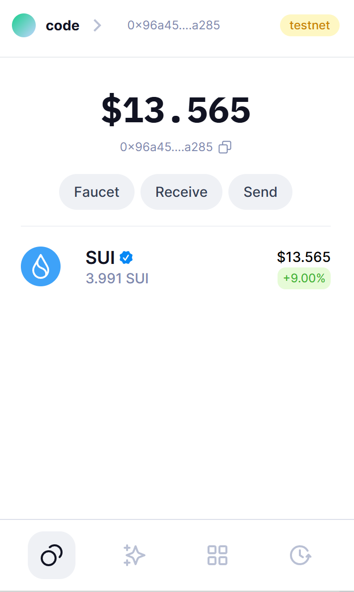
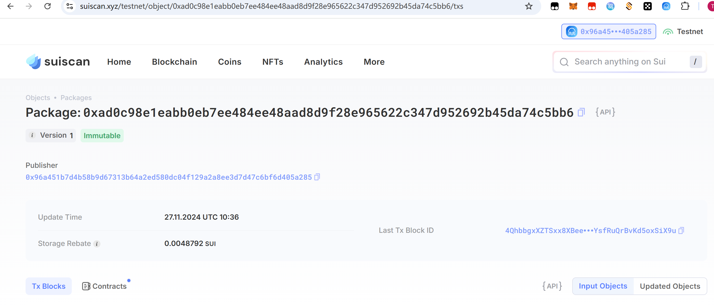

## 基本信息
- Sui钱包地址: `0x0d6599ba80f0d6f8afb9c78cb555221e907cd190c435b1087e888a92fb73a450`
> 首次参与需要完成第一个任务注册好钱包地址才被合并，并且后续学习奖励会打入这个地址
- github: `IShowCode`

## 个人简介
- 工作经验: 传统web2 java开发3年
- 技术栈: `Java` `solidity`
- 本科生，想转Sui生态开发
- 联系方式: gmail: `aliotrowerh545@gmail.com` 

## 任务

##   01 hello move  
- [√] Sui cli version:1.38.2
- [√] Sui钱包截图: 
- [√] （devnet）package id: 0xad0c98e1eabb0eb7ee484ee48aad8d9f28e965622c347d952692b45da74c5bb6
- [√] package id 在 scan上的查看截图:

##   02 move coin
- [] My Coin package id : 
- [] Faucet package id : 
- [] 转账 `My Coin` hash:
- [] `Faucet Coin` address1 mint hash:
- [] `Faucet Coin` address2 mint hash:

##   03 move NFT
- [] nft package id :
- [] nft object id : 
- [] 转账 nft  hash:
- [] scan上的NFT截图:

##   04 Move Game
- [] game package id :
- [] deposit Coin hash:
- [] withdraw `Coin` hash:
- [] play game hash:

##   05 Move Swap
- [] swap package id :
- [] call swap CoinA-> CoinB  hash :
- [] call swap CoinB-> CoinA  hash :

##   06 Dapp-kit SDK PTB
- [] save hash :
