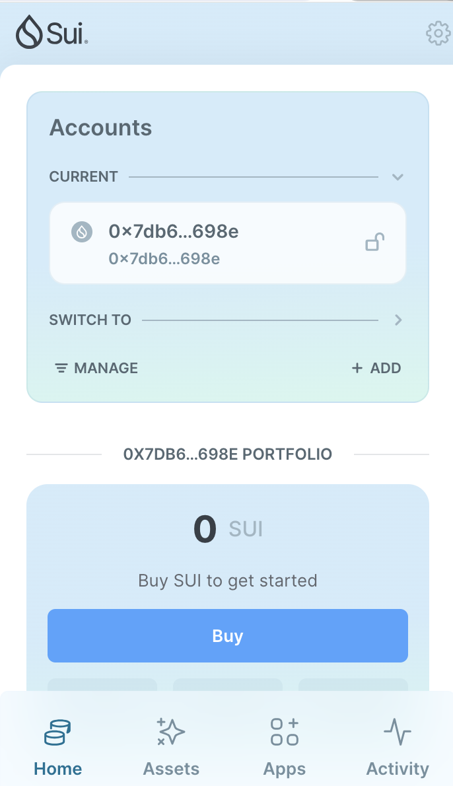
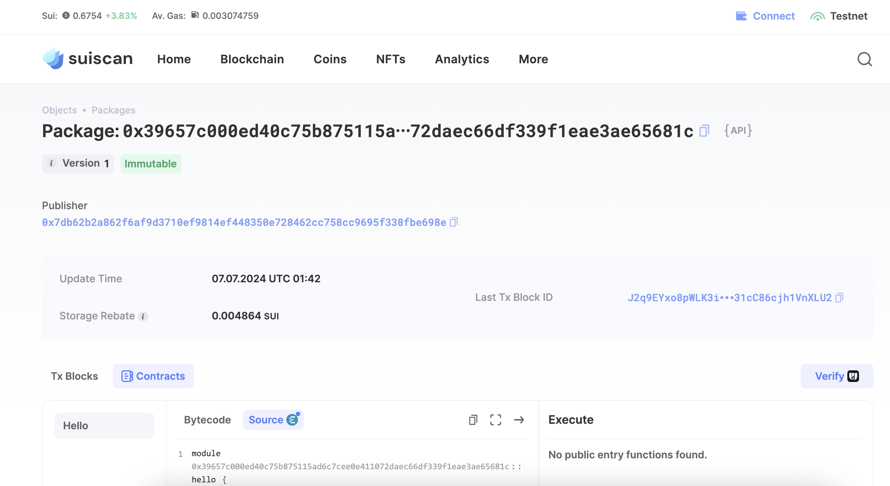
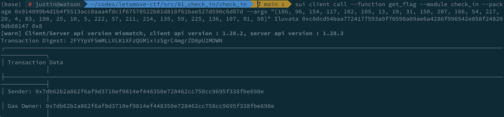

## 基本信息
- Sui钱包地址: `0x7db62b2a862f6af9d3710ef9814ef448350e728462cc758cc9695f338fbe698e`
> 首次参与需要完成第一个任务注册好钱包地址才被合并，并且后续学习奖励会打入这个地址
- github: `Iluvata`

## 个人简介
- 工作经验: 5年
- 技术栈: `Rust` `C++`
- 多年web2开发经验，对Move特别感兴趣，想通过Move入门区块链
- 联系方式: tg: `maxwell_pepper` 

## 任务

##   01 hello move  
- [x] Sui cli version: sui 1.28.2-08b50387a184
- [x] Sui钱包截图: 
- [x] package id: 0x39657c000ed40c75b875115ad6c7cee0e411072daec66df339f1eae3ae65681c 
- [x] package id 在 scan上的查看截图:

##   02 move coin
- [] My Coin package id : 
- [] Faucet package id : 
- [] 转账 `My Coin` hash:

##   03 move NFT
- [] nft package id :
- [] nft object id : 
- [] 转账 nft  hash:

##   04 Move Game
- [] game package id :
- [] call game hash:

##   05 Move Swap
- [] swap package id :
- [] call swap hash:

##   06 SDK PTB
- [] save hash :

##   07 Move CTF Check In
- [x] CLI call 截图 : 
- [x] flag hash : 2FYYpVFSmMLLVLK1XFzQGM1xizSgrC4mgrZD8pU2MDWN

##   08 Move CTF Lets Move
- [x] proof : [204,137,168,71]
- [x] flag hash : B2rmAvTBpa7NkMDgNfKTvs3HkGCy19jrhHETdDqC28H2