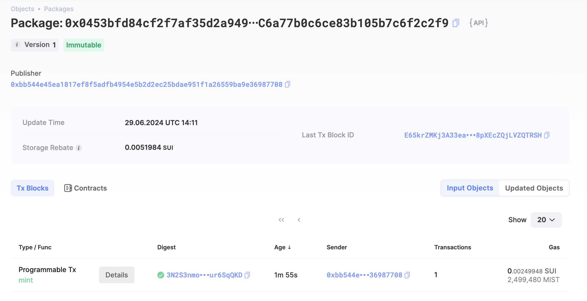

## 基本信息
- Sui钱包地址: `0xa77c3eecc002b208a094cc4c84a04ad82a19ab6eb3a597716f0932a27e3284f8`
> 首次参与需要完成第一个任务注册好钱包地址才被合并，并且后续学习奖励会打入这个地址
- github: `JA1E0`

## 个人简介
- 工作经验: 2年
- 技术栈: `Python` `C++`
> 重要提示 请认真写自己的简介
- 两年木马病毒分析，YARA规则熟练工，对区块链很好奇，想通过学习Move了解区块链。
- 联系方式: tg: `ye0304` 

## 任务

##   01 hello move  
- [x] Sui cli version: `sui 1.27.2-homebrew`
- [x] Sui钱包截图: 
- [x] package id: `0x0453bfd84cf2f7af35d2a949ed614fe28413ec6a77b0c6ce83b105b7c6f2c2f9`
- [x] package id 在 scan上的查看截图:

##   02 move coin
- [] My Coin package id : 
- [] Faucet package id : 
- [] 转账 `My Coin` hash:
- [] `Faucet Coin` address1 mint hash:
- [] `Faucet Coin` address2 mint hash:

##   03 move NFT
- [] nft package id :
- [] nft object id : 
- [] 转账 nft  hash:
- [] scan上的NFT截图:

##   04 Move Game
- [] game package id :
- [] deposit Coin hash:
- [] withdraw `Coin` hash:
- [] play game hash:

##   05 Move Swap
- [] swap package id :
- [] call swap CoinA-> CoinB  hash :
- [] call swap CoinB-> CoinA  hash :

##   06 Dapp-kit SDK PTB
- [] save hash :

##   07 Move CTF Check In
- [] CLI call 截图 : 
- [] flag hash :

##   08 Move CTF Lets Move
- [] proof : 
- [] flag hash :
