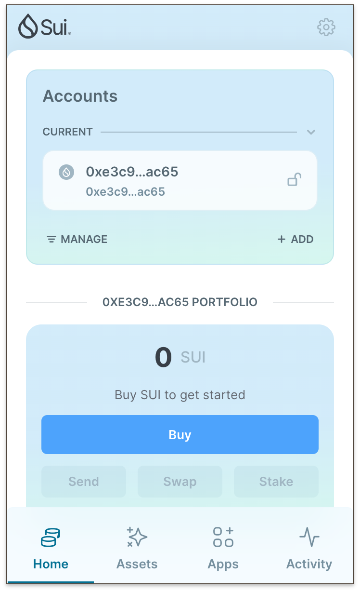
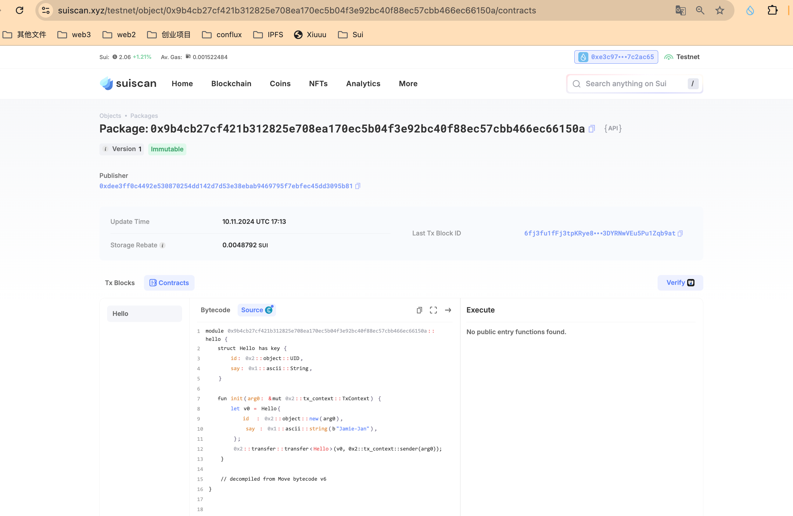
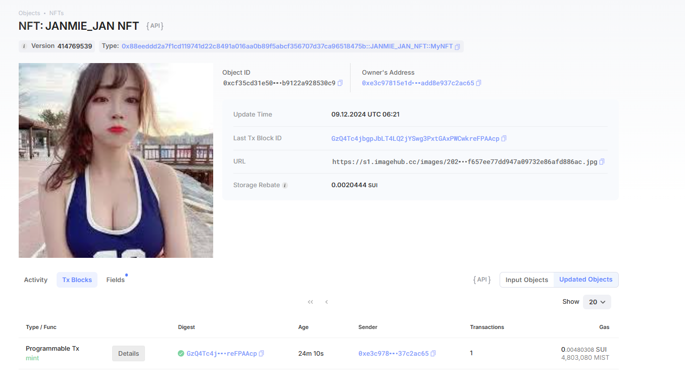

## 基本信息
- Sui钱包地址: `0xe3c97815e1d899293c2dc11fdde713b28294d621d49bbc3557add8e937c2ac65`
> 首次参与需要完成第一个任务注册好钱包地址才被合并，并且后续学习奖励会打入这个地址
- github: `Jamie-Jan`

## 个人简介
- 工作经验: 7年
- 技术栈: `Python` `Go` `Lua` `Solidity`
> 重要提示 请认真写自己的简介
- 多年web2开发经验，对Move特别感兴趣，想通过Move入门区块链
- 联系方式: tg: `@JamieJan9527` 

## 任务

##   01 hello move  
- [√] Sui cli version: sui 1.37.1-homebrew
- [√] Sui钱包截图: 
- [√] package id: 0x9b4cb27cf421b312825e708ea170ec5b04f3e92bc40f88ec57cbb466ec66150a
- [√] package id 在 scan上的查看截图:

##   02 move coin
- [√] My Coin package id : 0xaf01f79b811630aaba9568132599368ef365b90fa254e5d2f91efbf3cf629f8e
- [√] Faucet package id : 0x458446d261dff12681934d1a0f890fc341a522794007400279cce10ec16002e3
- [√] 转账 `My Coin` hash: 14auH62ZAqwz5bdJZod61Qqmv8mwUVUHb74yeUhKXWx8
- [√] `Faucet Coin` address1 mint hash: 8ANyAkjwoFeFvHNqigpTVnC4pizb752td1injuu4rjZe
- [√] `Faucet Coin` address2 mint hash: FZLcqYNDvSAf4yTbnM4aKePx1oeiUx1jT8eAYn6SkjAj

##   03 move NFT
- [] nft package id : 0x88eeddd2a7f1cd119741d22c8491a016aa0b89f5abcf356707d37ca96518475b
- [] nft object id : 0xe7ddada450f00a7ba5c4df241718a44696b4951ed6951a4050b996e79440f247
- [] 转账 nft  hash: GzQ4Tc4jbgpJbLT4LQ2jYSwg3PxtGAxPWCwkreFPAAcp
- [] scan上的NFT截图:

##   04 Move Game
- [] game package id :
- [] deposit Coin hash:
- [] withdraw `Coin` hash:
- [] play game hash:

##   05 Move Swap
- [] swap package id :
- [] call swap CoinA-> CoinB  hash :
- [] call swap CoinB-> CoinA  hash :

##   06 Dapp-kit SDK PTB
- [] save hash :

##   07 Move CTF Check In
- [] CLI call 截图 : 
- [] flag hash :

##   08 Move CTF Lets Move
- [] proof : 
- [] flag hash :
