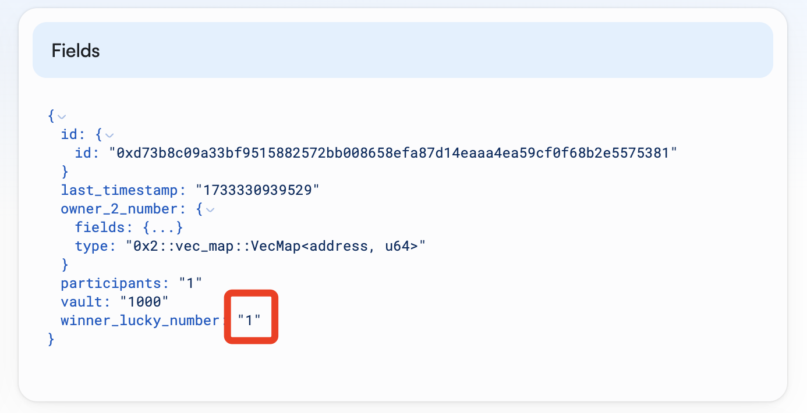
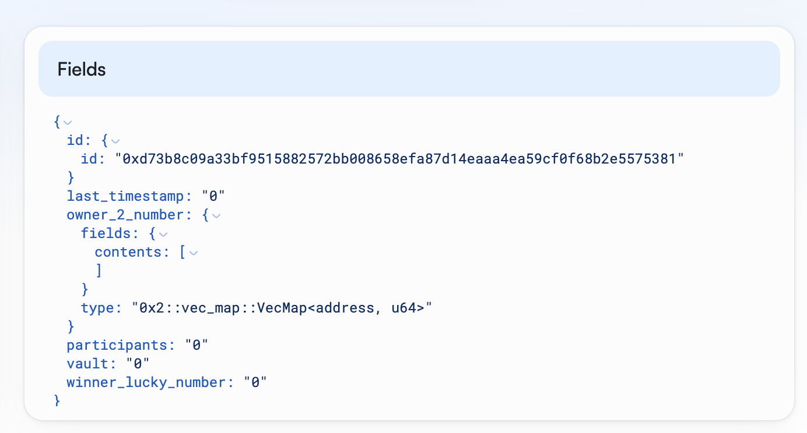
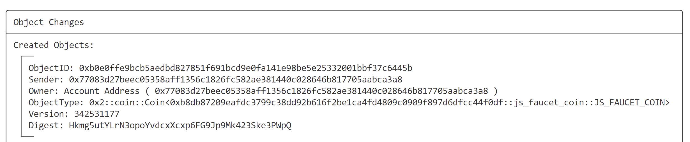

# Task4学习笔记

## 合约部署

```bash
$ sui client publish

Transaction Digest: J4rLpG3R3GXXXyZ97Z8iVF4T5adU41iL8URYqQxGwnxA

╭─────────────────────────────────────────────────────────────────────────────────────────────────────────────────────────╮
│ Object Changes                                                                                                          │
├─────────────────────────────────────────────────────────────────────────────────────────────────────────────────────────┤
│ Created Objects:                                                                                                        │
│  ┌──                                                                                                                    │
│  │ ObjectID: 0xd73b8c09a33bf9515882572bb008658efa87d14eaaa4ea59cf0f68b2e5575381                                         │
│  │ Sender: 0x77083d27beec05358aff1356c1826fc582ae381440c028646b817705aabca3a8                                           │
│  │ Owner: Shared( 342529930 )                                                                                           │
│  │ ObjectType: 0x14353b3ff0f3f91a58c13298dfbcc1f6e405a275d6bffa994ff61ddb0d936bb6::js_luck_number_game::LuckNumberGame  │
│  │ Version: 342529930                                                                                                   │
│  │ Digest: FG3HF7JyNfFWhK69GChRpRmHY2pAAvaQzJaBZizyxene                                                                 │
│  └──                                                                                                                    │
│  ┌──                                                                                                                    │
│  │ ObjectID: 0xeeee5a8070cc036ad7c684b95968027c69f752e1d43eec1789a08971ab264d52                                         │
│  │ Sender: 0x77083d27beec05358aff1356c1826fc582ae381440c028646b817705aabca3a8                                           │
│  │ Owner: Account Address ( 0x77083d27beec05358aff1356c1826fc582ae381440c028646b817705aabca3a8 )                        │
│  │ ObjectType: 0x2::package::UpgradeCap                                                                                 │
│  │ Version: 342529930                                                                                                   │
│  │ Digest: EccmReQNKCNsFjdf1geGfmf2t3hRt1EadWxQpjg8XD9W                                                                 │
│  └──                                                                                                                    │
│ Mutated Objects:                                                                                                        │
│  ┌──                                                                                                                    │
│  │ ObjectID: 0x21e47a8003565d3805f0ace77bad3580bf226d253513344fe6975ae1310dc11e                                         │
│  │ Sender: 0x77083d27beec05358aff1356c1826fc582ae381440c028646b817705aabca3a8                                           │
│  │ Owner: Account Address ( 0x77083d27beec05358aff1356c1826fc582ae381440c028646b817705aabca3a8 )                        │
│  │ ObjectType: 0x2::coin::Coin<0x2::sui::SUI>                                                                           │
│  │ Version: 342529930                                                                                                   │
│  │ Digest: Hno554eK2sGTp31tTyiX7JccoeDDSPYLBpB13EsJf1J4                                                                 │
│  └──                                                                                                                    │
│ Published Objects:                                                                                                      │
│  ┌──                                                                                                                    │
│  │ PackageID: 0x14353b3ff0f3f91a58c13298dfbcc1f6e405a275d6bffa994ff61ddb0d936bb6                                        │
│  │ Version: 1                                                                                                           │
│  │ Digest: BGbfBiYeXyTFMXPBu4LmBTbvcEuBRoJ9Es69VoWKnNwi                                                                 │
│  │ Modules: js_luck_number_game                                                                                         │
│  └──                                                                                                                    │
╰─────────────────────────────────────────────────────────────────────────────────────────────────────────────────────────╯
```

## 购买奖票

每张奖票对应一个幸运数字。

- **设置环境变量**

```bash
export PACKAGE_ID=0x14353b3ff0f3f91a58c13298dfbcc1f6e405a275d6bffa994ff61ddb0d936bb6

export GAME=0xd73b8c09a33bf9515882572bb008658efa87d14eaaa4ea59cf0f68b2e5575381

export JS_FAUCET_COIN=0xf5945c5bb5d66ccfeefd6ee7f76e6f848f6ee91cddc9d0b632dc349a43f90e63
```

- **购买奖票**

```bash
sui client call --package $PACKAGE_ID --module js_luck_number_game --function buy_ticket --args $GAME $JS_FAUCET_COIN 0x6

Transaction Digest: 4Vm79nuJMgrrY5J3nwsj29aWNxNnCjhEPmZ2fySEqDwy
```

## 查看Game对象

```json
{
    "id": {
        "id": "0xd73b8c09a33bf9515882572bb008658efa87d14eaaa4ea59cf0f68b2e5575381"
    },
    "last_timestamp": "1733330622560",
    "owner_2_number": {
        "fields": {
            "contents": [{
                "fields": {
                    "key": "0x77083d27beec05358aff1356c1826fc582ae381440c028646b817705aabca3a8",
                    "value": "1"
                },
                "type": "0x2::vec_map::Entry<address, u64>"
            }]
        },
        "type": "0x2::vec_map::VecMap<address, u64>"
    },
    "participants": "1",
    "vault": "1000",
    "winner_lucky_number": "0"
}

可见此时已经有一个参与抽奖的用户，幸运数字尚未产生` "winner_lucky_number": "0"`
```

## 获取幸运数字

```bash
sui client call --package $PACKAGE_ID --module js_luck_number_game --function get_lucky_number --args $GAME 0x8 0x6
```

- **若还未到游戏结束时间，将报错: EGameNotEnd**
  
  ```bash
  Error executing transaction 'ZXq2kXMyVpA8f2vPG4WxoK6dMzNG15z1XoS4hpk4DDk': 1st command aborted within function '0x14353b3ff0f3f91a58c13298dfbcc1f6e405a275d6bffa994ff61ddb0d936bb6::js_luck_number_game::get_lucky_number' at instruction 19 with code 3
  ```

- **成功执行后，产生幸运数字**
  
  ```bash
  Transaction Digest: EU2zMtVjh29USEcBA2JJA4B6eh4MWpu88JnHVy7BW5uW
  ```



## 中奖者领奖

```bash
sui client call --package $PACKAGE_ID --module js_luck_number_game --function get_reward --args $GAME 0x6

Transaction Digest: 4uZ1uvj1CmFzG6EU1zXbAmdxWmYjddZgsNfssE2Nyomd
```

- **中奖者领奖后，游戏清空，以便开启新一轮游戏**



- **获得奖励**

> 中奖者会获得这一轮奖池中的所有代币作为奖励。


