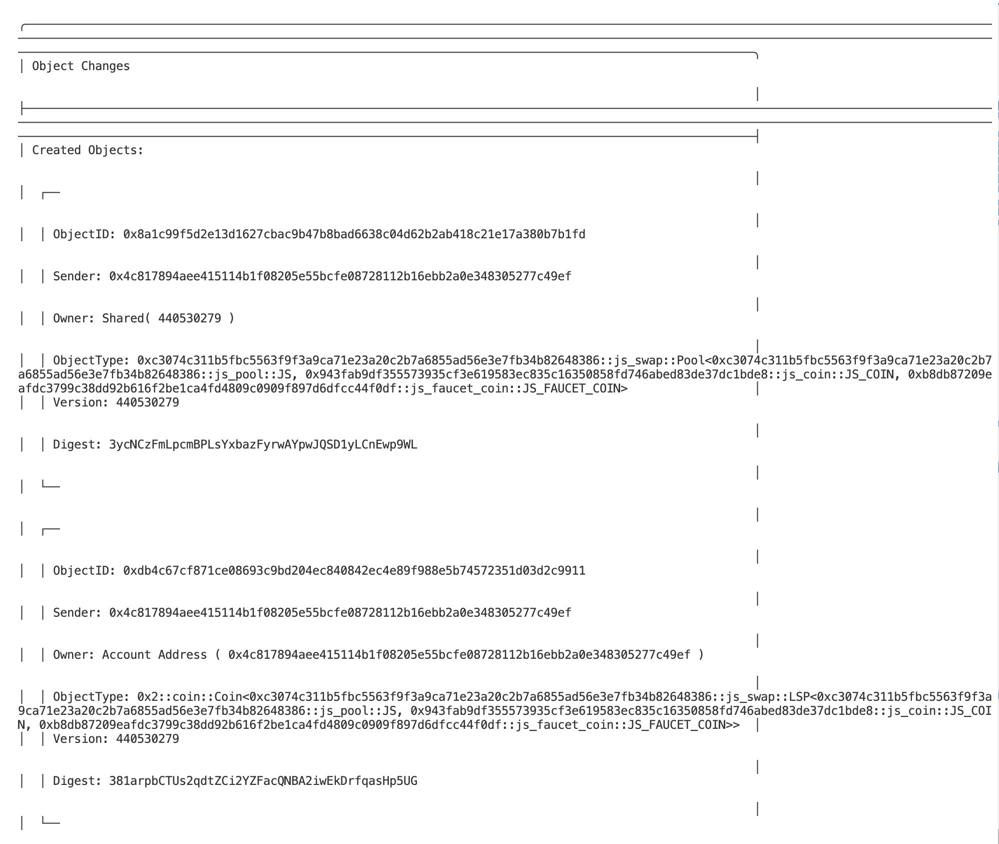
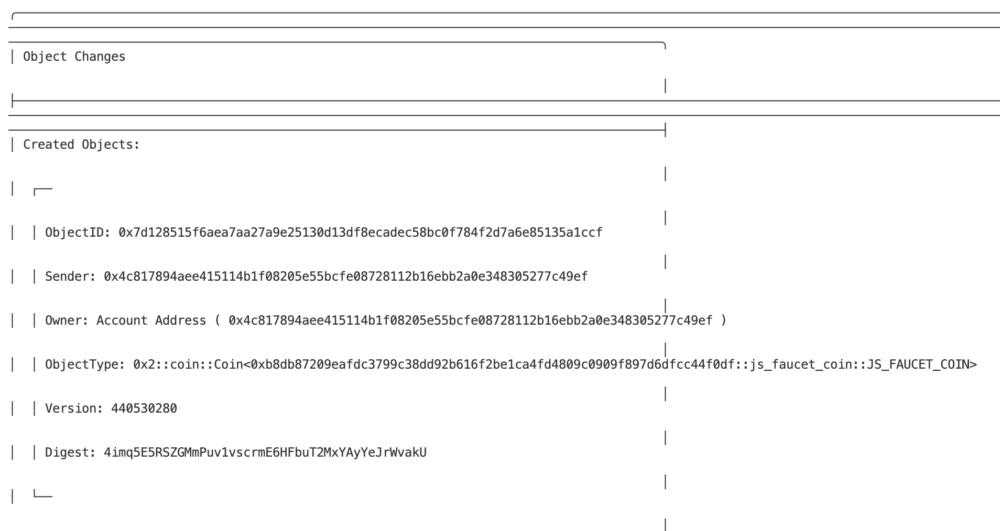
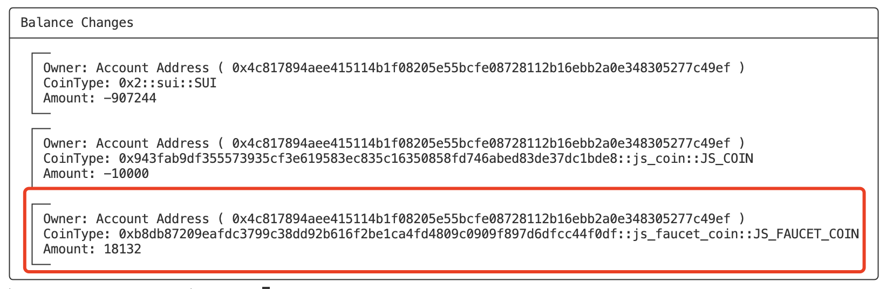
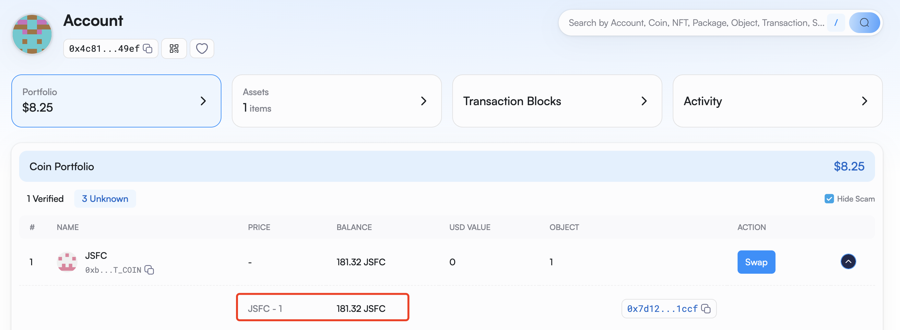
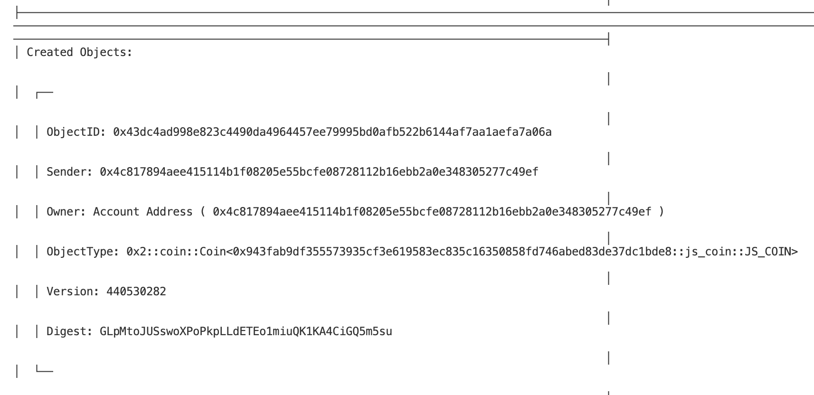
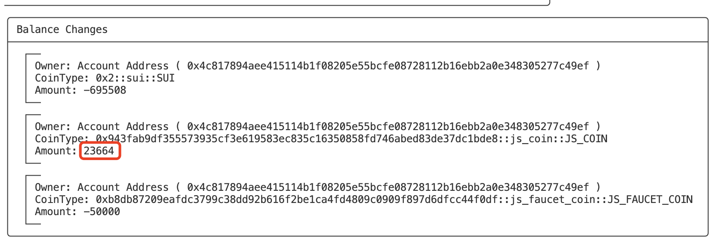
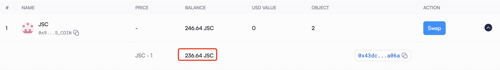

# Task5学习笔记

## 合约部署

```bash
$ sui client publish

Transaction Digest: 5oF6KUKaN54rMCTHH3xq4mdW292ZkhzdeooDKH8X7H6b

╭──────────────────────────────────────────────────────────────────────────────────────────────────╮
│ Object Changes                                                                                   │
├──────────────────────────────────────────────────────────────────────────────────────────────────┤
│ Created Objects:                                                                                 │
│  ┌──                                                                                             │
│  │ ObjectID: 0x043cbfe6060f4ca4f97a20a17c13938607040f03e56ac79c26ace820b7aa96ef                  │
│  │ Sender: 0x4c817894aee415114b1f08205e55bcfe08728112b16ebb2a0e348305277c49ef                    │
│  │ Owner: Account Address ( 0x4c817894aee415114b1f08205e55bcfe08728112b16ebb2a0e348305277c49ef ) │
│  │ ObjectType: 0x2::package::UpgradeCap                                                          │
│  │ Version: 440530277                                                                            │
│  │ Digest: UyjWTydjFceatpDyX6ZAL9mUmDAfLHqMEnRSRtopBAo                                           │
│  └──                                                                                             │
│ Mutated Objects:                                                                                 │
│  ┌──                                                                                             │
│  │ ObjectID: 0xdcfa01e8fc34125310cc7261e8736f34a6cd6383b710cff666e58c8a68a516dd                  │
│  │ Sender: 0x4c817894aee415114b1f08205e55bcfe08728112b16ebb2a0e348305277c49ef                    │
│  │ Owner: Account Address ( 0x4c817894aee415114b1f08205e55bcfe08728112b16ebb2a0e348305277c49ef ) │
│  │ ObjectType: 0x2::coin::Coin<0x2::sui::SUI>                                                    │
│  │ Version: 440530277                                                                            │
│  │ Digest: 3ELPzyKo8QbSwhfkq174U65Swaq2yMGr35Wfr9ud6fsz                                          │
│  └──                                                                                             │
│ Published Objects:                                                                               │
│  ┌──                                                                                             │
│  │ PackageID: 0xc3074c311b5fbc5563f9f3a9ca71e23a20c2b7a6855ad56e3e7fb34b82648386                 │
│  │ Version: 1                                                                                    │
│  │ Digest: D4hcCeBCPaLaXhrFqAcQDFCx1T68C61DdBq5NLzzmfX6                                          │
│  │ Modules: js_pool, js_swap                                                                     │
│  └──                                                                                             │
╰──────────────────────────────────────────────────────────────────────────────────────────────────╯
```

## 获取池子交易对

-   **池子构成**

代币A：1000 JSC

代币B：2000 JSFC

费率：0.3% （30）

-   **铸造1000 JSC**

```bash
export PACKAGE_ID=0x943fab9df355573935cf3e619583ec835c16350858fd746abed83de37dc1bde8
export TREASURY_CAP=0x7ad8627e8470871c2afff0c682b66b61717798a9162415bcf117bb67868bb310
export MY_ADDR=0x4c817894aee415114b1f08205e55bcfe08728112b16ebb2a0e348305277c49ef
export AMOUNT=100000

sui client call --package $PACKAGE_ID --module js_coin --function mint --args $TREASURY_CAP $AMOUNT $MY_ADDR

Transaction Digest: GYtG9CpM98b8FYMy8o2kKSpEm9wcszUYxMnuJpdDnAAV
ObjectID: 0xe492e5968be31f17fccee233ab3ab8a602ed7654ff66beb04382221d8dc2f052 
```

-   **领取2000 JSFC**

```bash
export PACKAGE_ID=0xb8db87209eafdc3799c38dd92b616f2be1ca4fd4809c0909f897d6dfcc44f0df
export TREASURY_CAP=0x1d3aab3edded7b2a60609c9fe5476f662805af6027924f57bac0bc560763db88
export AMOUNT=200000

sui client call --package $PACKAGE_ID --module js_faucet_coin --function airdrop --args $TREASURY_CAP $AMOUNT

Transaction Digest: 87Ue4upHCfNhrpjzbugrbeuSsvAE1wEeuvyvXcgeS97Q
ObjectID: 0xeec20ae659322173b9d0bd1bcdb405137ee08a1c7b0464ac6de8a48e29c410f2 
```

## 创建池子

```bash
export PACKAGE_ID=0xc3074c311b5fbc5563f9f3a9ca71e23a20c2b7a6855ad56e3e7fb34b82648386
export COIN_A=0xe492e5968be31f17fccee233ab3ab8a602ed7654ff66beb04382221d8dc2f052
export COIN_B=0xeec20ae659322173b9d0bd1bcdb405137ee08a1c7b0464ac6de8a48e29c410f2
export FEE_PERCENT=30

sui client call --package $PACKAGE_ID --module js_pool --function create_pool --args $COIN_A $COIN_B $FEE_PERCENT

Transaction Digest: 5uVqJF2QuCaa9TKJczGHgH6dkewonSzY2bjKg1TGEJqJ

export POOL=0x8a1c99f5d2e13d1627cbac9b47b8bad6638c04d62b2ab418c21e17a380b7b1fd
export LSP=0xdb4c67cf871ce08693c9bd204ec840842ec4e89f988e5b74572351d03d2c9911
```



## 使用100枚代币A（JSC）兑换代币B（JSFC）

-   **铸造100 JSC**

```bash
export PACKAGE_ID=0x943fab9df355573935cf3e619583ec835c16350858fd746abed83de37dc1bde8
export TREASURY_CAP=0x7ad8627e8470871c2afff0c682b66b61717798a9162415bcf117bb67868bb310
export MY_ADDR=0x4c817894aee415114b1f08205e55bcfe08728112b16ebb2a0e348305277c49ef
export AMOUNT=10000

sui client call --package $PACKAGE_ID --module js_coin --function mint --args $TREASURY_CAP $AMOUNT $MY_ADDR

export SWAP_COIN_A=0xf8a210fadfec4fc11eeb1db098655dd4ca3408f31c0bfd76c48fa8af18b23e02
```

-   **执行兑换**

```bash
export P_TYPE=$PACKAGE_ID::js_pool::JS
export TOKEN_A_TYPE=0x943fab9df355573935cf3e619583ec835c16350858fd746abed83de37dc1bde8::js_coin::JS_COIN
export TOKEN_B_TYPE=0xb8db87209eafdc3799c38dd92b616f2be1ca4fd4809c0909f897d6dfcc44f0df::js_faucet_coin::JS_FAUCET_COIN

sui client call --package $PACKAGE_ID --module js_swap --function swap_exact_a_for_b --args $POOL $SWAP_COIN_A --type-args $P_TYPE $TOKEN_A_TYPE $TOKEN_B_TYPE

Transaction Digest: GfUNvA3rUPYfYKLRCSUUnz5quuBLe6c2amLeQdHbUTTG
```



-   **兑换得到181.32 JSFC**





## 使用500枚代币B（JSFC）兑换代币A（JSC）

-   **领取500 JSFC**

```bash
export PACKAGE_ID=0xb8db87209eafdc3799c38dd92b616f2be1ca4fd4809c0909f897d6dfcc44f0df
export TREASURY_CAP=0x1d3aab3edded7b2a60609c9fe5476f662805af6027924f57bac0bc560763db88
export AMOUNT=50000

sui client call --package $PACKAGE_ID --module js_faucet_coin --function airdrop --args $TREASURY_CAP $AMOUNT

Transaction Digest: F2vEKQX7AVJECtBokge9V93TDEA9XpVC3rhnkAkDsxHU

export SWAP_COIN_B=0xfff9de82e2722caf04ba873eb73dbca43cfbbd671926ce7da88b1bd266c90224
```

-   **执行兑换**

```bash
export P_TYPE=$PACKAGE_ID::js_pool::JS
export TOKEN_A_TYPE=0x943fab9df355573935cf3e619583ec835c16350858fd746abed83de37dc1bde8::js_coin::JS_COIN
export TOKEN_B_TYPE=0xb8db87209eafdc3799c38dd92b616f2be1ca4fd4809c0909f897d6dfcc44f0df::js_faucet_coin::JS_FAUCET_COIN

sui client call --package $PACKAGE_ID --module js_swap --function swap_exact_b_for_a --args $POOL $SWAP_COIN_B --type-args $P_TYPE $TOKEN_A_TYPE $TOKEN_B_TYPE

Transaction Digest: 5gXN71a2GRP1oRH6hvRUJcsWr63HUojenzcSv5WP7gA8
```



-   **得到236.64 JSC**



