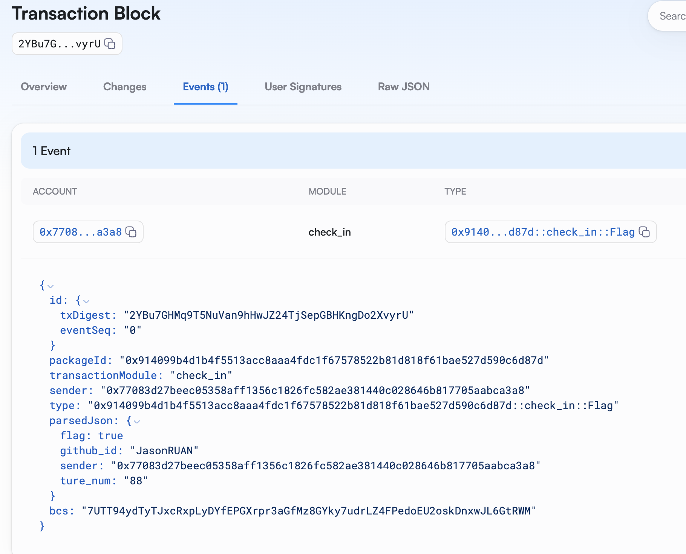

# Task7交互记录

## 查看`flag_str`对象当前值

https://testnet.suivision.xyz/object/0xc8dcd54baa7724177593a9f70598a09ae6a4286f996542e058f248209db08147

```
RlV;|HE37t-.JQ"o
```


## 在合约中添加单测计算编码后的flag

```python
#[test_only]
module check_in::check_in_tests;
    use std::bcs;
    use std::hash::sha3_256;
    use std::debug;

    #[test]
    fun test_check_in() {
        let flag_str = b"RlV;|HE37t-.JQ\"o";
        let github_id = b"JasonRUAN";

        let mut bcs_flag = bcs::to_bytes(&flag_str);
        vector::append<u8>(&mut bcs_flag, github_id);

        debug::print(&sha3_256(bcs_flag));
    }
}
```

-   **得到十六进制数据**

```
0x790eecea6313982c4a3b9eae286a569562bf99f68bc34e1cdfb1b773e24dcb27
```

-   **使用python脚本解码**

```
121,14,236,234,99,19,152,44,74,59,158,174,40,106,86,149,98,191,153,246,139,195,78,28,223,177,183,115,226,77,203,39
```

## 合约调用

```bash
export PACKAGE_ID=0x914099b4d1b4f5513acc8aaa4fdc1f67578522b81d818f61bae527d590c6d87d
export FLAG_STR_OBJ=0xc8dcd54baa7724177593a9f70598a09ae6a4286f996542e058f248209db08147

sui client call --package $PACKAGE_ID --module check_in --function get_flag --args [121,14,236,234,99,19,152,44,74,59,158,174,40,106,86,149,98,191,153,246,139,195,78,28,223,177,183,115,226,77,203,39] JasonRUAN $FLAG_STR_OBJ 0x8
```

-   **交易哈希**

```
Transaction Digest: 2YBu7GHMq9T5NuVan9hHwJZ24TjSepGBHKngDo2XvyrU
```

-   **合约事件**


-   **交易查看**

https://testnet.suivision.xyz/txblock/2YBu7GHMq9T5NuVan9hHwJZ24TjSepGBHKngDo2XvyrU?tab=Events



### flag_str对象已更新

https://testnet.suivision.xyz/object/0xc8dcd54baa7724177593a9f70598a09ae6a4286f996542e058f248209db08147

