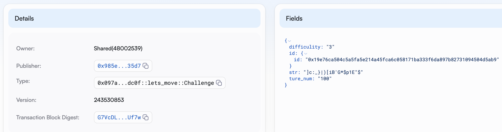
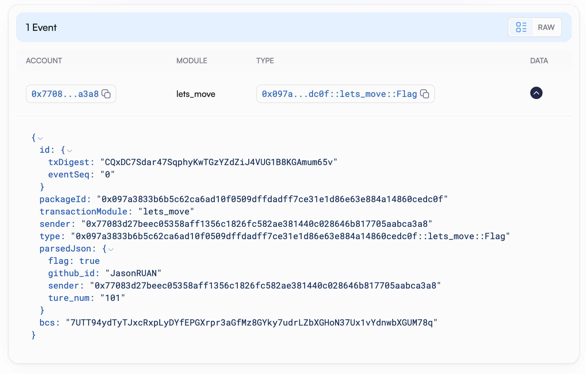
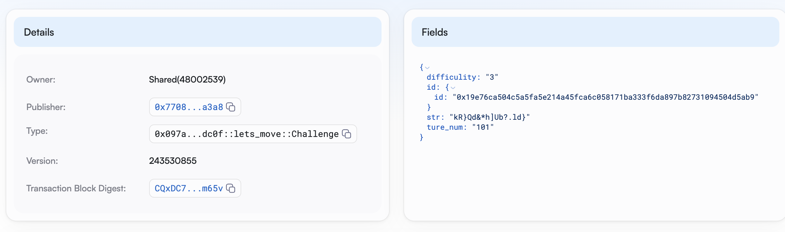

# Task8学习笔记

## 挑战对象当前值

https://github.com/JasonRUAN/hoh_letsmove/blob/main/task/08.move_ctf_lets_move.md



```json
{
	"difficulity": "3",
	"id": {
		"id": "0x19e76ca504c5a5fa5e214a45fca6c058171ba333f6da897b82731094504d5ab9"
	},
	"str": "]c:_}|)[iB'G*$p1E\"$",
	"ture_num": "100"
}
```

## 计算证明值

```ts
import { bcs, fromHex, toHex } from '@mysten/bcs';
import { sha3_256 } from '@noble/hashes/sha3';

// Address type for 32-byte addresses
const Address = bcs.bytes(32).transform({
	input: (val: string) => fromHex(val),
	output: (val) => toHex(val),
});

// UID type for 32-byte unique identifiers
const UID = bcs.fixedArray(32, bcs.u8()).transform({
	input: (id: string) => fromHex(id),
	output: (id) => toHex(Uint8Array.from(id)),
});

// Test sender address
const sender = '0x77083d27beec05358aff1356c1826fc582ae381440c028646b817705aabca3a8';
const senderBytes = Address.serialize(sender).toBytes();

// Challenge struct definition
const ChallengeStruct = bcs.struct('Challenge', {
    id: UID,
    str: bcs.string(),
    difficulity: bcs.u64(),
    ture_num: bcs.u64(),
});

// Test challenge data
const challengeBytes = ChallengeStruct.serialize({
    id: '0x19e76ca504c5a5fa5e214a45fca6c058171ba333f6da897b82731094504d5ab9',
    str: "]c:_}|)[iB'G*$p1E\"$",
    difficulity: 3,
    ture_num: 100,
}).toBytes();

/**
 * Calculates proof of work by finding a number that results in a hash with specific properties
 * @param maxAttempts Maximum number of attempts before giving up
 * @returns The proof number if found, null otherwise
 */
function calculateProof(maxAttempts = 10000000): number | null {
    const targetPrefixSum = 0;
    const prefixLength = 3;

    for (let attempts = 1; attempts <= maxAttempts; attempts++) {
        // Generate random proof between 0 and 100M
        const proof = Math.floor(Math.random() * 100000000);

        if (attempts % 1000 === 0) {
            console.log(`Attempt ${attempts}: ${proof}`);
        }

        const proofBytes = bcs.u64().serialize(proof).toBytes();

        // Combine all components for hashing
        const combined = new Uint8Array([...proofBytes, ...senderBytes, ...challengeBytes]);
        const hash = sha3_256(combined);

        // Calculate prefix sum of first N bytes
        const prefix_sum = hash
            .slice(0, prefixLength)
            .reduce((sum, byte) => sum + byte, 0);

        if (prefix_sum === targetPrefixSum) {
            console.log(`Success! Found proof after ${attempts} attempts: ${proof}`);
            console.log(`Proof bytes: [${proofBytes.toString()}]`);
            return proof;
        }
    }

    console.error(`Failed to find proof after ${maxAttempts} attempts`);
    return null;
}

// Execute proof calculation
calculateProof();
```

## 得到证明值

```bash
Success! Found proof after 7158758 attempts: 5860720
Proof bytes: [112,109,89,0,0,0,0,0]
```

## 构造并发送交易

```ts
import { bcs, fromBase64 } from "@mysten/bcs";
import { getFullnodeUrl, SuiClient } from "@mysten/sui/dist/cjs/client";
import { Transaction } from "@mysten/sui/transactions";
import { execSync } from "child_process";
import { readFileSync } from "fs";
import { homedir } from "os";
import path from "path";
import { Ed25519Keypair } from "@mysten/sui/keypairs/ed25519";

export const getAddressByAlias = (alias: string): string => {
  const str = execSync(`sui client  switch --address ${alias}`, {
    encoding: "utf8",
  }).trim();

  const regex = /Active address switched to (\S+)/;
  const match = str.match(regex);

  return match ? match[1] : "";
};

export const getSigner = (alias: string) => {
  const sender = getAddressByAlias(alias);

  const keystore = JSON.parse(
    readFileSync(
      path.join(homedir(), ".sui", "sui_config", "sui.keystore"),
      "utf8"
    )
  );

  for (const priv of keystore) {
    const raw = fromBase64(priv);
    if (raw[0] !== 0) {
      continue;
    }

    const pair = Ed25519Keypair.fromSecretKey(raw.slice(1));
    if (pair.getPublicKey().toSuiAddress() === sender) {
      return pair;
    }
  }

  throw new Error(`keypair not found for sender: ${sender}`);
};

async function call() {
  const rpcUrl = getFullnodeUrl("testnet");
  const client = new SuiClient({ url: rpcUrl });

  const pkgId =
    "0x097a3833b6b5c62ca6ad10f0509dffdadff7ce31e1d86e63e884a14860cedc0f";
  const moduleName = "lets_move";
  const funcName = "get_flag";

  const tx = new Transaction();

  tx.moveCall({
    target: `${pkgId}::${moduleName}::${funcName}`,

    arguments: [
      tx.pure(bcs.vector(bcs.u8()).serialize([112, 109, 89, 0, 0, 0, 0, 0])),
      tx.pure.string("JasonRUAN"),
      tx.object(
        "0x19e76ca504c5a5fa5e214a45fca6c058171ba333f6da897b82731094504d5ab9"
      ),
      tx.object("0x8"),
    ],
  });

  const signer = getSigner("JasonRUAN");
  const result = await client.signAndExecuteTransaction({
    signer,
    transaction: tx,
  });
  return result;
}

call().then(console.log).catch(console.error);
```

## 交易查看

https://testnet.suivision.xyz/txblock/CQxDC7Sdar47SqphyKwTGzYZdZiJ4VUG1B8KGAmum65v



## 查看当前挑战值



```json
{
	"difficulity": "3",
	"id": {
		"id": "0x19e76ca504c5a5fa5e214a45fca6c058171ba333f6da897b82731094504d5ab9"
	},
	"str": "kR}Qd&*h]Ub?.ld}",
	"ture_num": "101"
}
```

