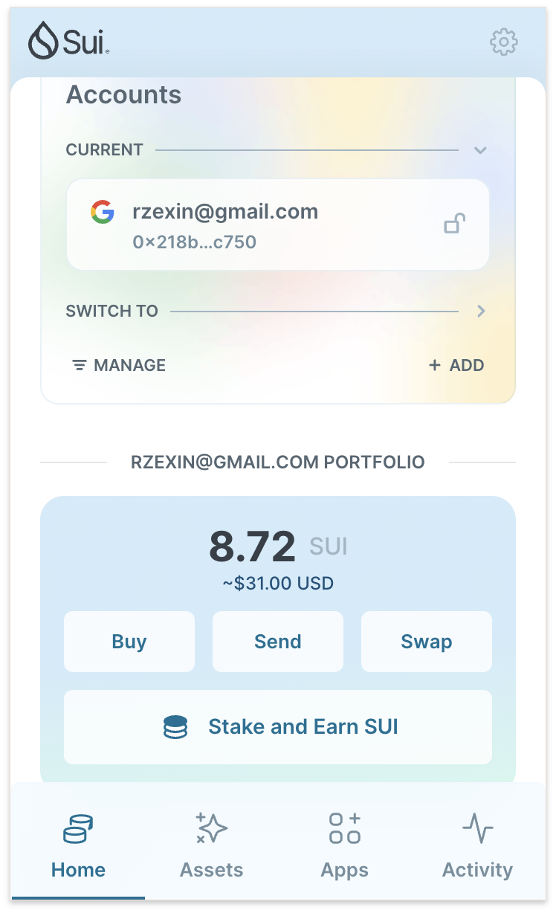
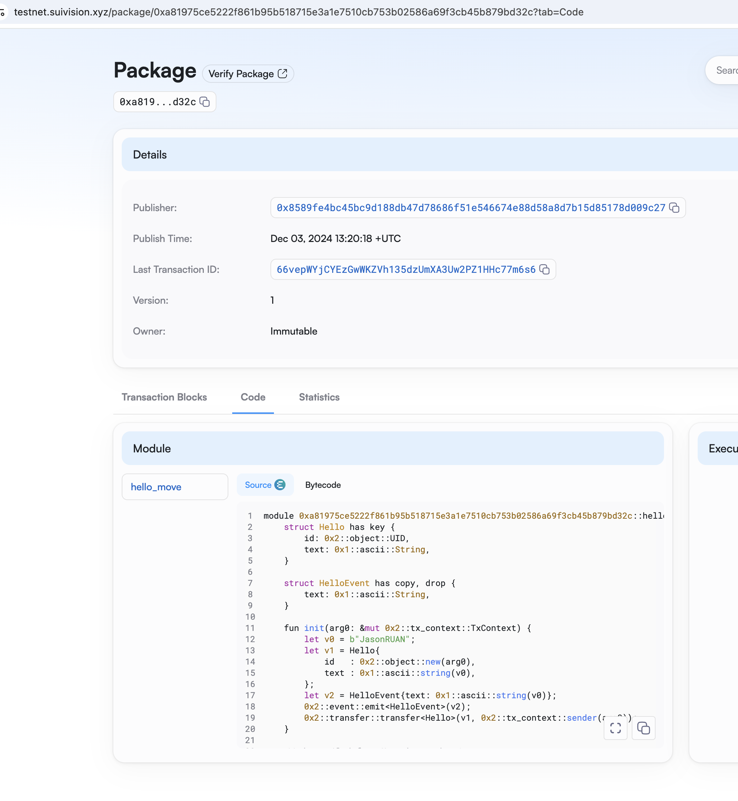
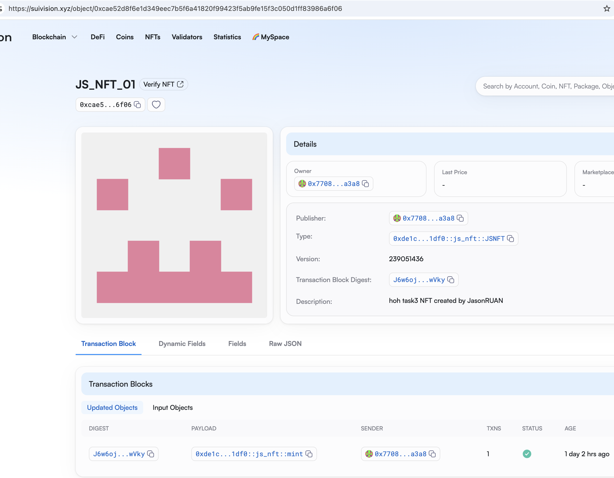
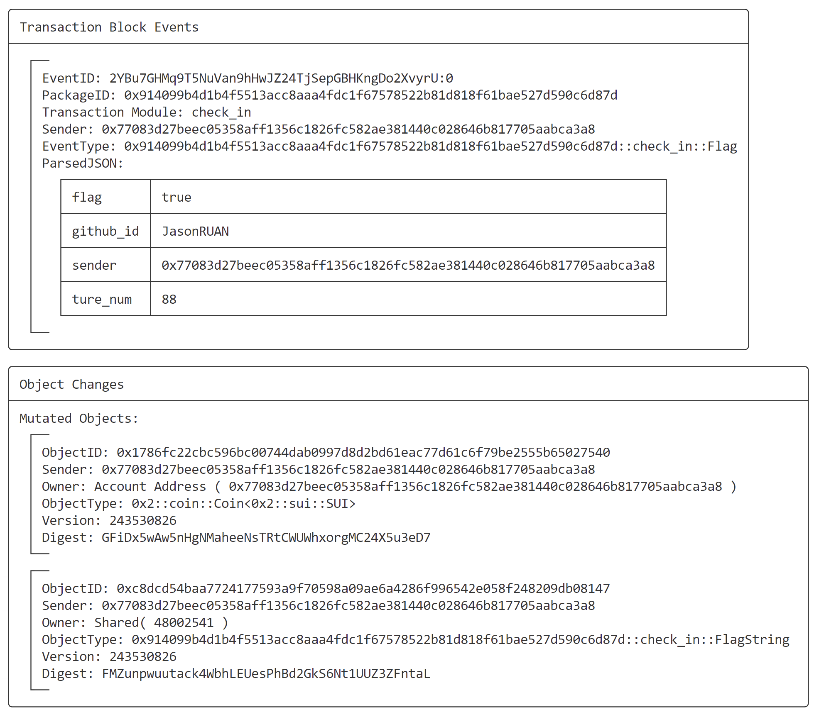

## 基本信息

- Sui钱包地址: `0x218bbfabde3dfce9e70b7e745afe1dbc58641c799d136bf919aa3078e25bc750`
  
  > 首次参与需要完成第一个任务注册好钱包地址才被合并，并且后续学习奖励会打入这个地址

- github: `JasonRUAN`

## 个人简介

- 工作经验: 15年

- 技术栈: `Go` `Python` `C++`
  
  > 重要提示 请认真写自己的简介

- 多年web2开发经验，对Move特别感兴趣，想通过Move做点有趣的东西

- 联系方式: tg: `rzexin`

## 任务

## 01 hello move

- [x] Sui cli version: `sui 1.39.0-252c332c445d`

- [x] Sui钱包截图: 

- [x] package id:  0xa81975ce5222f861b95b518715e3a1e7510cb753b02586a69f3cb45b879bd32c

- [x] package id 在 scan上的查看截图:

学习笔记：[note1.md](./code/task1/note1.md)

## 02 move coin

- [x] My Coin package id : 0x943fab9df355573935cf3e619583ec835c16350858fd746abed83de37dc1bde8

- [x] Faucet package id : 0xb8db87209eafdc3799c38dd92b616f2be1ca4fd4809c0909f897d6dfcc44f0df

- [x] 转账 `My Coin` hash: Du1gxaEKjRB5Xd9e3xwPPCLH7JWGXYzNKHqGVMXRpPbX

- [x] `Faucet Coin` address1 mint hash:787Nu8gsg7EEkEofQ4qGDxMvy6gk4Yfk6WUVFQtdRYmr

- [x] `Faucet Coin` address2 mint hash: 8uS4nZ5Q51h1nhXiznsKcRfCKrbHk1U5A482m4x8M8zf

学习笔记：[note2.md](./code/task2/note2.md)

## 03 move NFT

- [x] nft package id :0xde1c46c81e15397011e6e5be110366ea2f0a4276bd3c867a7f8ca158c0801df0

- [x] nft object id : 0xcae52d8f6e1d349eec7b5f6a41820f99423f5ab9fe15f3c050d1ff83986a6f06

- [x] 转账 nft  hash: 7LrfXnqHAribrhHjb7ergVE2SMhiSbVzuaH8s9dh9rvJ

- [x] scan上的NFT截图:

学习笔记：[note3.md](./code/task3/note3.md)

## 04 Move Game

- [x] game package id : 0x14353b3ff0f3f91a58c13298dfbcc1f6e405a275d6bffa994ff61ddb0d936bb6

- [x] deposit Coin hash: EU2zMtVjh29USEcBA2JJA4B6eh4MWpu88JnHVy7BW5uW

- [x] withdraw `Coin` hash: 4uZ1uvj1CmFzG6EU1zXbAmdxWmYjddZgsNfssE2Nyomd

- [x] play game hash: EU2zMtVjh29USEcBA2JJA4B6eh4MWpu88JnHVy7BW5uW

学习笔记：[note4.md](./code/task4/note4.md)

## 05 Move Swap

- [x] swap package id : 0xc3074c311b5fbc5563f9f3a9ca71e23a20c2b7a6855ad56e3e7fb34b82648386

- [x] call swap CoinA-> CoinB  hash : GfUNvA3rUPYfYKLRCSUUnz5quuBLe6c2amLeQdHbUTTG

- [x] call swap CoinB-> CoinA  hash : 5gXN71a2GRP1oRH6hvRUJcsWr63HUojenzcSv5WP7gA8

学习笔记：[note5.md](./code/task5/note5.md)

## 06 Dapp-kit SDK PTB

- [x] save hash: https://suivision.xyz/txblock/786hLMhfW9uvYLCSyyNNk4QBacHmWgsQ2poYtefCpLgx

学习笔记：[note6.md](./code/task6/note6.md)

## 07 Move CTF Check In

- [x] CLI call 截图 : 

- [x] flag hash : 2YBu7GHMq9T5NuVan9hHwJZ24TjSepGBHKngDo2XvyrU

学习笔记：[note7.md](./code/task7/note7.md)

## 08 Move CTF Lets Move

- [x] proof : [112,109,89,0,0,0,0,0]

- [x] flag hash : CQxDC7Sdar47SqphyKwTGzYZdZiJ4VUG1B8KGAmum65v

学习笔记：[note8.md](./code/task8/note8.md)
