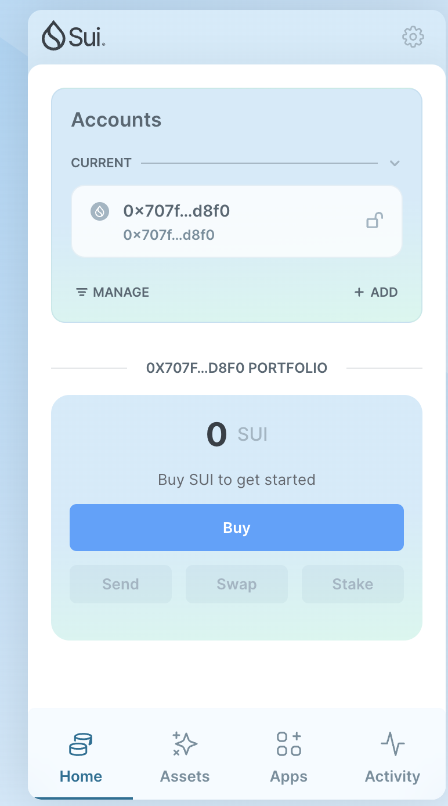
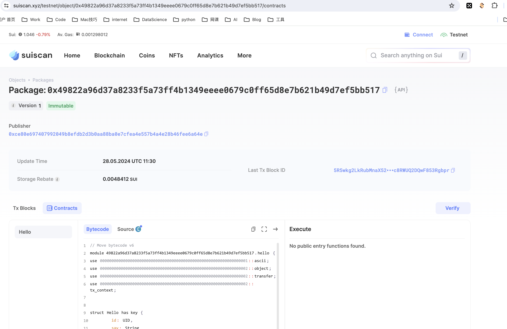

## 基本信息
- Sui钱包地址: `0xb4e62dac5c1d363b72990f32001656c4a6a5b015cde36f42a61cae62bd3fd9a4`
- github: `https://github.com/Jay9625`

## 个人简介
- 工作经验: 1年
- 技术栈: `Python` `C++` `Go`
- 本硕计算机专业，有web2开发经验，对Move特别感兴趣，想通过Move入门区块链
- 联系方式: tg: `AAAJaychou` 

## 任务

##   01 hello move  
- [x] Sui cli version: sui 1.26.0-homebrew
- [x] Sui钱包截图: 
- [x] package id: 0x49822a96d37a8233f5a73ff4b1349eeee0679c0ff65d8e7b621b49d7ef5bb517
- [x] package id 在 scan上的查看截图:

##   02 move coin
- [] My Coin package id : 
- [] Faucet package id : 
- [] 转账 `My Coin` hash:
- [] `Faucet Coin` address1 mint hash:
- [] `Faucet Coin` address2 mint hash:

##   03 move NFT
- [] nft package id :
- [] nft object id : 
- [] 转账 nft  hash:
- [] scan上的NFT截图:

##   04 Move Game
- [] game package id :
- [] deposit Coin hash:
- [] withdraw `Coin` hash:
- [] play game hash:

##   05 Move Swap
- [] swap package id :
- [] call swap CoinA-> CoinB  hash :
- [] call swap CoinB-> CoinA  hash :

##   06 Dapp-kit SDK PTB
- [] save hash :
