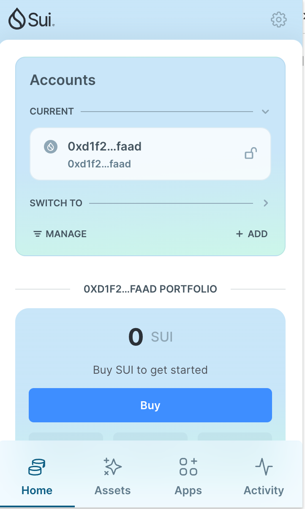
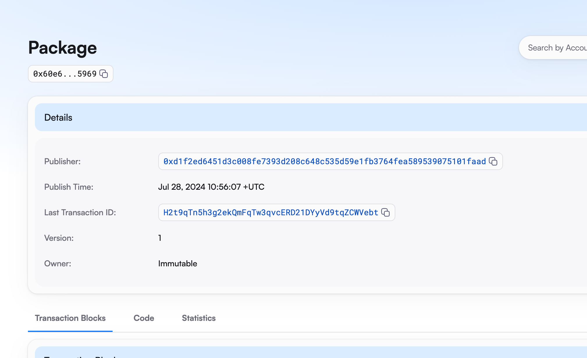
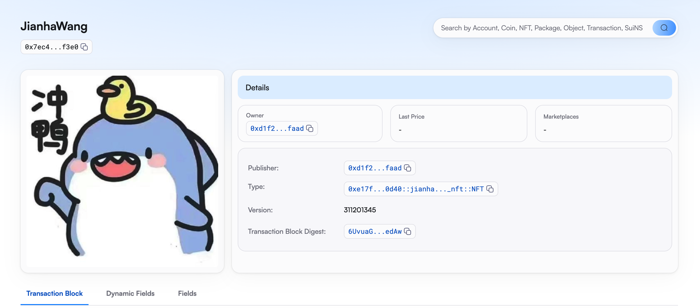

## 基本信息
- Sui钱包地址: `0xd1f2ed6451d3c008fe7393d208c648c535d59e1fb3764fea589539075101faad`
> 首次参与需要完成第一个任务注册好钱包地址才被合并，并且后续学习奖励会打入这个地址
- github: `JianhaWang`

## 个人简介
- 工作经验: 1年
- 技术栈: `C++`
> 重要提示 请认真写自己的简介
- 多年web2开发经验，对Move特别感兴趣，想通过Move入门区块链
- 联系方式: tg: `Greego` 

## 任务

##   01 hello move  
- [x] Sui cli version: sui-client 1.29.2-09db80adf1af
- [x] Sui钱包截图: 
- [x] package id:  0x7cd0cc37aa1711c8365da790282d546c220b7d166aa2e314ee88b33ab19c0bbe
- [x] package id 在 scan上的查看截图:

##   02 move coin
- [x] My Coin package id :  [0x3532789c2976cbc05868dba979423c5f6376da1de5ef1257d55d296b99e3c15a](https://suivision.xyz/package/0x3532789c2976cbc05868dba979423c5f6376da1de5ef1257d55d296b99e3c15a)
- [x] Faucet package id :  [0x3532789c2976cbc05868dba979423c5f6376da1de5ef1257d55d296b99e3c15a](https://suivision.xyz/package/0x3532789c2976cbc05868dba979423c5f6376da1de5ef1257d55d296b99e3c15a)
- [x] 转账 `My Coin` hash: [3XE4YWCtdPH9MBwycNqjjrucV1mgDFMXhTVb7JKkUtba](https://suivision.xyz/txblock/3XE4YWCtdPH9MBwycNqjjrucV1mgDFMXhTVb7JKkUtba)
- [x] `Faucet Coin` address1 mint hash: [3dEEoFLdgs9NZcKsK6LbGcCwYjuYa5SouvZapXUrTMvR](https://suivision.xyz/txblock/3dEEoFLdgs9NZcKsK6LbGcCwYjuYa5SouvZapXUrTMvR)
- [x] `Faucet Coin` address2 mint hash: [Gmbh2iabzHSqeyjrru9uATzxw3DE7tJhwVH2QYnnBVsT](https://suivision.xyz/txblock/Gmbh2iabzHSqeyjrru9uATzxw3DE7tJhwVH2QYnnBVsT)

##   03 move NFT
- [x] nft package id :  [0xe17f33b07c9a91b35632386f436a45ee78a66a9a8cdad9973f8a6dde5f770d40](https://suivision.xyz/package/0xe17f33b07c9a91b35632386f436a45ee78a66a9a8cdad9973f8a6dde5f770d40)
- [x] nft object id :  [0x7ec425ed0c6ef9af1c00b8a8b792a815b00e5f5887cc24131fb31383522bf3e0](https://suivision.xyz/object/0x7ec425ed0c6ef9af1c00b8a8b792a815b00e5f5887cc24131fb31383522bf3e0)
- [x] 转账 nft  hash : [HsojqjGBSq7vTg7LViex9mu6De4fWHgBEgmtqxARhoDc](https://suivision.xyz/txblock/HsojqjGBSq7vTg7LViex9mu6De4fWHgBEgmtqxARhoDc)
- [x] scan上的NFT截图:

##   04 Move Game
- [x] game package id : [0xd22aa04dc7b3c5ec7586d35f9ccd6b449a08dbb4c7dbbe71ebe216d82514e6cb](https://suivision.xyz/package/0xd22aa04dc7b3c5ec7586d35f9ccd6b449a08dbb4c7dbbe71ebe216d82514e6cb)
- [x] deposit Coin hash: [9873ZiH6RoMEGqrmm26RrsCzpkJGtQ1DL2xPF8ZBtgmy](https://suivision.xyz/txblock/9873ZiH6RoMEGqrmm26RrsCzpkJGtQ1DL2xPF8ZBtgmy)
- [x] withdraw `Coin` hash:  [DLZ1zvT3CoBZxcKzFpNMbnT2e3CkzY4pEzRoSTPACttR](https://suivision.xyz/txblock/DLZ1zvT3CoBZxcKzFpNMbnT2e3CkzY4pEzRoSTPACttR)
- [x] play game hash:  [FafWkF8u5bXCprHMbQmkm8tR9PZq3zCcqaY9BYz673dV](https://suivision.xyz/txblock/FafWkF8u5bXCprHMbQmkm8tR9PZq3zCcqaY9BYz673dV)

##   05 Move Swap
- [] swap package id :
- [] call swap CoinA-> CoinB  hash :
- [] call swap CoinB-> CoinA  hash :

##   06 Dapp-kit SDK PTB
- [] save hash :

##   07 Move CTF Check In
- [] CLI call 截图 : 
- [] flag hash :

##   08 Move CTF Lets Move
- [] proof : 
- [] flag hash :
