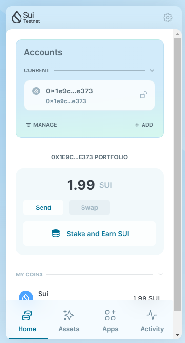
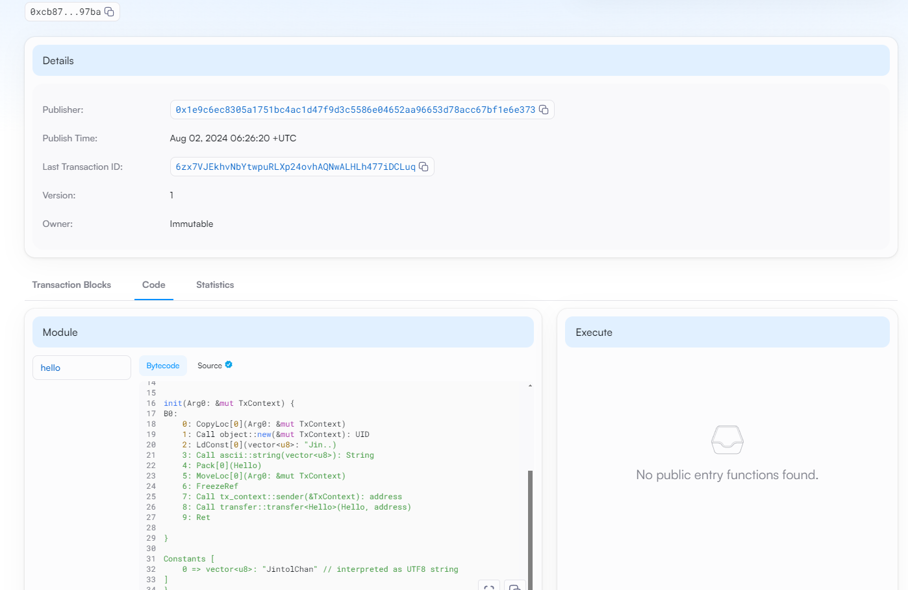

## 基本信息
- Sui钱包地址: `0x1e9c6ec8305a1751bc4ac1d47f9d3c5586e04652aa96653d78acc67bf1e6e373`
> 首次参与需要完成第一个任务注册好钱包地址才被合并，并且后续学习奖励会打入这个地址
- github: `JintolChan`

## 个人简介
- 工作经验: 0年
- 技术栈: `python` 
> 重要提示 请认真写自己的简介
- 在校大学生，专注于学习Web3开发，对Move特别感兴趣，想通过Move入门区块链。热爱探索前沿科技，致力于通过Web3技术推动互联网的去中心化发展。
- 联系方式: tg: `itdog_jt` 

## 任务

##   01 hello move  
- [] Sui cli version: sui 1.30.1-a4185da5659d
- [] Sui钱包截图: 
- [] package id: 0xcb87c924efd973409b6505bce5cfc8bc6124f2777e933d13d1b98830a56397ba
- [] package id 在 scan上的查看截图:

##   02 move coin
- [] My Coin package id : 0x78ef7610736b79c7378ee4e0a37f69a7260ca66419fbfc73d167af9a5b04a10f
- [] Faucet package id : 0xe0f8ceffac4d5e596b78220ae1d10557aae9515ddf962e509eef795d61e02e3b
- [] 转账 `My Coin` hash:9HrUVtLPAq8R2rh58Rxc6HL5dJ6opogiuKA7py9tM8S7
- [] `Faucet Coin` address1 mint hash:EpyQqaHWTfDchxZw4YjfREZ18zD19aQ5VKh1nYMNu5Te
- [] `Faucet Coin` address2 mint hash:4Z8G7N8a25LRBUmQKo6eERtBcq6PiSMrQNsmyE9Vqe6f

##   03 move NFT
- [] nft package id :
- [] nft object id : 
- [] 转账 nft  hash:
- [] scan上的NFT截图:

##   04 Move Game
- [] game package id :
- [] deposit Coin hash:
- [] withdraw `Coin` hash:
- [] play game hash:

##   05 Move Swap
- [] swap package id :
- [] call swap CoinA-> CoinB  hash :
- [] call swap CoinB-> CoinA  hash :

##   06 Dapp-kit SDK PTB
- [] save hash :

##   07 Move CTF Check In
- [] CLI call 截图 : 
- [] flag hash :

##   08 Move CTF Lets Move
- [] proof : 
- [] flag hash :
