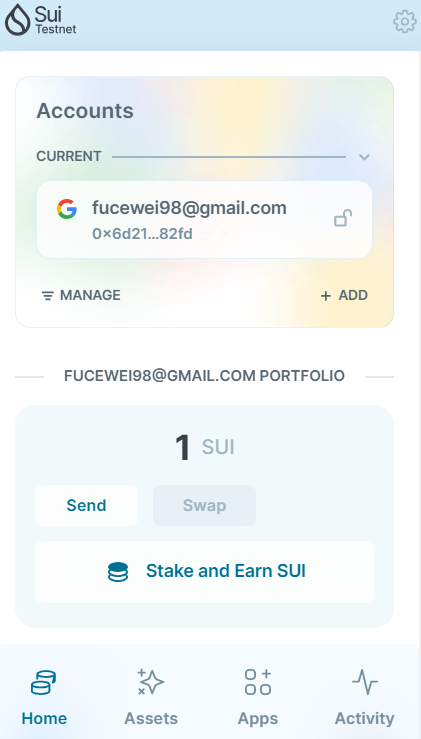
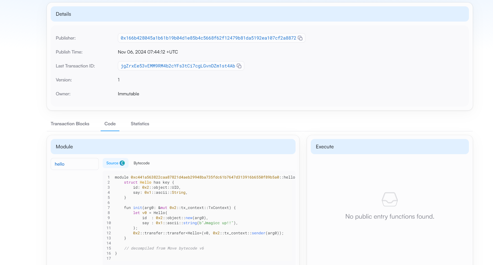
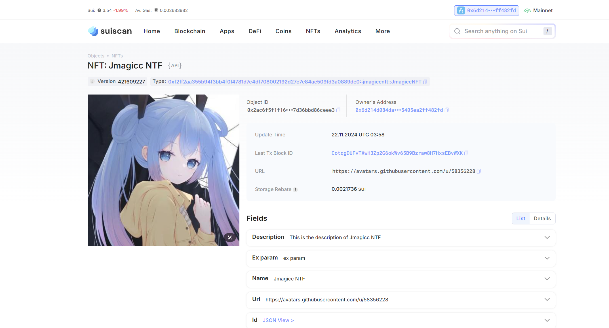

## 基本信息
- Sui钱包地址: `0x6d214d084dadb8d37d6d2f7edea3778f07c7e76e0737ac27ce5405ea2ff482fd`
> 首次参与需要完成第一个任务注册好钱包地址才被合并，并且后续学习奖励会打入这个地址
- github: `Jmagicc`

## 个人简介
- 工作经验: 5年
- 技术栈: `Rust` `golang``python``vue` `react``solidity`
> 重要提示 请认真写自己的简介
- 熟悉NFT和DeFi项目,对点对点通信很感兴趣.期待能在sui上做点什么
- 联系方式: wx: `ASDMJH55` 

## 任务

##   01 hello move  
- [x] Sui cli version: sui 1.34.0-99ebd8f082f2
- [x] Sui钱包截图: 
- [x] package id: 0xc441a563822caa87821d4aeb29948ba735fdc61b7647d313916b6550f89b5a0
- [x] package id 在 scan上的查看截图:

##   02 move coin  
- [x] My Coin package id : 0x26c52507cbd06684da94a201bc6228acce8337bb768bd423f7a5d8db5fe28598
- [x] Faucet package id :  0x456356b93dd173dfc641a21db0b53f504baeca59b9679c267692c5b5b3f28369
- [x] 转账 `My Coin` hash: Bc9RUbLhzw31xaE87NmqzpwyXiqx12hanJGgyiPJ1o62
- [x] `Faucet Coin` address1 mint hash: 9GdcMy9xUsVPFZ1TeK6vvQ3DpvUeLTxW1kpH8KoKgPfG
- [x] `Faucet Coin` address2 mint hash: 2pnVPpT3mMCrHVgCgpXoP9VSbDeV75VA2yB57Fe3X2ib

##   03 move NFT
- [x] nft package id : 0xf2ff2aa355b94f3bb4f0f4781d7c4df708002192d27c7e84ae509fd3a0889de0
- [x] nft object id :  0x2ac6f5f1f162fd6607bd3880c9438d60c2808074190a73720d7d36bbd86ceee3
- [x] 转账 nft  hash: JEF88V2kwZbEviS9rDvG5LPz7yyaxQ8zSqSmSJqrgTEp
- [x] scan上的NFT截图:

##   04 Move Game
- [] game package id :
- [] deposit Coin hash:
- [] withdraw `Coin` hash:
- [] play game hash:

##   05 Move Swap
- [] swap package id :
- [] call swap CoinA-> CoinB  hash :
- [] call swap CoinB-> CoinA  hash :

##   06 Dapp-kit SDK PTB
- [] save hash :

##   07 Move CTF Check In
- [] CLI call 截图 : 
- [] flag hash :

##   08 Move CTF Lets Move
- [] proof : 
- [] flag hash :
