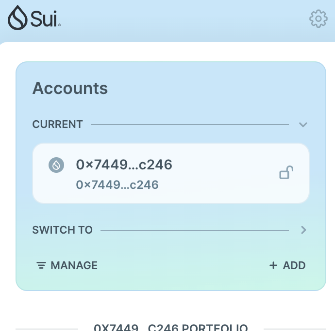
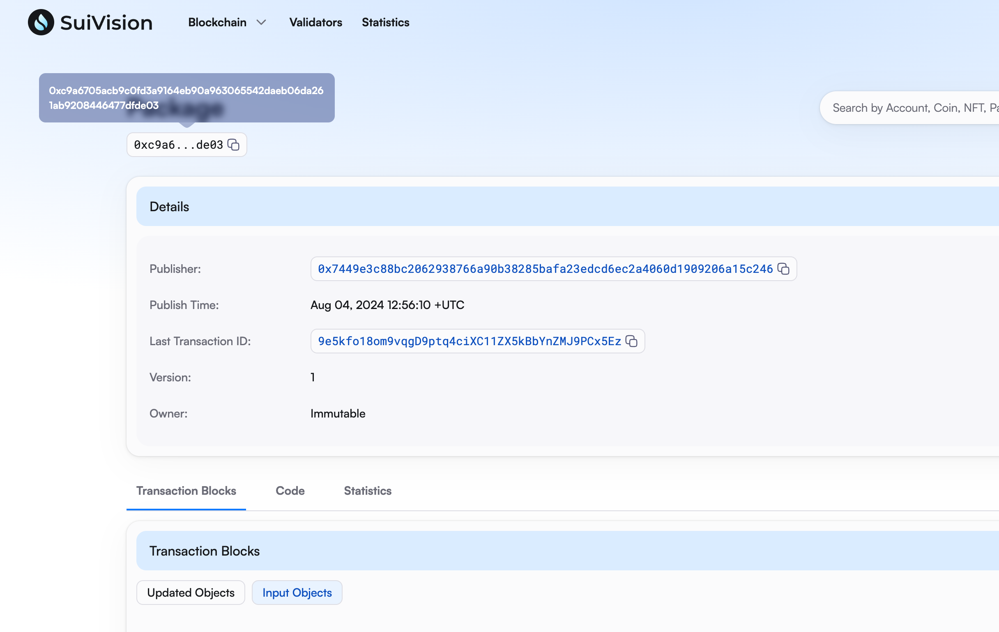
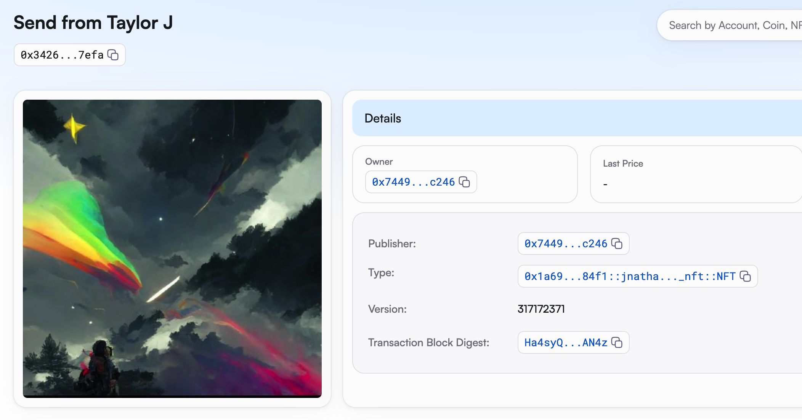
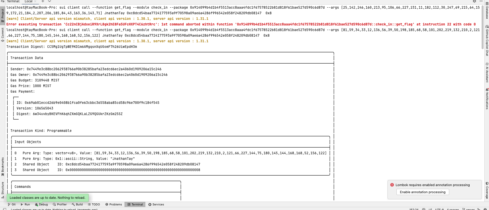

d## 基本信息
- Sui钱包地址: `0x7449e3c88bc2062938766a90b38285bafa23edcd6ec2a4060d1909206a15c246`
> 首次参与需要完成第一个任务注册好钱包地址才被合并，并且后续学习奖励会打入这个地址
- github: `JnathanTay`

## 个人简介
- 工作经验: 4年
- 技术栈: `Vue`
> 重要提示 请认真写自己的简介
- 丰富前端开发经验，对Move特别感兴趣，想通过Move入门区块链
- 联系方式: tg: `TaylerJ` 

## 任务

##   01 hello move  
- [x] Sui cli version: 1.30.1
- [x] Sui钱包截图: 
- [x] package id:  0xc9a6705acb9c0fd3a9164eb90a963065542daeb06da261ab9208446477dfde03
- [x] package id 在 scan上的查看截图:

##   02 move coin
- [x] My Coin package id : 0x6aeea8a177777c804b9344d389182ba14f50d71d68d39d295ac260372465ec84
- [x] Faucet package id : 0x6aeea8a177777c804b9344d389182ba14f50d71d68d39d295ac260372465ec84
- [x] 转账 `My Coin` hash:  46qqKQrzryG98eHvhonobsr5r7UwbosC2Lua81bwoDhw
- [x] `Faucet Coin` address1 mint hash:  9LiRJFvyHkADpXFzKkSwBYyDj5ons2tpqKkrAAanxqqk
- [x] `Faucet Coin` address2 mint hash: 5BegVYEav5G21YzJn65fjgYdDaPjUxAXoPzg3fiUWVAG

##   03 move NFT
- [x] nft package id :  0x1a69f143dd652b788c5128e42abea4c6e1d298eeda7f2ddaa3825e68802084f1
- [x] nft object id :  0x34260025507c8259213343ec77d0640aa724788bbade4c5be3b0de247d0d7efa
- [x] 转账 nft  hash:  8x2Fnpmc1TkyAyqRqg8teZiVQs8Jg4reQdMLB158Uh4V
- [x] scan上的NFT截图:

##   04 Move Game
- [x] game package id : 0xa049bdd2e95bea609ae4776dd2c892dabfe137fc64eb57ed0590e283e7c71d5e
- [x] deposit Coin hash: 7bMgn5gZky6onVkGmsrnojWQqtP5R3SXeXXC4i12K2pg
- [x] withdraw `Coin` hash: 3b1DZvUDar2Bcad4HuvS9P1QwL2nfA6GqGuEoXXi7Wvm
- [x] play game hash: AGf5WRHZLcpEwF3yQnSgQcHztuwK2ZCLEcW2VXY8HRJa

##   05 Move Swap
- [x] swap package id : 0x5eb83a588c9fad049095970afd4f296ed06ba9b4303bdda94b6c57942d72a1d8
- [x] call swap CoinA-> CoinB  hash :  2QRLWqKiza3HFfZ4nAod1ssPzYBdwPvCDy9K7Wi4LGcA
- [x] call swap CoinB-> CoinA  hash : 4igabB2oJRKLuiBGSn4YjpaiWXnSCz9c4vyWksyrU7D1

##   06 Dapp-kit SDK PTB
- [x] save hash : 9GWrB3Vx3LgYBuGvHm8ebcoNoNg9th29fPP3Znm1gXRP

##   07 Move CTF Check In
- [x] CLI call 截图 : 
- [x] flag hash : CC5Mg1UgTpWE9KD1m6AMgqsnXqUGomF7h26UiwEpdH3m

##   08 Move CTF Lets Move
- [x] proof : 205e782f2310d6c0d199
- [x] flag hash : 9XacUp8ExfmYA4Ro2SbuVi4b4gNVzWrbL5gMhBZHaZUa
