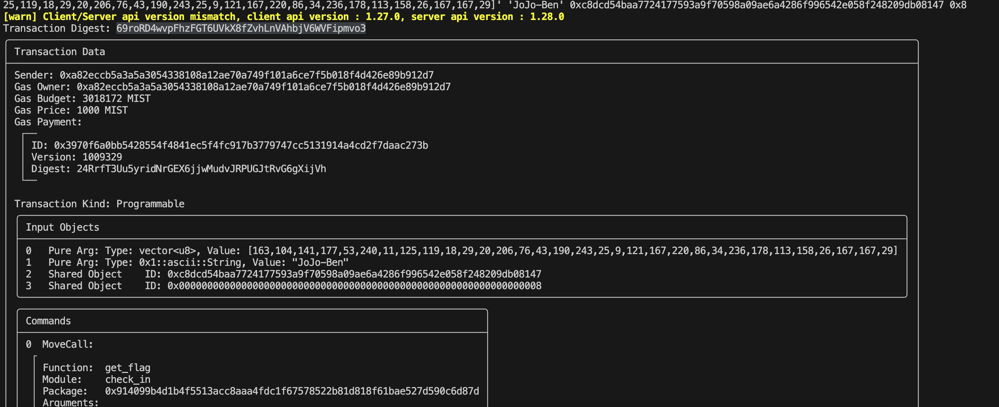

## 基本信息
- Sui钱包地址: `0xa82eccb5a3a5a3054338108a12ae70a749f101a6ce7f5b018f4d426e89b912d7`
> 首次参与需要完成第一个任务注册好钱包地址才被合并，并且后续学习奖励会打入这个地址
- github: `0xpaul0903`

## 个人简介
- 工作经验: 0年
- 雖然我沒有編程經驗，但我對區塊鏈技術和加密貨幣產生了濃厚的興趣，我正在學習 Move 語言。
- 联系方式: `18721658352@163.com` 

## 任务

##   01 hello move  
- [x] (Testnet)package id:  0x37d0b44f047b31d69f7c3d0b1a0386cc1b5f2ceb0f364eab3e4f5d60d50eaf17

##   02 move coin
- [x] My Coin package id : 0xa8385516f66e045fe3c69179453c5b76855a141017ca622ae2516153e6622735
- [x] Faucet package id : 0xa8385516f66e045fe3c69179453c5b76855a141017ca622ae2516153e6622735
- [x] 转账 `My Coin` hash: BmvUTQXVhKsVrvfPfpqJZPBSqeoWEAApYGJ1TbKzKAWU

##   03 move NFT
- [x] nft package id : 0x8bd45abe0784d12bfd12b20e9d7ac4c1f3b467ed49f69d57bffb2004d4a17003
- [x] nft object id : 0xbeab697d0e12cbbde74ac27d245b2bea7e616672f19a4e47682ef6817ea18d2b
- [x] 转账 nft  hash: FdJo9bUQLNkTBfTQU2JaHLr91iVLdH1xYxWNCnSP8vje

##   04 Move Game
- [x] (testnet Random) game package id : 0xfe0eff9fd4550b800461bd6301b5a74c9cc9aa8fd2bb50a88f209345ecc93a58
- [x] (testnet Random)call game hash: BjVbfXFM3VF7BaAc1qi6V71z2TFK5PSgHVD1mWfwJnbg
```bash
[warn] Client/Server api version mismatch, client api version : 1.27.0, server api version : 1.27.4
Object 0x0000000000000000000000000000000000000000000000000000000000000008 does not exist
```

##   05 Move Swap
- [ ] swap package id :
- [ ] call swap hash:

##   06 SDK PTB
- [ ] save hash :

##   07 Move CTF Check In
- [x] CLI call 截图: 
- [x] flag hash: 69roRD4wvpFhzFGT6UVkX8fZvhLnVAhbjV6WVFipmvo3

##   08
- [x] proof: `75pi`
- [x] hash: ArVMrBAKPaTRsTTuAm9rbE5J1QNJNQsUHaH4RpAqS3B6
