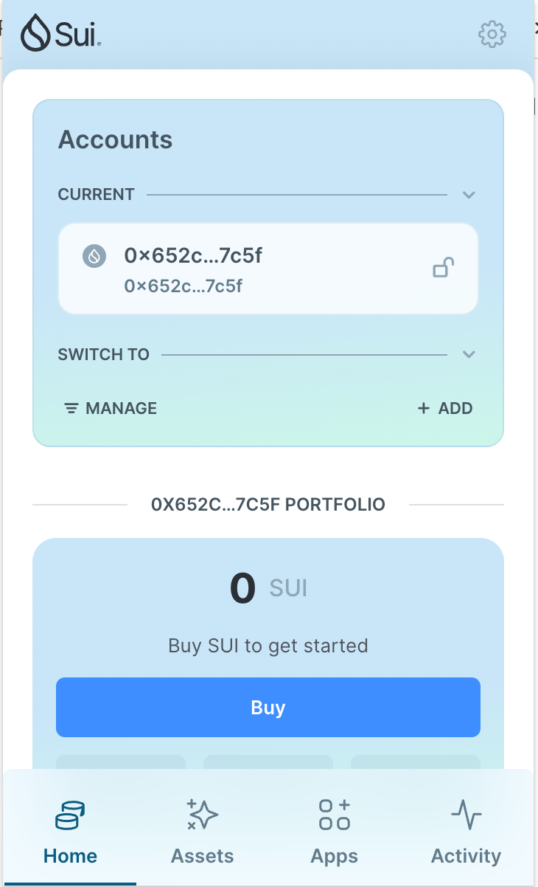
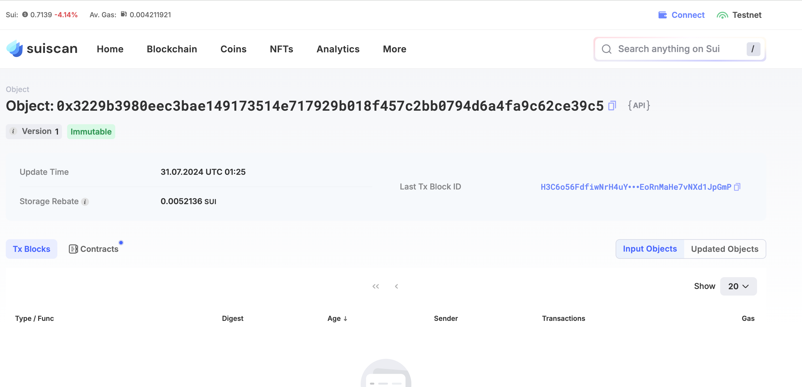
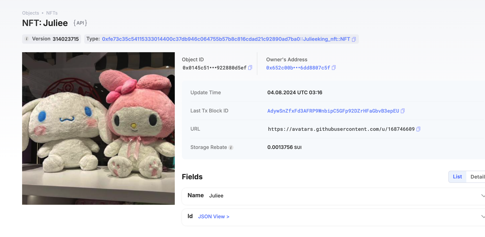

## 基本信息
- Sui钱包地址: `0x652c00b2a660af73204fc6a73f54e3377721e77ea3610041782e686dd8807c5f`
> 首次参与需要完成第一个任务注册好钱包地址才被合并，并且后续学习奖励会打入这个地址
- github: `JulieeKing`

## 个人简介
- 工作经验: 4年
- 技术栈: `Java`
> 重要提示 请认真写自己的简介
- 多年Spring开发经验，对Move感兴趣，想通过Move入门区块链
- 联系方式: tg: `JulieeeKing` 

## 任务

##   01 hello move  
- [x] Sui cli version: 1.30.1
- [x] Sui钱包截图: 
- [x] package id:  0x3229b3980eec3bae149173514e717929b018f457c2bb0794d6a4fa9c62ce39c5
- [x] package id 在 scan上的查看截图:

##   02 move coin
- [x] My Coin package id : 0x0f52cb81aeb0aa35ec076d48f86479971ab2f1c9f8e569994b6055e115f09245
- [x] Faucet package id : 0x0f52cb81aeb0aa35ec076d48f86479971ab2f1c9f8e569994b6055e115f09245
- [x] 转账 `My Coin` hash: 4ykH9DaGL45R3v5wadHbiGRkdip19M2j3kHHz4DtRoLF
- [x] `Faucet Coin` address1 mint hash: Gm9Ey9GwGBXdDHj7JYNPNme2zJ51NUxTbcQnVTWHe27i
- [x] `Faucet Coin` address2 mint hash: HEF9FQ7N2HmY4FwRxy4ihJFmzh6S8njfLwwutiYVSkun

##   03 move NFT
- [x] nft package id : 0xfe73c35c54115333014400c37db946c064755b57b8c816cdad21c92890ad7ba0
- [x] nft object id : 0x0145c51ff9a058ed8eaba1454d13531c6ed3005e4cefcc3b586819922880d5ef
- [x] 转账 nft  hash:  DnJGyoKpFn5zcAMBYnp7vWJP26zjLTqEUb9bTs36Kngs
- [x] scan上的NFT截图:

##   04 Move Game
- [x] game package id : 0xbefb3cdcc83de32ac78343e4cd77ca143e59cc10a8379e91258cc62930dc9ef5
- [x] deposit Coin hash: 7z4ENKcAKVBvMgFXrBAegmpmFJYrpaf69dC5vjTat4fm
- [x] withdraw `Coin` hash:  Fkc9ZGQQEVrR8xCcHN9bjuZo4rGVTHAuJ6ihBaJCebAg
- [x] play game hash: 51PMxyAfvXzz3n2UN2hc8P4UpDxU3mF9gSLzTJaE3VRa

##   05 Move Swap
- [x] swap package id : 0x237003470a5694d099f3105f74aa8b18944faad6f48d698ee265155ddb1bc355
- [x] call swap CoinA-> CoinB  hash : CUqtKAXKZvr5HQpXLGhNnKBL4R7vfsyvZjwL2yNgiNVE
- [x] call swap CoinB-> CoinA  hash : 5BcrqpFZ44zWpB7Sqiy7hoqFTup8PKGsGVXtc4v4KqTA

##   06 Dapp-kit SDK PTB
- [x] save hash : 2bg4LjjpRmYafdeGS2QWgbzYJKEB8aJVEie1tQSUygVe

##   07 Move CTF Check In
- [x] CLI call 截图 : 
- [x] flag hash : 2tesfakeLvQJLw3UXzP1egkU22ukgbUFrAsKEVyN7GWq

##   08 Move CTF Lets Move
- [x] proof : 2dfc745aa60754d46967
- [x] flag hash : 5abhEXc5VfQwW8b7NMs1FnFscZkmYHK7QVK9eA82Lmbg
