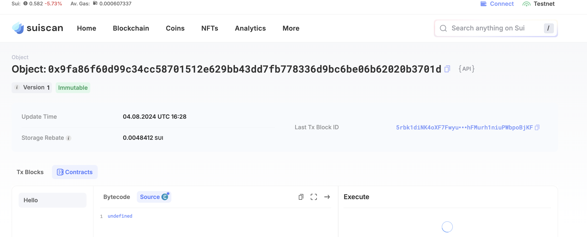

## 基本信息

- Sui钱包地址: `0x16f73edf56f2f55a51a38aa7d65abccc157dddfce3b125d21ec556fc3a820d44`

> 首次参与需要完成第一个任务注册好钱包地址才被合并，并且后续学习奖励会打入这个地址

- github: `July-NANA`

## 个人简介

- 工作经验: 2年
- 技术栈: `Java` `C++`
- 多年web2开发经验，对Move特别感兴趣，想通过Move入门区块链

## 任务

## 01 hello move

- [x] Sui cli version: sui 1.30.1-a4185da5659d
- [x] Sui钱包截图: 
- [x] package id: 0x9fa86f60d99c34cc58701512e629bb43dd7fb778336d9bc6be06b62020b3701d
- [x] package id 在 scan上的查看截图:

## 02 move coin

- [x] My Coin package id : 0xe03c047a1c85887ed3a3c4b775d0d74c752dfce736705e5abacbbc3ddf27bf8b
- [x] Faucet package id : 0xe03c047a1c85887ed3a3c4b775d0d74c752dfce736705e5abacbbc3ddf27bf8b
- [x] 转账 `My Coin` hash: HjW9J3wydtXyN13gVTmFwoqsPFcd4bCzLaqqSPH7QRap
- [x] `Faucet Coin` address1 mint hash: FHbX12bsE14hqTHDYY24qLVNRmF7emnxpwqr8x4Jydw7
- [x] `Faucet Coin` address2 mint hash: 9dhsxvGnQd8CEoBQwZ6QXmAYXaGbESqPnTdCc4vmJFwj

## 03 move NFT

- [x] nft package id : 0x21a50681402efcfcb12a49d99f09f78c5641e1da0d1fa1b98681d8dc2eaa8cb1
- [x] nft object id : 0xaab31354f405a610fa3f309c23b5d9e19eff3a987b34483cc718793317c2227a
- [x] 转账 nft hash: 4SZXarcJaUY2DordxxgwiTBiwMcXdK9PZhfjPa2WB7aP
- [x] scan上的NFT截图:

## 04 Move Game

- [x] game package id : 0x81ff3a0f03c8d066b2f162a3c0d48dd891e67f55297a6dab27fa920780fc9f5a
- [x] deposit Coin hash: A7HcXCDdNuXF3YmeXFLGt1T8HDVKa2DN25xtBNor9oNK
- [x] withdraw `Coin` hash: 7wuBt9PspJ1XPVRubEBKujwPHynAKKZXEonQsYs5o8y
- [x] play game hash: A7HcXCDdNuXF3YmeXFLGt1T8HDVKa2DN25xtBNor9oNK

## 05 Move Swap

- [x] swap package id : 0xd6405b9957ea58f1966f27165c107231a4cd04edf5bb2d407aad3e58b292648f
- [x] call swap CoinA-> CoinB hash : APzFnv4E4Q41QTbVoEiFhYMTwGp7uHA6UrMXMpjskTWz
- [x] call swap CoinB-> CoinA hash : BW3G6EFRfmuhSMzfHU82EyXibf9muLGMPkWXofqaWu3B

## 06 Dapp-kit SDK PTB

- [] save hash :

## 07 Move CTF Check In

- [] CLI call 截图 : 
- [] flag hash :

## 08 Move CTF Lets Move

- [] proof :
- [] flag hash :
