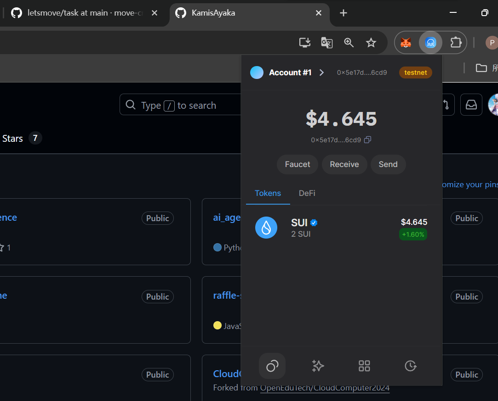
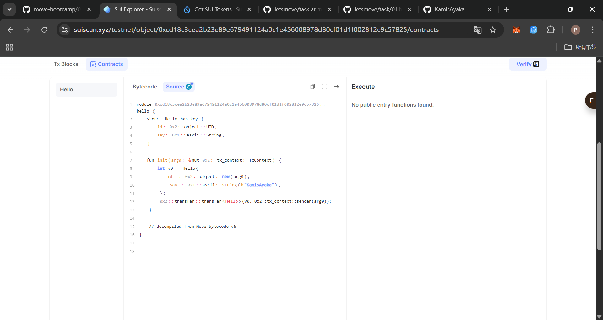
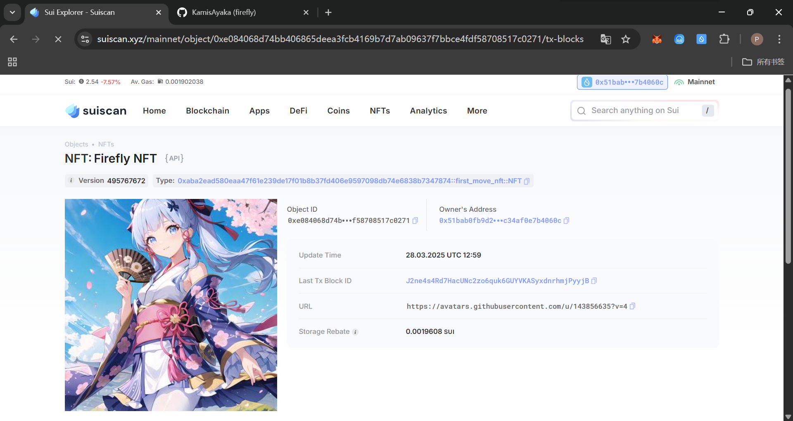

## 基本信息
- Sui钱包地址: `0x5e17de73d5c924dde91b5b03abe25dec994f97e42896a336a816827163fe6cd9`
> 首次参与需要完成第一个任务注册好钱包地址才被合并，并且后续学习奖励会打入这个地址
- github: `KamisAyaka`

## 个人简介
- 工作经验: 0
- 技术栈: `solidity` `go` `python`
> 重要提示 请认真写自己的简介
- 自学了一年solidity，对move和solidity的区别感兴趣，想知道两者之间的差别。
- 联系方式: 邮箱: `2504970020@qq.com`

## 任务

##   01 hello move  
- [√] Sui cli version: sui 1.45.0-3ef5cc5b5c90
- [√] Sui钱包截图: 
- [√] package id: 0xcd18c3cea2b23e89e679491124a0c1e456008978d80cf01d1f002812e9c57825
- [√] package id 在 scan上的查看截图:

##   02 move coin
- [√] My Coin package id : 0xba695b7c5f47db5d85606ee1a5f6ad4b54638094f2e72181d5f370f64505fe5e
- [√] Faucet package id : 0x2e6c5b963c248ae765ccb34d517fec2cc82c3818178aff32bd636e2c8752c6f4
- [√] 转账 `My Coin` hash: Fz9deTwmnX7gUuGTuajnBk5XBFL1GXf5eWphHhmkJKe7
- [√] `Faucet Coin` address1 mint hash: AGqcTUV5WqHm62bqakD6zjX9XRePHTBWjx549XqEpT9d
- [√] `Faucet Coin` address2 mint hash: C9dKg2XXeL9KYhBFysCVzcKKHbhBTDvqN4UBDJUsJHAq

##   03 move NFT
- [√] nft package id :0xaba2ead580eaa47f61e239de17f01b8b37fd406e9597098db74e6838b7347874
- [√] nft object id : 0xe084068d74bb406865deea3fcb4169b7d7ab09637f7bbce4fdf58708517c0271
- [√] 转账 nft  hash: 8JBxMyUuSM88M4TLCzLzTiNhh1ryKm8EEWviSy1LpwRD
- [√] scan上的NFT截图:

##   04 Move Game
- [√] game package id :0xd0bb0d2dfe587ac1438b430e158ad2ba7bc4fac112bded92be4dfa9d515ff6fb
- [√] deposit Coin hash: DE5yCFGodJasjviaatHNKtNvDMJHbHUvstJFo7jiWurm
- [√] withdraw `Coin` hash: 8wN68Fb4j2eQj71YntoEZTAXNaNjWWDXUGc8bF3MkWsx
- [√] play game hash: 6QLNqRL4SatxArPLKyqPbMQeFrh8j2n7CzRNZ6sDRVNd

##   05 Move Swap
- [√] swap package id : 0x2f569870c9211706499c6b5c6d1d20a858a03fc7cad09a555626d222e9843dac
- [√] call swap CoinA-> CoinB  hash : 3t1MYUbQieGpW6wJADb4ZSunoFYvKU4Er1T8BukjwAqC
- [√] call swap CoinB-> CoinA  hash : 849RMDuq5tNu2viaBkF8wnr5qaU8MgqtpZtNbFfYR7CL

##   06 Dapp-kit SDK PTB
- [√] save hash : 5nxgEX6eFXG3MYAoB4qpoFbW9LRodaANWnRRve9ct3j9

##   07 Move CTF Check In
- [] CLI call 截图 : 
- [] flag hash :

##   08 Move CTF Lets Move
- [] proof : 
- [] flag hash :

