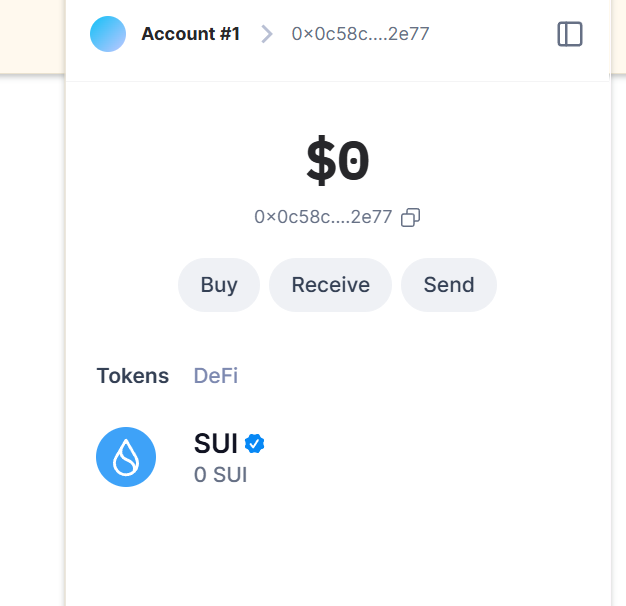
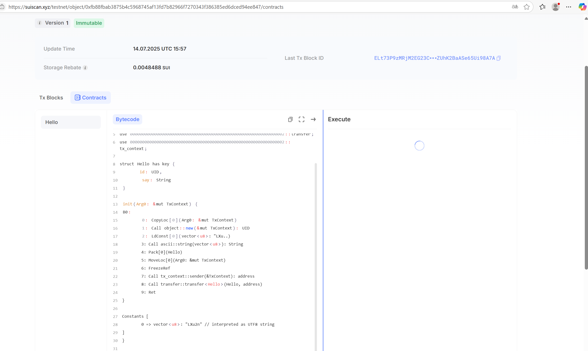
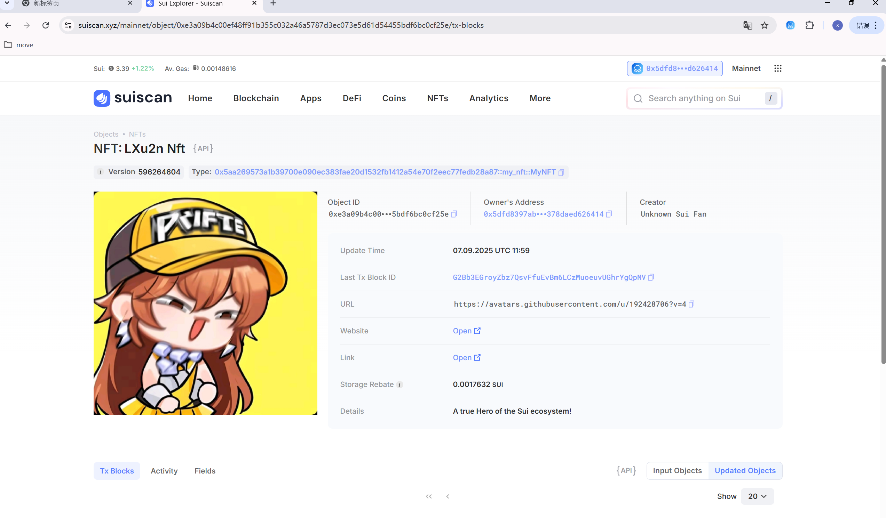

## 基本信息
- Sui钱包地址: `0x5dfd8397ab2c24d973e602ae9cf3254b27f32d2ac87cf300453378daed626414`
> 首次参与需要完成第一个任务注册好钱包地址才被合并，并且后续学习奖励会打入这个地址
- github: `LXu2n`

## 个人简介
- 工作经验: 0年
- 技术栈: 无
> 重要提示 请认真写自己的简介
- 多年web2开发经验，对Move特别感兴趣，想通过Move入门区块链
- 联系方式: tg: `qq:2274739582` 

## 任务

##   01 hello move  
- [] Sui cli version: sui 1.51.4-9cb6277fed87
- [] Sui钱包截图: 
- [] package id: 0xfb88fbab3875b4c5968745af13fd7b82966f7270343f386385ed6dced94ee847
- [] package id 在 scan上的查看截图:

##   02 move coin
- [] My Coin package id : 
- [] Faucet package id : 
- [] 转账 `My Coin` hash:
- [] `Faucet Coin` address1 mint hash:
- [] `Faucet Coin` address2 mint hash:

##   03 move NFT
- [] nft package id : 0x5aa269573a1b39700e090ec383fae20d1532fb1412a54e70f2eec77fedb28a87
- [] nft object id : 0xe3a09b4c00ef48ff91b355c032a46a5787d3ec073e5d61d54455bdf6bc0cf25e
- [] 转账 nft  hash: pxpevETfPtMN5L9rK5RGYkKjaYAf4JRik189f5rn1A3
- [] scan上的NFT截图:

##   04 Move Game
- [] game package id :
- [] deposit Coin hash:
- [] withdraw `Coin` hash:
- [] play game hash:

##   05 Move Swap
- [] swap package id :
- [] call swap CoinA-> CoinB  hash :
- [] call swap CoinB-> CoinA  hash :

##   06 Dapp-kit SDK PTB
- [] save hash :

##   07 Move CTF Check In
- [] CLI call 截图 : 
- [] flag hash :

##   08 Move CTF Lets Move
- [] proof : 
- [] flag hash :

